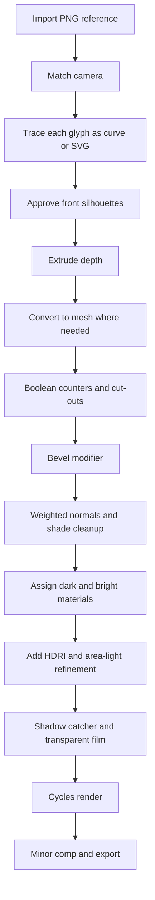

# Identifying and Reconstructing the 3D Logo

## Executive summary

The supplied image most probably reads as **LABS**, using four separate custom glyphs: a highly stylised first glyph best read as **L**, a geometric **A**, a very clear **B**, and a metallic **S**. Confidence is highest for **B**, then **S** and **A**; the first glyph is the least certain in isolation, but its placement in a four-glyph sequence heavily favours **L** over competing readings such as a second **A**, a **4**, or an abstract monogram. This is an image-based inference, not a verified brand identification.

From a rendering standpoint, the image looks like a **studio-style product render** with a **transparent background**, **soft cast/contact shadows**, **moderate gloss on the dark glyphs**, and a **much more reflective polished-metal finish** on the final glyph. The overall look is consistent with a physically based workflow in Blender, Redshift, or Arnold, using environment lighting plus at least one controlled studio key/fill source. Blender’s text/curve systems, Boolean, Solidify, Bevel, Weighted Normal, Environment Texture, camera DOF, and Cycles sampling/denoising features are all suited to reproducing this look in one package. citeturn29search11turn29search1turn0search5turn0search32turn29search13turn0search20turn24search1turn20search2turn30search7turn32search2

For reconstruction, the most reliable path is **not** to trust a stock typeface blindly. Instead, use the image as a tracing reference, rebuild each front silhouette as a **curve or SVG**, extrude to thickness, cut internal counters with live Booleans where needed, then add controlled bevels and weighted normals. This preserves silhouette accuracy and keeps the workflow non-destructive until late in the process. Blender is the strongest single-tool recommendation if no software is specified. Cinema 4D, Maya, and Fusion 360 all have valid equivalents, but they differ in where they are strongest: C4D for motion-design spline workflows, Maya for studio/Arnold pipelines, and Fusion 360 for CAD-clean solids and parametric edits. citeturn25view0turn37search1turn25view5turn25view8turn25view9turn25view10

Several details are **not recoverable from the image alone**: the original font family, the exact HDRI, the renderer used, the real-world dimensions, and the exact bevel radii. Where that ground truth is unavailable, this report gives **recommended starting values** chosen to match the visual evidence as closely as possible.

## Glyph identification and visual evidence

All identification findings in this section are derived from the supplied image itself.


The total sequence is most plausibly **LABS**. The strongest reason is structural rather than typographic: the last two glyphs read very cleanly as **B** and **S**, which makes **L-A-B-S** a much more coherent reading than any alternative four-glyph sequence. The first glyph is too stylised to be read safely in isolation, but in context it most likely functions as an angular **L**.

### Confidence table

| Region | Approx. image box | Probable reading | Confidence | Visual evidence |
|---|---:|---:|---:|---|
| **R1** | x≈55–305, y≈205–560 | **L** | **0.68** | Long lower foot, angular outer shell, triangular inner cut-out, no convincing closed apex; reads more like a custom geometric initial than a conventional Roman capital. In sequence, this is the best place for an **L**. |
| **R2** | x≈285–450, y≈180–565 | **A** | **0.83** | Tall upright stance, central aperture, diagonal bridge/crossbar element, and a top opening consistent with a stylised **A**. |
| **R3** | x≈445–705, y≈220–560 | **B** | **0.98** | Two internal counters, stacked bowls, broad rounded right side, and unmistakable capital-**B** massing. |
| **R4** | x≈700–970, y≈210–560 | **S** | **0.88** | Distinct upper/lower sweep with a constricted centre band, but faceted into a more sculptural single-piece form. |

### Alternative readings

The first glyph could plausibly be read as an **abstract angular emblem**, and the second glyph could, in isolation, be mistaken for a more generic structural form rather than a clean textbook **A**. However, once the third and fourth glyphs anchor the sequence as **…BS**, the full reading **LABS** becomes the most economical interpretation.

### What is visible and what is not

What is visible: four separate extruded solids, distinct front silhouettes, different materials for the final glyph versus the others, soft shadows, and a transparent/removed background.

What is not visible: exact rear-face topology, exact bevel profile, true physical scale, whether the file began as text, curves, SVG, or CAD, and whether the render used one HDRI or an HDRI plus area lights.

## Materials, lighting, camera, and rendering analysis

The image reads as a **PBR-style studio render** with two material families. The first three glyphs appear to use a **very dark coated or painted finish** with controlled but visible specular response; the last glyph appears to use a **polished metallic finish** with much lower roughness and stronger environment reflection. Blender’s Principled BSDF is explicitly designed to model a wide range of materials, and Redshift Standard Material and Arnold Standard Surface serve the same physically based role in their respective ecosystems. citeturn0search2turn25view4turn15search2

For metals specifically, Arnold documents that **metalness 1.0** produces fully specular metallic behaviour with complex Fresnel, and that polished mirror-like reflections come from high metalness with very low specular roughness. The same source lists measured-looking base/specular values for real metals such as aluminium and silver, which is useful for the bright final glyph. citeturn33view0

The lighting almost certainly includes an **environment-based component**. The broad, scene-wide reflections inside the counters and along the glossy contours are more consistent with a studio HDRI than with a single point light. In Blender, the Environment Texture node is specifically intended to light a scene from an environment map, and Poly Haven notes that HDRIs are commonly used either as the sole light source for realistic lighting or to enrich reflections. A neutral indoor studio HDRI such as **Story Studio 02** is a close visual fit because it is described as an indoor studio with softbox/umbrella lighting, neutral walls, and medium contrast. citeturn24search1turn24search11turn26view3turn27view0

The shadow behaviour suggests **at least one dominant directional emphasis** in addition to that environment lighting. The shadows are soft rather than hard-edged, which points to broad sources such as studio panels, softboxes, area lights, or an HDRI dome. The shadows appear to bias slightly down and right, while the glossy rims still pick up brighter values on right-facing facets, so the most plausible setup is **multi-source studio lighting**: one key producing shadow placement, plus one or more large reflective fill sources shaping the highlights. Redshift’s Dome/Light system and Arnold’s Skydome workflow are designed for exactly this style of image-based studio illumination. citeturn14search0turn25view2turn8search1turn15search10

The camera looks **mildly elevated and slightly off-axis**, not orthographic but also not wide-angle. A good working estimate is a **70–90 mm full-frame equivalent** lens, pitched downward by roughly **10–15°**, with a small horizontal yaw so that top faces and some side thickness remain visible without obvious edge distortion. Depth of field is either absent or very mild, because all glyphs remain comparably sharp. Blender’s camera documentation describes F-stop as the control over blur strength; lower values increase depth-of-field blur, which is not strongly present here. citeturn20search2

The output also appears to have been prepared for compositing. The file carries transparency around the artwork, and Blender supports **transparent film** plus passes for compositing the environment back in, as well as **shadow catcher** behaviour for collecting shadows on an otherwise invisible plane. Equivalent matte/shadow-catcher workflows also exist in Redshift and Arnold. citeturn10search0turn10search2turn28search2turn28search11

The render looks clean but not clinically perfect. There is a slight hint of micro-speckle on the dark surfaces that could come from modest sample counts, intentional grain, or image compression. If you want a cleaner replica, Cycles’ adaptive sampling and denoising are appropriate; if you want to preserve the slight texture of the original, denoise first and then add a very restrained grain pass in comp. Cycles supports adaptive sampling via Noise Threshold, and Blender’s Denoise node is specifically meant to reduce render time by allowing fewer samples. citeturn30search7turn32search2

## Blender reconstruction workflow

If no software is specified, Blender is the best all-round choice because it natively covers text properties, curve geometry, Boolean/Solidify/Bevel/Weighted Normal, PBR shading, environment lighting, camera DOF, shadow passes, and final rendering. Text objects expose geometry controls such as extrusion and bevel; curve geometry can turn a line into a ribbon or volume; Boolean, Solidify, and Bevel modifiers cover the hard-surface stage; and Weighted Normal improves flat face shading. citeturn29search11turn29search1turn0search5turn0search32turn29search13turn0search20

### Recommended modelling strategy

Use a **curve-first** workflow for silhouette accuracy.

1. **Set up the reference and camera.**  
   Import the PNG as a reference image or image plane. Position the camera until the front silhouettes line up with the render. Start with a focal length around **85 mm**, then adjust only if the side faces look either too exaggerated or too flat.

2. **Treat each glyph as a separate object.**  
   Do not build the word as one fused mesh. Keep **L**, **A**, **B**, and **S** separate so you can control bevels, materials, and shading independently.

3. **Trace the front silhouette as curves.**  
   For the clearest result, draw Bézier curves over the visible front outlines. For **B**, a heavy rounded text glyph may be a useful starting point, but I would still convert and edit it. For **L**, **A**, and especially **S**, manual tracing is more faithful than forcing a font match.

4. **Use curve extrusion first, not Solidify first.**  
   Curves can be given depth directly through geometry/extrusion. Only switch to a mesh and use **Solidify** if you deliberately begin from a flat mesh outline or need an alternative thickness workflow. In other words: for this logo, **Extrude is primary; Solidify is optional**. citeturn29search1turn29search11turn0search32

5. **Convert to mesh only when you need mesh-only operations.**  
   Boolean cut-outs, mesh bevel weighting, and detailed cleanup are easier in mesh form. Delay conversion until the 2D silhouette is approved.

6. **Cut apertures and counters with live Booleans.**  
   Use separate cutter objects for the triangular void in **L**, the aperture and diagonal bridge logic in **A**, the two counters in **B**, and any internal shaping in **S**. Blender’s Boolean documentation notes that manifold input geometry is the configuration with guaranteed results, so keep all cutters watertight and avoid messy self-intersections. citeturn0search5

7. **Add bevels conservatively.**  
   The image does not show giant chamfers. It shows **small but visible rounding** that helps reflections read cleanly. Use a Bevel modifier after the Booleans, keep the width low, and favour **2–4 segments** for a modern polished logo look. Blender’s Bevel tools and modifier exist specifically to soften infinitely sharp CG edges. citeturn29search5turn29search13

8. **Finish shading with Weighted Normal.**  
   After bevels, add **Weighted Normal** to keep broad front and side faces reading as flat, premium manufactured surfaces. Blender’s Weighted Normal modifier is meant to make selected faces appear flatter in shading. citeturn0search20

9. **Use ngons pragmatically, not dogmatically.**  
   This is a static logo, not a deforming character. Flat front caps may safely contain ngons if they remain planar and render cleanly. The topology risk lives in the transition zones: Boolean junctions, bevel intersections, and tight internal corners. Keep those areas simple and test them under glossy lighting early.

10. **Unwrap only as far as the shader needs.**  
    If you use the procedural node recipes below, UVs are optional. If you add decals, dirt breakup, or anisotropic directional maps, unwrap front/back caps with planar projection and place seams along hidden rear/side transitions. Blender’s UV tools and seams workflow support that standard separation. citeturn10search1turn10search19


### Exact Blender node recipes

The following are **recommended start values**, not measured originals.

```text
DARK GLYPHS: satin black coated finish

Layer Weight (Facing)
→ ColorRamp
→ MixRGB [Color1 = #050505, Color2 = #121212]
→ Principled BSDF Base Color

Texture Coordinate (Object)
→ Mapping
→ Noise Texture
    Scale = 220
    Detail = 2.0
    Roughness = 0.35
→ Bump
    Strength = 0.015
    Distance = 0.02
→ Principled BSDF Normal

Principled BSDF
    Metallic = 0.00
    Roughness = 0.22
    IOR = 1.45
    Coat = 0.10
    Coat Roughness = 0.08
```

```text
BRIGHT GLYPH: polished chrome or aluminium

Texture Coordinate (Object)
→ Mapping
→ Noise Texture
    Scale = 120
    Detail = 1.5
    Roughness = 0.25
→ Bump
    Strength = 0.006
    Distance = 0.01
→ Principled BSDF Normal

Optional, Cycles only:
Bevel Node
    Radius = 0.002
    Samples = 4
→ Principled BSDF Normal
(use instead of Bump, or very carefully combine)

Principled BSDF
    Base Color = 0.80, 0.80, 0.80
    Metallic = 1.00
    Roughness = 0.10
    Anisotropic = 0.05
```

```text
WORLD

Texture Coordinate (Generated)
→ Mapping
→ Environment Texture (EXR HDRI)
→ Background
    Strength = 1.0 to 1.3
→ World Output
```

These node chains are fully aligned with Blender’s general node model: Texture Coordinate can supply object-based coordinates, Mapping transforms vectors, Environment Texture is intended for environment-map lighting, Bump perturbs normals from height input, and the Principled BSDF is Blender’s general-purpose physically based material. The optional Bevel shader node is useful when you want small highlight rounding without further geometry edits. citeturn23search2turn23search1turn24search1turn23search24turn0search2turn0search31


### Lighting and camera settings to match the image

Start with a **neutral studio HDRI** such as Story Studio 02, which Poly Haven describes as an indoor studio with umbrella/softbox illumination, neutral walls, and medium contrast. Rotate it so a brighter source lands on the logo’s upper-left/front quadrant. Then add one large rectangular **Area Light** above-left/front at low intensity if you need stronger shadow direction, and a very large low-intensity fill card or area light from camera-right to bring out the bright edge rolls on the dark glyphs. citeturn27view0turn26view3

For the camera, begin with the following:

| Setting | Start value |
|---|---:|
| Focal length | **85 mm** |
| Pitch | **-12°** |
| Yaw | **8°** |
| Roll | **0°** |
| DOF | **Off** first; optional later |
| F-stop if DOF used | **8–11** |

### Render and compositing settings

Use **Cycles** for the final match. A sensible starting point is:

| Setting | Recommended start |
|---|---:|
| Engine | **Cycles** |
| Samples | **512** |
| Adaptive sampling | **On** |
| Noise Threshold | **0.01** |
| Denoise | **On** |
| Color transform | **AgX** |
| View contrast | **Medium High** |
| Film | **Transparent** |
| Shadow catcher plane | **On** |
| Output | **16-bit PNG with alpha** or **EXR** |

Cycles supports adaptive sampling through Noise Threshold, and AgX is Blender’s current preferred tone-mapping path over Filmic. A transparent film plus shadow catcher is the cleanest route if you need the same isolated logo presentation. citeturn30search7turn19search0turn10search0turn10search2

### Reconstruction pipeline diagram



### Suggested timeline

```mermaid
gantt
    title Suggested reconstruction timeline
    dateFormat  X
    axisFormat %Lh

    section Setup
    Reference import and camera match     :a1, 0, 1
    section Modelling
    Trace front silhouettes               :a2, 1, 2
    Extrude and boolean cut-outs          :a3, 3, 2
    Bevels and shading cleanup            :a4, 5, 1
    section Lookdev
    Materials and node setup              :a5, 6, 1
    HDRI, lights, and shadow catcher      :a6, 7, 1
    section Final
    Render tests and post                 :a7, 8, 1
```



## Equivalent workflows in Cinema 4D, Maya, and Fusion 360

### Cinema 4D

Cinema 4D is a strong alternative if you prefer spline-first motion-design workflows. Maxon’s documentation states that C4D text objects are generated as **connected splines** and can be given depth using an **Extrude** object. It also warns that poor fonts can produce overlapping edges, which is relevant here because this logo is highly stylised and should not rely on random typefaces. The **Bevel Deformer** gives a procedural, non-destructive bevel workflow, and the Boolean Generator can emit edge selections that can then be used to bevel only Boolean cut edges. For rendering, Redshift gives you the right mental model: **Standard Material** for PBR shading, **Dome/Redshift lights** for studio illumination, and a **Redshift Camera Object** for exposure and DOF control. citeturn25view0turn37search1turn37search4turn25view4turn25view2turn25view3turn14search0

**Recommended C4D route:** draw or import each glyph as a spline, place under Extrude, add a Bevel Deformer or bevel in the caps, use Booleans only for internal cut-outs, and keep the final **S** on its own material. If you already use Cinema 4D R26+, Exoside notes that QuadRemesher functionality was integrated natively as **ZRemesher** in the Remesh modifier. citeturn26view1

### Maya

Maya works well if you are in an Arnold-centred studio pipeline. Autodesk’s Type Tool creates a polygonal text mesh and exposes geometry controls for **extrusion** and **bevels**; it also allows **separate shaders for type, bevel, and extrude**, which is unusually useful for logo work. Arnold’s **aiStandardSurface** is Autodesk’s recommended shader for reflective and refractive materials, including metals, and Arnold’s Skydome workflow is intended for HDR-based look development. For custom non-font shapes, Maya also supports curve bevel workflows and polygon Boolean operations with construction history. citeturn25view5turn25view8turn15search0turn8search1turn36search11turn36search18

**Recommended Maya route:** use **Create > Type** only if a glyph is close to a known font shape, otherwise draw clean curves, use bevel/bevelPlus where appropriate, convert to polygons, then finish with Booleans and a restrained polyBevel. Shade the dark glyphs and bright **S** separately using aiStandardSurface, then light with an HDR-loaded Skydome plus one fill/card light if needed. citeturn25view5turn25view8turn33view0

### Fusion 360

Fusion 360 is the right choice if your end goal is a **manufacturable solid** or a **parametric master model**, not if your top priority is final lookdev. Autodesk’s learning resources explicitly frame Fusion around **Extrude**, **Fillet**, and the **Timeline**, and the keyboard reference confirms direct access to Extrude, Press Pull, Model Fillet, Move, and Appearance. Fusion also supports **Insert SVG** into an active sketch, which is extremely useful here because the fastest clean path is to trace the glyph fronts as vectors and import them as sketches. citeturn25view9turn25view10turn35search1turn35search5

**Recommended Fusion route:** trace the glyph fronts as SVG in Inkscape or Illustrator, **Insert SVG** into sketches, constrain only the must-have dimensions, then **Extrude**, **Combine/Cut**, and **Fillet** the edges. Use the Timeline to keep edits parametric. If you start from messy meshes, Exoside provides a **Quad Remesher add-in for Fusion 360**, but for this job I would prefer vector/SVG reconstruction over mesh clean-up. For final polished visuals, export the BRep/STEP model to Blender, C4D, or Maya for shading and rendering. citeturn26view0turn25view11turn35search7

## Materials and render settings comparison

### Match-to-image settings

| Component | Visual read from image | Blender starting point | Redshift / Arnold analogue | Notes |
|---|---|---|---|---|
| **Glyphs L, A, B** | Satin-to-semi-gloss near-black finish | Principled BSDF, Metallic **0.00**, Roughness **0.22**, Coat **0.10**, Coat Roughness **0.08**, subtle Noise→Bump | Redshift Standard Material or aiStandardSurface with reflective non-metal dark coating | Reads more like a coated finish than mirror-black metal. |
| **Glyph S** | Bright polished metal | Principled BSDF, Metallic **1.00**, Roughness **0.10**, Anisotropic **0.05** | Redshift Standard Material / aiStandardSurface metalness workflow | Use slightly imperfect micro-roughness so it does not look computer-perfect. |
| **Environment** | Neutral studio, medium contrast | HDRI Background **1.0–1.3** | Dome / Skydome with HDRI | Prefer neutral walls and softbox reflections. |
| **Key shaping light** | Soft but directional | Large Area Light from upper-left/front | Redshift Area Light / Arnold Area Light | Only if the HDRI alone does not produce the observed shadow bias. |
| **Camera** | Moderate perspective, slight elevation | **85 mm**, pitch **-12°**, yaw **8°** | Redshift Camera / Maya Camera | Start here, refine by eye. |
| **DOF** | Minimal or none | Off, or F-stop **8–11** | Camera optical DOF if needed | The source image does not show strong blur falloff. |
| **Shadows** | Soft contact/cast shadows on invisible plane | Shadow catcher plane | Redshift Matte / Arnold Shadow Matte | Necessary if you want the same isolated presentation. |
| **Output** | Transparent/isolated presentation | Transparent film, 16-bit PNG or EXR | Matte/alpha-based composite | The supplied file already behaves like a composited alpha output. |

### Software equivalence table

| Goal | Blender | Cinema 4D | Maya | Fusion 360 |
|---|---|---|---|---|
| Fastest accurate rebuild from PNG | **Best** | Very good | Good | Fair |
| Best non-destructive silhouette editing | **Excellent** with curves/modifiers | Excellent with splines/generators | Good with curves/history | Very good if using SVG sketches |
| Best final render quality | **Excellent** in Cycles | Excellent in Redshift | Excellent in Arnold | Limited compared with DCC renderers |
| Best for parametric/product geometry | Good | Fair | Fair | **Best** |
| Best single-app answer here | **Yes** | If you already live in C4D | If you already live in Maya | Only if CAD is the priority |

## Tools, plugins, tutorials, and limitations

### Recommended tools and primary-source references

| Resource | Why it matters |
|---|---|
| **Blender Manual: Text, Curves, Booleans, Solidify, Bevel, Weighted Normal, Camera, Environment Texture, Cycles sampling** | This is the core official reference set for rebuilding the logo entirely inside Blender. It covers text properties, curve extrusion, Boolean expectations, beveling, shading cleanup, camera blur, environment lighting, and sampling/denoising. citeturn29search11turn29search1turn0search5turn0search32turn29search13turn0search20turn20search2turn24search1turn30search7turn32search2 |
| **Blender Studio** | Official Blender training. The Motion Graphics course and Blender Fundamentals are useful if you want a production-grade text/graphics workflow rather than isolated tool pages. citeturn17search3turn17search18turn17search6 |
| **Poly Haven HDRIs and Blender add-on** | A very good primary source for neutral studio HDRIs and for pulling HDRIs/materials/models directly into Blender’s asset browser. Their FAQ is also useful for understanding when HDRIs should drive the whole look. citeturn26view3turn27view0turn25view13turn26view2 |
| **Cinema 4D Help and Redshift docs** | Official Maxon documentation for text splines, extrude depth, the Bevel Deformer, Boolean edge-selection handling, Redshift lights, Standard Material, and Redshift Camera optical controls. citeturn25view0turn37search1turn37search4turn25view4turn25view2turn25view3 |
| **Maya Help and Arnold docs** | Official Autodesk guidance for Type Tool geometry/shader separation, aiStandardSurface, reflective material setup, and HDR-based Skydome lighting. citeturn25view5turn25view8turn33view0turn8search1 |
| **Autodesk Learn for Fusion** | Official Autodesk tutorials for Extrude, Fillet, the Timeline, and self-paced Fusion learning. Useful if you want a CAD-clean master version of the logo. citeturn25view9turn25view10turn25view11 |
| **Fusion SVG import docs** | Important if you decide to rebuild the front silhouettes as vectors and import them instead of tracing directly inside Fusion. citeturn35search1turn35search5turn35search7 |
| **DECALmachine** | Strong official documentation for UV-light, non-destructive hard-surface detailing, especially if you later add trim or logo accents beyond the base glyphs. It is not required for the reconstruction, but it is very relevant to adjacent presentation/detail workflows. citeturn34view0 |
| **Quad Remesher** | Helpful when you inherit dirty boolean or CAD meshes and need automated quad cleanup. It is officially available for Blender, Maya, and Fusion 360, and Exoside notes its historic/native integration path for Cinema 4D R26. citeturn25view15turn26view0turn26view1 |
| **Substance 3D Painter** | Official Adobe documentation for painting and rendering textured 3D meshes, with direct relevance if you want to add controlled imperfection maps or produce multiple finish variants of the logo. citeturn25view14 |

### Open questions and limitations

The report’s biggest uncertainty is **glyph one**. I believe it is most likely an **L**, but that interpretation relies partly on the coherence of the whole sequence rather than on the glyph’s standalone legibility.

The exact **font source** is not recoverable from the image and may not be a font at all. It may be a custom-drawn vector wordmark.

The exact **renderer, HDRI, light intensities, bevel widths, real dimensions, and post-processing stack** are also not recoverable from the image alone. The settings given above are therefore **reconstruction settings**, chosen to match appearance rather than claimed as original source values.

Finally, because only a single beauty image is available, there is no direct evidence for the unseen back side, object pivots, live modifier stack, or original mesh topology.