# NeuroSpect Product Overview & User Guide

> **Important Disclaimers**
>
> **All performance data in this document is illustrative and synthetic. It is not based on live trading results.**
>
> **NeuroSpect is an educational and research tool. It is not financial advice.**
>
> **Past performance — real or simulated — does not guarantee future results.**
>
> **Trading involves significant risk of loss. Only trade with capital you can afford to lose.**

---

## Table of Contents

1. [Executive Summary](#1-executive-summary)
2. [Product Architecture — The Six Components](#2-product-architecture--the-six-components)
3. [How to Use Each Component Correctly](#3-how-to-use-each-component-correctly)
4. [Component Integration Map](#4-component-integration-map)
5. [Data Sources and Data Warehousing](#5-data-sources-and-data-warehousing)
6. [Analytics Surfaces — Where to View Insights](#6-analytics-surfaces--where-to-view-insights)
7. [How Trade Data Feeds the Platform](#7-how-trade-data-feeds-the-platform)
8. [Tier Workflows with Concrete Examples](#8-tier-workflows-with-concrete-examples)
9. [EdgeLab Research Engines — Deep Dive](#9-edgelab-research-engines--deep-dive)
10. [ICT Course Curriculum](#10-ict-course-curriculum)
11. [Competitive Capability Matrix](#11-competitive-capability-matrix)
12. [Subscription Stack Replacement](#12-subscription-stack-replacement)
13. [Trader Maturity Radar](#13-trader-maturity-radar)
14. [Risk Architecture & Safety](#14-risk-architecture--safety)
15. [Improvement Paths per Tier](#15-improvement-paths-per-tier)
16. [Session & Day-of-Week Analytics](#16-session--day-of-week-analytics)
17. [Mistake Taxonomy](#17-mistake-taxonomy)
18. [Setup Performance Analysis](#18-setup-performance-analysis)
19. [Glossary of ICT Terms](#19-glossary-of-ict-terms)
20. [Future Roadmap Preview](#20-future-roadmap-preview)

---

# 1. Executive Summary

## What NeuroSpect Is

**NeuroSpect** is an AI-native trading intelligence platform built specifically for ICT and Smart Money Concepts traders. It combines personalized AI coaching, structured trade journaling, ICT-aware retrieval, event-driven backtesting, feature discovery, production model scoring, and guarded trading automation into one integrated system. Instead of treating trading education, journaling, research, analytics, and execution as separate workflows, NeuroSpect connects them into a single learning loop: study the model, prepare for the session, execute with rules, journal the outcome, analyze behavior, validate the edge, improve the model, and repeat with increasing discipline.

NeuroSpect is not a generic chatbot, not a simple trading journal, and not a conventional backtester. It is designed around a **Domain-Specific Language Model (DSLM)** architecture that understands ICT vocabulary, structured entry models, liquidity narratives, session context, market regimes, trader psychology, and quant research workflows. Its purpose is to help traders move from discretionary inconsistency toward evidence-backed execution, without stripping away the contextual reasoning that makes ICT-style trading distinct.

## The Problem NeuroSpect Solves

Most serious traders are not short on tools. They are overwhelmed by them.

A typical ICT trader may use:

1. **ChatGPT or Claude** for general explanation.
2. **TradingView** for charting.
3. **Tradovate or NinjaTrader** for execution.
4. **TradeZella, TraderSync, Notion, or spreadsheets** for journaling.
5. **Discord or private communities** for signals and feedback.
6. **Backtesting software** for strategy research.
7. **Course replays, PDFs, and notes** for ICT study.

The result is fragmentation. The coaching tool does not know the journal. The journal does not know the strategy checklist. The backtester does not understand liquidity sweeps, Fair Value Gaps, SMT divergence, or kill-zone timing. The AI assistant may explain ICT terms, but it cannot reliably validate a trader’s actual setup against deterministic rules or historical evidence.

> **Key Insight:** Traders do not need another isolated dashboard. They need a connected intelligence layer that remembers their trading process, evaluates their decisions, and compounds learning over time.

## Why Existing Solutions Fail

Existing tools fail for three structural reasons.

### 1. Generic AI Hallucinates or Oversimplifies ICT Concepts

Generic language models can explain FVG, OB, MSS, or SMT in broad terms, but they are not grounded in a trader’s curated knowledge base, entry-model rules, journal history, or backtest results. Without source-grounded retrieval and deterministic rule validation, the AI may produce confident-sounding coaching that is not faithful to the trader’s methodology.

### 2. Journals Do Not Integrate with Coaching

Most trading journals record outcomes, screenshots, tags, and notes. They may calculate win rate or PnL, but they rarely close the loop between behavior and coaching. A journal can tell a trader they lost three trades on Monday. It usually cannot say: “You violated your confirmation rule after two consecutive losses, during the last 10 minutes of the NY AM kill zone, in a low-quality session regime, and this pattern has appeared four times this month.”

### 3. Backtesting Tools Do Not Understand ICT Methodology

General backtesting platforms are built around indicators, signals, and mechanical rules. ICT and Smart Money Concepts require event-driven structure: liquidity sweeps, displacement, Fair Value Gaps, order blocks, market structure shifts, session windows, SMT divergence, bias alignment, and regime context. Without native detectors and anti-lookahead enforcement, a trader either oversimplifies the model or accidentally validates rules that would not have been visible in real time.

## The NeuroSpect Approach

NeuroSpect uses a **Domain-Specific Language Model architecture** that combines:

- A base LLM.
- **36K+ lines of curated ICT knowledge**.
- Structured entry-model playbooks.
- Prompt versioning.
- Model versioning.
- Hybrid retrieval through NeuroCore.
- Feature engineering through EdgeLab.
- Evaluation loops that compare outputs against historical outcomes.
- Journal-aware personalization.
- Regime-aware model scoring.
- Safety-gated automation.

This makes NeuroSpect a purpose-built DSLM, not a generic chatbot wrapper. The platform does not merely respond to trading questions. It turns knowledge, journal behavior, strategy rules, market data, and model evaluations into a connected learning system.

## Key Platform Numbers

| Platform Area | Key Number | Meaning |
|---|---:|---|
| ICT Knowledge Base | **36K+ lines** | Curated ICT wiki, transcripts, and structured concepts |
| Entry Models | **7** | Machine-readable strategy checklists |
| Course Curriculum | **5 modules** | Structured trader education pathway |
| Journal Fields | **100+** | Behavioral, technical, execution, risk, and outcome fields |
| ICT Pattern Detectors | **8** | Swing, FVG, OrderBlock, MarketStructure, Session, SMT, Bias, Consolidation |
| Market Regimes | **6** | Regime-aware optimization and scoring |
| Capability Coverage | **14 unique capabilities** | Full-stack coverage no single competitor matches |
| Monte Carlo Testing | **10K iterations** | Robustness testing for strategies and model outputs |

## Before NeuroSpect vs. After NeuroSpect

| Workflow Need | Before NeuroSpect | After NeuroSpect |
|---|---|---|
| AI explanation | ChatGPT / Claude | **NeuroSpect Mentor** with ICT-grounded retrieval and journal memory |
| Chart context | TradingView notes and screenshots | **Journal + Mentor + NeuroCore** context layer |
| Execution records | Broker export | **Tradovate import + auto-filled trade journal** |
| Journaling | TradeZella, TraderSync, Notion, spreadsheet | **100+ field intelligent journal** |
| Coaching | Discord, mentor calls, generic AI | **Personalized 24/7 Mentor** |
| Strategy validation | Manual replay or generic backtester | **EdgeLab event-driven ICT backtesting** |
| Quant filters | Scripts and spreadsheets | **Feature Store + NeuroQuant scoring** |
| Automation roadmap | Separate bot stack | **NeuroTrader Agent with safety gates** |

> **Key Insight:** NeuroSpect replaces a disconnected stack with a single operating system for ICT learning, research, execution review, and model improvement.

---

# 2. Product Architecture — The Six Components

NeuroSpect is organized into four layers: **Consumer**, **Intelligence**, **Research**, and **Automation**. Each layer has a distinct role, but the platform’s advantage comes from how the layers connect.

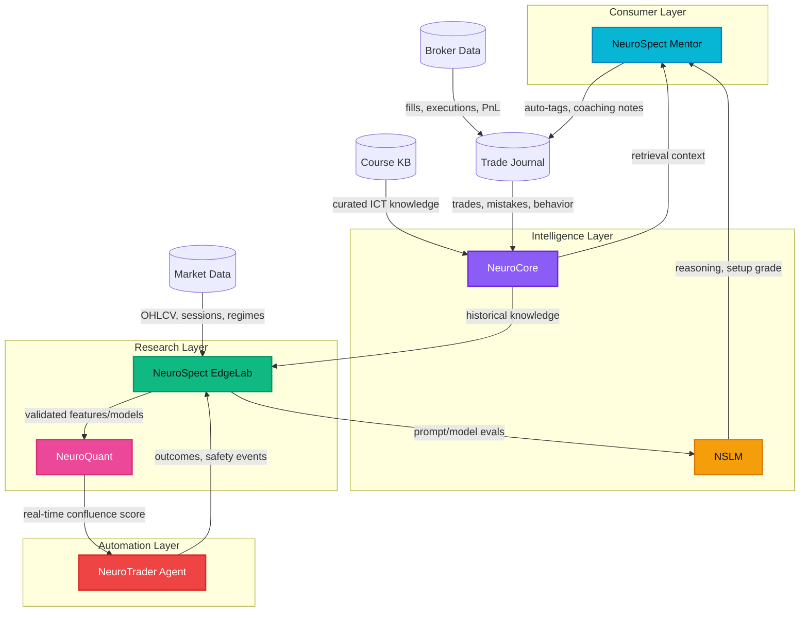

## 2A. NeuroSpect Mentor

**Layer:** Consumer  
**Color:** Cyan `#06b6d4`

### What It Does

**NeuroSpect Mentor** is the trader-facing AI coaching product. It combines retrieval-augmented generation, curated ICT knowledge, trade journal memory, and deterministic rule validation against seven machine-readable entry-model checklists. It is available 24/7 and can read the trader’s journal to understand recurring mistakes before the trader asks for help.

### Data Consumed

| Data Type | Examples |
|---|---|
| ICT Knowledge | FVG rules, MSS definitions, kill-zone guidance, entry-model checklists |
| Trade Journal | Setup tags, screenshots, PnL, mistakes, psychology notes, execution grades |
| Market Context | Session, instrument, volatility, regime, economic calendar |
| NeuroCore Retrieval | Source-grounded passages and structured tags |
| NSLM Outputs | Reasoning, setup classification, confidence, coaching explanation |

### Data Produced

| Output | Description |
|---|---|
| Coaching Response | Source-grounded explanation and action plan |
| Setup Grade | Deterministic checklist pass/fail plus NSLM quality score |
| Mistake Tags | Auto-tags such as early entry, ignored invalidation, overtrading |
| Study Assignments | Targeted review based on failed concepts |
| Journal Updates | Coaching notes and corrected reasoning |

### Connected Components

- **NeuroCore** for retrieval.
- **NSLM** for ICT-aware reasoning.
- **Trade Journal** for personalization.
- **Course KB** for study references.
- **Risk Dashboard** for rule review.

### Pricing Tiers

| Tier | Included? |
|---|---|
| Free / Trial | Limited |
| Mentor `$29` | Yes |
| Trader `$99` | Yes |
| Research `$199` | Yes |
| Quant `$349` | Yes |

### Usage Example

A trader asks: “Was my NQ long valid after London swept PDL?” Mentor retrieves the relevant entry-model checklist, reads the trader’s journal entry, checks whether displacement and FVG retrace rules were satisfied, notices the trader entered before confirmation, and returns a coaching note: “The liquidity narrative was valid, but your entry violated the confirmation step. This is your fourth early-entry tag this month.”

---

## 2B. NeuroCore

**Layer:** Intelligence  
**Color:** Purple `#8b5cf6`

### What It Does

**NeuroCore** is the platform’s knowledge and retrieval layer. It uses hybrid three-signal search via **Reciprocal Rank Fusion** to combine keyword/BM25 search, semantic vector search, and entity/tag retrieval. This allows the platform to retrieve exact ICT jargon, conceptually similar lessons, and instrument/session/strategy-specific references.

### Data Consumed

| Source | Examples |
|---|---|
| ICT Wiki | 36K+ lines of curated concepts |
| Mentor Transcripts | Prior coaching sessions and explanations |
| Trade Journal | Trader-specific behavior and setup history |
| EdgeLab Experiments | Strategy results, features, model comparisons |
| Market Data | Session context, regimes, historical examples |
| Agent Signals | Shadow/paper/live decisions and safety triggers |

### Data Produced

| Output | Description |
|---|---|
| Ranked Context Packs | Source-grounded passages for Mentor and NSLM |
| Entity Graphs | Instruments, sessions, strategies, setup tags |
| Search Explanations | Why a passage was retrieved |
| Retrieval Metrics | Hit rate, source diversity, query diagnostics |

### Connected Components

- **Mentor** for coaching retrieval.
- **NSLM** for context injection.
- **EdgeLab** for historical knowledge.
- **Journal** for personalization.

### Pricing Tiers

| Tier | Included? |
|---|---|
| Mentor `$29` | Yes |
| Trader `$99` | Yes |
| Research `$199` | Yes, expanded retrieval |
| Quant `$349` | Yes, full retrieval and production signals |

### Usage Example

A trader asks about “failed FVG continuation in NY PM.” NeuroCore uses keyword search to capture exact FVG phrasing, semantic search to find related continuation failure lessons, and entity/tag search to focus on NY PM trades in the trader’s journal.

---

## 2C. NSLM — NeuroSpect Language Model

**Layer:** Intelligence  
**Color:** Amber `#f59e0b`

### What It Does

**NSLM** is NeuroSpect’s ICT-aware model family. It is trained and evaluated around private mentorship content, wiki content, structured playbooks, journal feedback, and EdgeLab evaluation results. NSLM produces structured reasoning, setup classifications, confidence scores, and model-derived features for EdgeLab and NeuroQuant.

### Data Consumed

| Data Type | Examples |
|---|---|
| Curated Knowledge | ICT concepts, model definitions, examples |
| Structured Playbooks | Seven machine-readable entry models |
| Prompt Versions | Prompt templates, context windows, feature injections |
| Model Versions | Baseline, fine-tuned, experiment candidates |
| Evaluation Feedback | Correctness labels, trade outcome comparisons |

### Data Produced

| Output | Description |
|---|---|
| Structured Reasoning | Bias, liquidity narrative, invalidation, risks |
| Setup Classification | FVG, MSS, OB continuation, breaker retest, etc. |
| Confidence Scores | Probabilistic and rubric-based scores |
| Feature Suggestions | Potential explanatory variables for EdgeLab |
| Narrative Coherence Score | Used by NeuroQuant confluence decisions |

### Connected Components

- **Mentor** for coaching generation.
- **EdgeLab** for evaluation and feature testing.
- **NeuroQuant** for production scoring.
- **NeuroCore** for retrieval context.

### Pricing Tiers

| Tier | Included? |
|---|---|
| Mentor `$29` | Coaching-grade access |
| Trader `$99` | Setup grading and risk review |
| Research `$199` | Prompt/model experiment access |
| Quant `$349` | Production scoring integration |

### Usage Example

NSLM evaluates an NQ setup and outputs: “A- setup: PDL sweep confirmed, bullish displacement valid, FVG retrace in discount, but opposing order block is 18 points overhead. Reduce target or require stronger momentum continuation.”

---

## 2D. NeuroSpect EdgeLab

**Layer:** Research  
**Color:** Emerald `#10b981`

### What It Does

**EdgeLab** is NeuroSpect’s event-driven research engine. It supports anti-lookahead backtesting, strategy compilation from YAML into executable strategy specifications, ICT pattern detection, feature discovery, Monte Carlo simulation, walk-forward optimization, and NSLM prompt/model evaluation. It is where hypotheses become evidence.

### Data Consumed

| Data Type | Examples |
|---|---|
| Market Data | OHLCV, sessions, volatility, economic calendar |
| ICT Detectors | Swing, FVG, OrderBlock, MarketStructure, Session, SMT, Bias, Consolidation |
| Trade Journal | Outcomes, tags, mistakes, psychological notes |
| NSLM Outputs | Setup grades, reasoning fields, confidence scores |
| Strategy Specs | YAML definitions and rule sets |

### Data Produced

| Output | Description |
|---|---|
| Backtest Results | Trades, equity curves, R-distributions |
| Monte Carlo Results | Drawdown bands, risk of ruin, fan charts |
| Walk-Forward Metrics | Out-of-sample efficiency, deflated Sharpe |
| Feature Library Updates | New validated features and importance rankings |
| Model Promotion Candidates | Models ready for NeuroQuant review |

### Connected Components

- **NeuroCore** for historical knowledge.
- **NSLM** for prompt/model evaluation.
- **NeuroQuant** for model promotion.
- **Trade Journal** for feature discovery.
- **NeuroTrader Agent** for outcome feedback.

### Pricing Tiers

| Tier | Included? |
|---|---|
| Trader `$99` | Strategy reports and basic validation |
| Research `$199` | Full EdgeLab dashboard and feature studio |
| Quant `$349` | Production promotion and agent feedback loops |

### Usage Example

A trader writes a YAML strategy for “Liquidity Sweep + Displacement + FVG.” EdgeLab detects historical sweeps and FVGs, enforces point-in-time visibility, runs backtests, performs 10K Monte Carlo iterations, tests thresholds, and promotes a validated version only if it passes statistical and robustness checks.

```yaml
strategy: liquidity_sweep_fvg_long
instrument: NQ
session: NY_AM
rules:
  require_pdl_sweep: true
  displacement_strength_min: 0.50
  fvg_fill_max: 0.50
  htf_bias_alignment: true
  stop: below_fvg
  target: previous_day_high
validation:
  monte_carlo_iterations: 10000
  null_test_p_max: 0.05
  walk_forward_required: true
```

---

## 2E. NeuroQuant

**Layer:** Research / Production Model Layer  
**Color:** Rose `#ec4899`

### What It Does

**NeuroQuant** is the production scoring layer. It consumes validated features and models from EdgeLab, applies regime-aware scoring, uses model ensembles, and makes confluence decisions based on ICT gates, ML confidence, and NSLM narrative coherence. It calibrates confidence through Platt scaling.

### Data Consumed

| Data Type | Examples |
|---|---|
| Validated Features | displacement_strength, session_quality_score, ob_proximity |
| Promoted Models | Backtested and walk-forward validated models |
| Market Regime | Trending Bull, HV Expansion, Transition, etc. |
| NSLM Reasoning | Narrative quality and setup classification |
| ICT Gates | Binary checklist pass/fail conditions |

### Data Produced

| Output | Description |
|---|---|
| Confluence Score | Unified score from gates, ML, and NSLM |
| Regime Classification | Current market environment |
| Model Ensemble Output | Weighted probability across models |
| Trade Recommendation Context | Pass, caution, block, or reduce size |
| Production Logs | Score history and calibration diagnostics |

### Connected Components

- **EdgeLab** for validated models.
- **NSLM** for narrative score.
- **NeuroTrader Agent** for execution gating.
- **Mentor** for trader-facing explanation.

### Pricing Tiers

| Tier | Included? |
|---|---|
| Research `$199` | Research previews |
| Quant `$349` | Full production scoring |

### Usage Example

For an NQ long setup, NeuroQuant receives a valid ICT checklist, ML probability of 0.84, NSLM coherence score of 0.91, and a Trending Bull regime. It returns a confluence score of 0.91, “A+ continuation,” and a position-size suggestion subject to risk limits.

---

## 2F. NeuroTrader Agent

**Layer:** Automation  
**Color:** Red `#ef4444`

### What It Does

**NeuroTrader Agent** is the guarded automation layer. It progresses through **Shadow → Paper → Limited Live** stages, with human approval required for every escalation. It uses a five-layer safety architecture, requires EdgeLab evidence before activation, and records outcomes back into EdgeLab for continuous improvement.

### Data Consumed

| Data Type | Examples |
|---|---|
| NeuroQuant Scores | Confluence score, regime, confidence |
| Risk Rules | Daily loss, max trades, prop firm limits |
| Broker Data | Account state, open positions, fills |
| Safety Triggers | Drawdown, volatility, news windows |
| Human Approvals | Escalation permissions |

### Data Produced

| Output | Description |
|---|---|
| Shadow Decisions | What the agent would have done |
| Paper Trades | Simulated execution records |
| Limited Live Orders | Approved, risk-constrained orders |
| Safety Logs | Blocks, pauses, kill-switch events |
| Post-Trade Analysis | Agent reasoning and improvement notes |

### Connected Components

- **NeuroQuant** for scoring.
- **EdgeLab** for validation and outcome feedback.
- **Broker Integration** for execution.
- **Risk Dashboard** for safety monitoring.

### Pricing Tiers

| Tier | Included? |
|---|---|
| Quant `$349` | Shadow, paper, and limited-live roadmap |

### Usage Example

The agent observes an A+ NQ setup in shadow mode. It records that it would have entered at the FVG retrace, with stop below the FVG and target at PDH. The human trader can compare the agent’s shadow decision against their own execution before any live automation is considered.

---

# 3. How to Use Each Component Correctly

## 3A. NeuroSpect Mentor — Getting Started

### Prerequisites

- At least one defined entry model.
- A basic trade journal history or willingness to journal every trade going forward.
- Screenshots or structured notes for recent trades.
- Risk limits: daily loss limit, max trades, max contracts, cooldown rule.

### Step-by-Step Workflow

1. Import or create your trading profile.
2. Select the entry models you trade.
3. Add recent trades with screenshots, outcome, session, setup type, and mistake tags.
4. Ask Mentor for a pre-session brief.
5. Before a trade, ask for setup validation against the checklist.
6. After the trade, let Mentor review execution and psychology.
7. Save coaching notes back to the journal.
8. Review weekly mistake patterns.

### Common Mistakes to Avoid

| Mistake | Why It Hurts |
|---|---|
| Asking vague questions | Produces broad coaching instead of setup-specific feedback |
| Skipping journal fields | Prevents personalization |
| Treating Mentor as a signal service | Undermines rule-based learning |
| Ignoring repeated mistake tags | Blocks behavioral improvement |

### What Success Looks Like

- Fewer repeated mistakes.
- Cleaner pre-trade checklists.
- More consistent session preparation.
- Better understanding of invalidation.
- Clear weekly action items.

### When to Move to the Next Component

Move toward **EdgeLab** when your main question changes from “Did I follow my rules?” to “Do these rules have evidence across enough historical examples?”

---

## 3B. NeuroCore — Getting Started

### Prerequisites

- Curated knowledge base.
- Tagged trade journal.
- Defined concepts, instruments, sessions, and strategies.

### Step-by-Step Workflow

1. Upload or connect ICT knowledge sources.
2. Normalize vocabulary: FVG, OB, MSS, SMT, kill zone, OTE, etc.
3. Tag journal entries by setup, session, instrument, and mistake type.
4. Use Mentor queries that reference exact concepts.
5. Review retrieved sources when a coaching answer matters.
6. Add missing notes when retrieval fails.

### Common Mistakes to Avoid

| Mistake | Why It Hurts |
|---|---|
| Inconsistent naming | “FVG,” “imbalance,” and “gap” may fragment results |
| Untagged journal entries | Weakens personalization |
| Over-relying on semantic search | Misses exact ICT jargon |
| Not reviewing retrieval misses | Leaves gaps in the knowledge layer |

### What Success Looks Like

- Coaching answers cite the right source context.
- Repeated concepts are retrieved consistently.
- Journal examples appear alongside course knowledge.
- The trader builds a living knowledge graph.

### When to Move to the Next Component

Move toward **NSLM and EdgeLab** when retrieval quality is strong enough to support structured reasoning and experiment design.

---

## 3C. NSLM — Getting Started

### Prerequisites

- Structured entry-model rules.
- Labeled examples of good, weak, and invalid setups.
- Prompt templates for setup grading.
- Evaluation criteria.

### Step-by-Step Workflow

1. Choose one entry model to evaluate.
2. Define the required checklist fields.
3. Feed NSLM retrieved context and trade examples.
4. Ask for structured output: bias, setup, invalidation, risks, confidence.
5. Compare NSLM’s grade with actual outcome and rule adherence.
6. Version the prompt when improvements are made.
7. Send prompt/model versions to EdgeLab for evaluation.

### Common Mistakes to Avoid

| Mistake | Why It Hurts |
|---|---|
| Using free-form answers only | Hard to evaluate or compare |
| Confusing outcome with process | A winning rule violation is still a bad process |
| Not versioning prompts | No reliable improvement loop |
| Letting NSLM override hard gates | Weakens risk discipline |

### What Success Looks Like

- Outputs are structured and comparable.
- Setup grades align with defined rules.
- Prompt versions improve over time.
- NSLM reasoning becomes a measurable feature.

### When to Move to the Next Component

Move to **NeuroQuant** when NSLM outputs are stable enough to combine with ML confidence and deterministic gates.

---

## 3D. EdgeLab — Getting Started

### Prerequisites

- Clean historical market data.
- Defined strategy rules.
- Anti-lookahead assumptions.
- Baseline performance expectations.
- Minimum sample-size discipline.

### Step-by-Step Workflow

1. Define the strategy in YAML.
2. Select instrument, timeframe, sessions, and date range.
3. Enable ICT detectors.
4. Run a baseline backtest.
5. Inspect trades manually for detector quality.
6. Run Monte Carlo simulation.
7. Run walk-forward optimization.
8. Run null tests.
9. Add or reject features based on significance.
10. Promote only robust models to NeuroQuant.

### Common Mistakes to Avoid

| Mistake | Why It Hurts |
|---|---|
| Optimizing before validating detectors | Creates false confidence |
| Testing too many thresholds | Increases overfitting |
| Ignoring drawdown distribution | Underestimates risk |
| Promoting models without null tests | Allows random edges into production |

### What Success Looks Like

- Strategy logic is reproducible.
- Results survive Monte Carlo stress.
- Walk-forward performance remains acceptable.
- Feature improvements are statistically justified.

### When to Move to the Next Component

Move to **NeuroQuant** when a strategy passes robustness testing and has stable feature importance.

---

## 3E. NeuroQuant — Getting Started

### Prerequisites

- Validated EdgeLab model.
- Approved feature set.
- Regime classifier.
- Risk limits.
- Calibration checks.

### Step-by-Step Workflow

1. Promote a model candidate from EdgeLab.
2. Attach validated features.
3. Calibrate confidence using historical predictions.
4. Configure regime-specific thresholds.
5. Combine ICT gates, ML probability, and NSLM coherence.
6. Monitor live or simulated scoring.
7. Compare score quality against journal outcomes.
8. Send drift or failure cases back to EdgeLab.

### Common Mistakes to Avoid

| Mistake | Why It Hurts |
|---|---|
| Treating score as certainty | A probability is not a guarantee |
| Ignoring regime shifts | Models decay in changing conditions |
| Using uncalibrated confidence | Inflates conviction |
| Skipping post-trade review | Prevents improvement |

### What Success Looks Like

- Scores filter out weak trades.
- High-confidence setups show better expectancy.
- Regime changes adjust thresholds.
- Model drift is detected early.

### When to Move to the Next Component

Move to **NeuroTrader Agent** only after scoring is stable in shadow mode and risk rules are fully configured.

---

## 3F. NeuroTrader Agent — Getting Started

### Prerequisites

- EdgeLab evidence gate passed.
- Null test p-value below required threshold.
- NeuroQuant scoring active.
- Broker integration configured.
- Human escalation approvals defined.
- Kill switch tested.

### Step-by-Step Workflow

1. Run the agent in shadow mode.
2. Compare shadow decisions to your own trade decisions.
3. Review safety blocks and missed opportunities.
4. Move to paper mode only after shadow evidence is acceptable.
5. Run paper mode through multiple regimes.
6. Approve limited live mode only with strict size limits.
7. Monitor every trade and safety event.
8. Feed outcomes back to EdgeLab.

### Common Mistakes to Avoid

| Mistake | Why It Hurts |
|---|---|
| Skipping shadow mode | Removes the safest validation step |
| Letting automation trade unvalidated models | Increases risk of uncontrolled losses |
| Disabling safety gates | Defeats the purpose of guarded automation |
| Scaling too quickly | Converts model uncertainty into financial risk |

### What Success Looks Like

- Agent decisions are explainable.
- Safety gates block poor conditions.
- Paper results match expected behavior.
- Limited live trading remains within risk limits.

### When to Expand

Expand only after stable, audited performance across multiple regimes, instruments, and calendar conditions.

---

# 4. Component Integration Map

NeuroSpect’s integration layer ensures that every decision produces data, and every data point improves future decisions.

## Data Flow Summary

| From | To | Data | Timing |
|---|---|---|---|
| NeuroCore | Mentor | Retrieved ICT passages, journal examples, source context | On-demand |
| NSLM | Mentor | Structured reasoning, setup classification, confidence | On-demand / real-time |
| NeuroCore | EdgeLab | Historical knowledge, labeled concepts, prior experiments | Batch / on-demand |
| EdgeLab | NSLM | Prompt/model evaluation results, failed cases, labels | Batch |
| EdgeLab | NeuroQuant | Validated features, promoted models, thresholds | Batch |
| NeuroQuant | NeuroTrader | Confluence score, regime, risk recommendation | Real-time |
| Trade Journal | Mentor | Personalization, recurring mistakes, recent trades | On-demand |
| Trade Journal | EdgeLab | Outcomes, tags, feature discovery inputs | Batch |
| NeuroTrader | EdgeLab | Agent outcomes, blocked trades, safety triggers | Batch / near real-time |
| Mentor | Trade Journal | Mistake tags, coaching notes, study assignments | On-demand |

## Integration Diagram

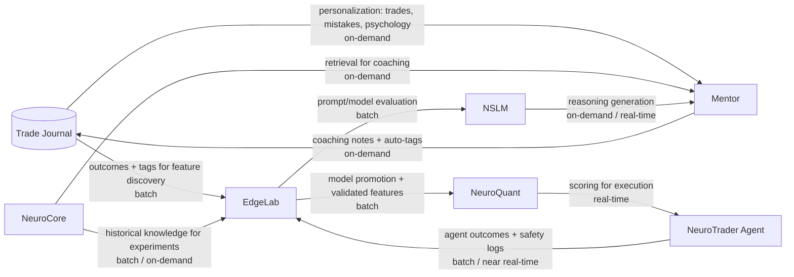

## Complete Trade Lifecycle Sequence

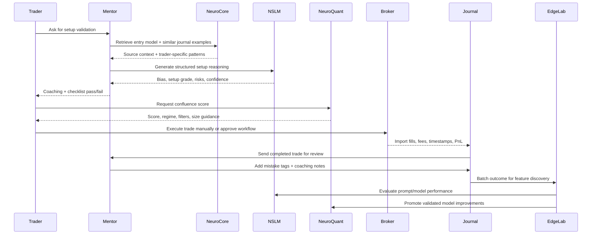

> **Pro Tip:** The lifecycle should be reviewed weekly. Daily reviews catch behavior; weekly reviews catch patterns; monthly reviews validate whether the strategy itself deserves more capital or less attention.

---

# 5. Data Sources and Data Warehousing

## 5A. Primary Data Sources

| Source | Type | Storage | Refresh Rate | Used By |
|---|---|---|---|---|
| ICT Wiki | Curated knowledge | PostgreSQL + embeddings | Manual/versioned | NeuroCore, Mentor, NSLM |
| Mentor Transcripts | Conversational knowledge | PostgreSQL | Continuous | Mentor, NeuroCore, Analytics |
| Trade Journal | Structured user data | PostgreSQL | Real-time / user entry | Mentor, EdgeLab, Analytics |
| Market Data | OHLCV futures data | Parquet on R2 | Daily / intraday | EdgeLab, NeuroQuant |
| EdgeLab Experiments | Research outputs | PostgreSQL + object storage | Per experiment | EdgeLab, NeuroQuant, NSLM |
| NSLM Versions | Prompt/model registry | PostgreSQL | Versioned releases | NSLM, EdgeLab |
| Broker Data | Trades, fills, account state | PostgreSQL | Real-time / API sync | Journal, Risk, Agent |
| Economic Calendar | News and event schedule | PostgreSQL cache | Daily / intraday | EdgeLab, NeuroQuant, Agent |

## 5B. Database Schema

NeuroSpect uses **PostgreSQL with pgvector** as the core application and intelligence database. The schema is organized around functional domains.

```sql
-- Core
users
accounts
trades
trade_fills
conversations
conversation_messages
journal_entries
journal_screenshots

-- EdgeLab
edgelab_experiments
edgelab_runs
edgelab_trades
edgelab_metrics
monte_carlo_runs
walk_forward_windows
null_tests
strategy_specs

-- Features
feature_definitions
feature_snapshots
feature_values
feature_importance
regime_classifications

-- NSLM
prompt_versions
model_versions
evaluation_runs
structured_outputs
reasoning_scores
setup_classifications

-- Analytics
trader_profiles
psychology_patterns
mistake_events
risk_events
session_analytics
setup_performance
```

## 5C. Search Architecture

NeuroCore uses **three-signal hybrid search** combined through Reciprocal Rank Fusion.

| Signal | Technology | What It Captures | Why It Matters for ICT |
|---|---|---|---|
| Keyword / BM25 | PostgreSQL `tsvector` | Exact terms such as FVG, CISD, SMT, OTE | ICT jargon is highly specific; exact matches matter |
| Semantic | `pgvector` embeddings | Conceptual similarity | Traders may ask using different wording than the source |
| Entity / Tag | Structured metadata | Instrument, session, setup, strategy, mistake | Context often determines whether a concept applies |

### Why All Three Are Needed

A query like “Why did my NY AM FVG long fail after PDL sweep?” requires exact jargon matching, conceptual reasoning about liquidity and displacement, and structured filtering by session, instrument, setup, and trader history. Keyword search alone is too brittle. Semantic search alone may blur exact definitions. Entity search alone lacks explanation. Together, they create reliable context.

## 5D. Data Flow Diagram

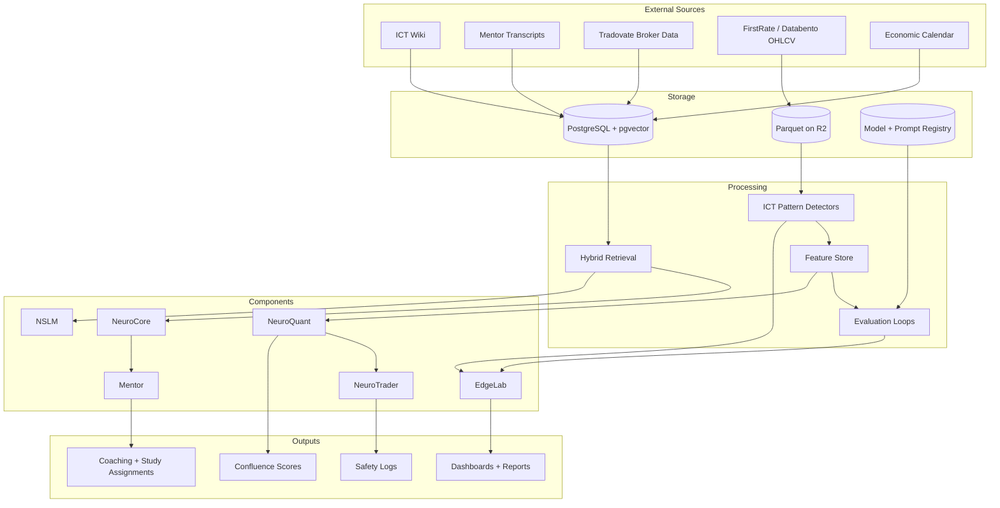

---

# 6. Analytics Surfaces — Where to View Insights

| Analytics Surface | What It Shows | Tier Required |
|---|---|---|
| Trade Journal Dashboard | PnL, win rate, R-distribution, day-of-week, session breakdown, mistake frequency | All paid |
| Psychology Profiler | Revenge trading detection, hesitation patterns, overtrading clusters, tilt sequences | Mentor `$29` |
| Entry Model Validator | Per-setup checklist pass/fail rates, setup quality scores, best/worst setups | Mentor `$29` |
| Strategy Performance Reports | Backtest equity curves, Monte Carlo fan charts, walk-forward efficiency | Trader `$99` |
| EdgeLab Experiment Dashboard | Experiment list, backtest detail, feature browser, NSLM prompt comparison | Research `$199` |
| Feature Library | Feature definitions, importance rankings, regime sensitivity, impact scores | Research `$199` |
| NeuroQuant Scoring Panel | Real-time confluence scores, regime classification, model ensemble outputs | Quant `$349` |
| NeuroTrader Monitor | Shadow/paper/live trade log, agent reasoning, safety layer triggers | Quant `$349` |
| Risk Dashboard | Drawdown curves, daily loss tracking, prop firm rule compliance, position sizing | Trader `$99` |
| Session Analytics | PnL by session, best setups per session | All paid |

## Specific Insights by Surface

| Surface | Insights a Trader Gains |
|---|---|
| Trade Journal Dashboard | Which setup actually contributes PnL; whether winners are larger than losers; which sessions create most mistakes |
| Psychology Profiler | Whether losses cluster after tilt; whether hesitation follows missed trades; whether revenge trades occur after invalidation violations |
| Entry Model Validator | Which checklist step fails most often; whether a setup is being traded outside its rules; which conditions produce the cleanest A-grade entries |
| Strategy Performance Reports | Whether the equity curve is robust; expected drawdown range; whether out-of-sample performance survives walk-forward testing |
| EdgeLab Experiment Dashboard | Which experiments are improving the edge; which prompt version grades setups better; which features are stable or unstable |
| Feature Library | Which variables matter most; how features behave by regime; which signals are redundant or harmful |
| NeuroQuant Scoring Panel | Whether current setup has enough confluence; what regime is active; whether model ensemble confidence agrees with NSLM reasoning |
| NeuroTrader Monitor | What the agent would have done; why a trade was blocked; whether safety layers are working as intended |
| Risk Dashboard | How close the trader is to daily loss limits; whether prop firm rules are safe; whether position sizing is aligned with drawdown tolerance |
| Session Analytics | Which session fits the trader’s model; whether Lunch trades are low quality; which setup performs best in NY AM vs London |

---

# 7. How Trade Data Feeds the Platform

A single trade becomes far more than a row in a journal. It becomes training data for coaching, behavior analytics, feature discovery, model evaluation, and risk improvement.

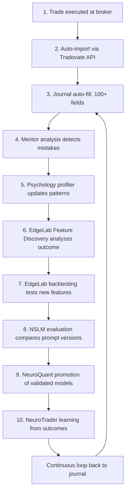

## Ten-Step Data Propagation

| Step | Data Movement | Platform Effect |
|---:|---|---|
| 1 | Broker execution creates fill data | Ground truth for entry, exit, size, and PnL |
| 2 | Tradovate API imports trade | Reduces manual journal errors |
| 3 | Journal auto-fills fields | Adds session, setup, risk, outcome, and psychology context |
| 4 | Mentor analyzes entry | Detects rule violations and coaching opportunities |
| 5 | Psychology profiler updates | Finds tilt, hesitation, revenge, overtrading patterns |
| 6 | EdgeLab Feature Discovery ingests outcome | Searches for win/loss explanatory patterns |
| 7 | Backtesting validates features | Tests whether new features improve historical results |
| 8 | NSLM evaluation compares prompt versions | Improves model reasoning and grading quality |
| 9 | NeuroQuant promotes validated models | Moves robust research into production scoring |
| 10 | NeuroTrader outcomes feed back | Improves agent safety, selectivity, and monitoring |

---

# 8. Tier Workflows with Concrete Examples

> **Reminder:** All performance data in this section is illustrative and synthetic. It is not based on live trading results.

## Illustrative Performance Data — 1-Month NQ Futures, May 2026

| Metric | Tier 1 Discretionary | Tier 2 Quant | Tier 3 Hybrid | Tier 4 S-Tier |
|---|---:|---:|---:|---:|
| Net PnL | +$1,850 | +$4,900 | +$7,450 | +$10,900 |
| Total Trades | 38 | 24 | 20 | 16 |
| Win Rate | 42% | 55% | 62% | 71% |
| Profit Factor | 1.18 | 1.72 | 2.41 | 4.28 |
| Sharpe Ratio | 0.42 | 0.91 | 1.38 | 2.14 |
| Max Drawdown | -$3,200 | -$1,800 | -$1,200 | -$820 |
| Mistakes | 24 | 8 | 4 | 2 |
| Rule Adherence | 38% | 78% | 88% | 96% |
| Execution Grade | D+ | B- | A- | A+ |
| Avg Winner | $537 | $531 | $708 | $1,073 |
| Avg Loser | $321 | $200 | $150 | $250 |
| Expectancy / Trade | $49 | $204 | $373 | $681 |

## Tier 1 Workflow — Discretionary ICT Trader

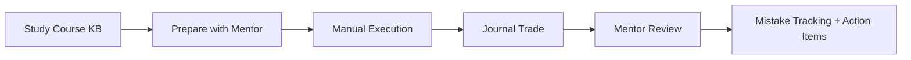

### Components Used

- Mentor
- NeuroCore
- Journal
- Course KB
- Risk Limits

### Example Trade

**Scenario:** NQ NY AM session. London sweeps the previous day’s low. The trader sees bullish displacement and a 5-minute Fair Value Gap. The trader enters long at the FVG, places the stop below the FVG, and targets the previous day’s high.

### Workflow

1. **Study:** Trader reviews liquidity sweep and FVG entry rules in the Course KB.
2. **Prepare:** Mentor creates a pre-session brief: key levels, news window, likely liquidity pools.
3. **Execute:** Trader manually enters after spotting the FVG.
4. **Journal:** Trade form captures session, setup, entry, exit, screenshot, emotion, and rule adherence.
5. **Review:** Mentor checks whether the trader waited for confirmation and respected invalidation.
6. **Improve:** Mistake tracking shows repeated early entries after a loss.

### Key Metrics

| Metric | Illustrative Result |
|---|---:|
| Net PnL | +$1,850 |
| Win Rate | 42% |
| Mistakes | 24 |
| Rule Adherence | 38% |
| Expectancy / Trade | $49 |

### What This Tier Is Missing

Tier 1 has no statistical validation, no quant filtering, no backtesting, and no production scoring. Emotional decisions are visible after the fact but not systematically blocked before entry.

---

## Tier 2 Workflow — Quant Trader

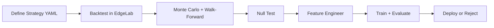

### Components Used

- EdgeLab
- Feature Store
- Model Registry
- NeuroQuant

### Example Trade

**Scenario:** The same NQ NY AM setup appears. Before entry, the model checks:

| Filter | Value | Status |
|---|---:|---|
| Displacement strength | 0.72 | Passes 0.50 threshold |
| Momentum score | 0.68 | Passes |
| HTF bias alignment | true | Passes |
| Session quality | 0.85 | Passes |

### Workflow

1. **Define Strategy:** The trader writes strategy rules in YAML.
2. **Backtest:** EdgeLab tests the strategy against historical NQ data.
3. **Validate:** Monte Carlo and walk-forward analysis check robustness.
4. **Null Test:** The strategy must outperform randomized baselines.
5. **Feature Engineer:** Loss clusters reveal weak displacement and late kill-zone entries.
6. **Train:** Model learns validated filters.
7. **Evaluate:** Performance is checked by regime and session.
8. **Deploy / Reject:** Only robust filters move to NeuroQuant.

### Key Metrics

| Metric | Illustrative Result |
|---|---:|
| Net PnL | +$4,900 |
| Win Rate | 55% |
| Mistakes | 8 |
| Rule Adherence | 78% |
| Expectancy / Trade | $204 |

### What This Tier Is Missing

Tier 2 may miss ICT contextual narrative. It can filter for displacement strength, but it may not fully understand whether the liquidity story, order block proximity, and session narrative make discretionary sense.

---

## Tier 3 Workflow — Hybrid Trader

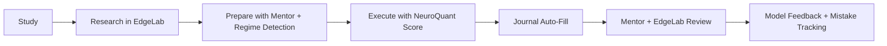

### Components Used

- Mentor
- NeuroCore
- Journal
- EdgeLab
- NeuroQuant
- NSLM

### Example Trade

The same NQ setup appears. Quant filters pass, and NSLM evaluates:

> “A+ setup — sweep of PDL confirmed bullish intent, FVG retrace to discount, OTE zone entry, kill zone active, no opposing OB within 30 points.”

**Confluence score:** `0.91`

### Workflow

1. **Study:** Trader understands the setup and context.
2. **Research:** EdgeLab confirms the setup has evidence in similar conditions.
3. **Prepare:** Mentor summarizes session bias, regime, and personal risks.
4. **Execute:** Trader uses NeuroQuant score as a final filter.
5. **Journal:** Trade data is auto-filled and enriched.
6. **Review:** Mentor explains process quality; EdgeLab compares outcome to expected behavior.
7. **Improve:** Model feedback and mistake tracking refine both trader and system.

### Key Metrics

| Metric | Illustrative Result |
|---|---:|
| Net PnL | +$7,450 |
| Win Rate | 62% |
| Mistakes | 4 |
| Rule Adherence | 88% |
| Expectancy / Trade | $373 |

### What This Tier Is Missing

Tier 3 still relies on manual execution. It lacks full automated execution, dynamic position sizing, and full regime-conditional model selection.

---

## Tier 4 Workflow — S-Tier Trader

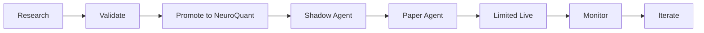

### Components Used

- Everything from previous tiers
- NeuroTrader Agent
- Five-layer safety architecture

### Example Trade

The same NQ setup appears:

| Signal | Value |
|---|---|
| Regime | TREND_BULL |
| HTF structure | Confirmed bullish |
| Feature gates | All pass |
| NSLM grade | A+ |
| NeuroQuant confluence | 0.91 |
| Size adjustment | 1.5x for A+ grade, within risk limits |
| Agent state | Shadow confirms it would enter |

The human may enter manually, or in approved limited-live mode the agent enters with all safety layers active.

### Workflow

1. **Research:** Build and test models in EdgeLab.
2. **Validate:** Require Monte Carlo, walk-forward, and null-test evidence.
3. **Promote:** Move robust model to NeuroQuant.
4. **Shadow:** Agent records what it would do.
5. **Paper:** Agent executes simulated trades.
6. **Limited Live:** Human-approved, tightly risk-controlled automation.
7. **Monitor:** Review reasoning, safety blocks, and outcomes.
8. **Iterate:** Feed results back into EdgeLab.

### Key Metrics

| Metric | Illustrative Result |
|---|---:|
| Net PnL | +$10,900 |
| Win Rate | 71% |
| Mistakes | 2 |
| Rule Adherence | 96% |
| Expectancy / Trade | $681 |

### What This Tier Adds

Tier 4 delivers maximum selectivity, fewer bad trades, higher expectancy, dynamic sizing, regime-awareness, and guarded automation. The platform handles process enforcement; the trader handles judgment and oversight.

---

# 9. EdgeLab Research Engines — Deep Dive

## 9A. Feature Discovery Engine

The **Feature Discovery Engine** turns trade outcomes into research hypotheses.

### Workflow

1. Ingest trades from backtest.
2. Segment trades into wins, losses, and breakevens.
3. Analyze conditions at entry for each losing trade.
4. Find patterns such as “85% of losses had displacement_strength < 0.4.”
5. Propose new features.
6. Simulate baseline vs feature-enhanced models.
7. If statistically significant, add the feature to the Feature Library.

### Feature Table

| Feature | Type | Description | Discovery Source |
|---|---|---|---|
| displacement_strength | 0-1 | Displacement candle magnitude vs ATR | 78% of losses < 0.4 |
| fvg_fill_percentage | 0-1 | FVG fill before entry | Winners avg 0.15, losers 0.62 |
| htf_bias_alignment | 0/1 | LTF matches HTF bias | 91% T4 wins aligned, 52% T1 losses |
| session_quality_score | 0-1 | Kill zone + volume + spread composite | Losses in sessions < 0.3 |
| ob_proximity | pts | Distance to opposing order block | 3x loss rate within 20 pts |
| consecutive_loss_flag | 0/1 | 2+ consecutive session losses | 34% of T1 losses from overtrading |
| sweep_recency | candles | Candles since liquidity sweep | 72% wins within 8 candles |
| smt_divergence_present | 0/1 | SMT confirms direction | 71% WR with vs 48% without |
| adr_percentile | 0-100 | Day's range vs 20-day ADR | >80th percentile: 2.3x more losses |
| time_in_killzone | min | Minutes remaining in kill zone | Last 10 min: 62% loss rate |

### Before / After Feature Comparison

```text
Illustrative / Synthetic Model Comparison

Metric                  Baseline Model        Feature-Enhanced Model
---------------------------------------------------------------
Win Rate                48%                   61%
Profit Factor           1.24                  2.06
Max Drawdown            -$2,900               -$1,350
Avg Trade Quality       C+                    A-
Rule Violations         19                    6
Out-of-Sample Stability Low                   Moderate/High
```

```text
Profit Factor
Baseline          ████████████ 1.24
With Features     ████████████████████ 2.06

Max Drawdown
Baseline          ████████████████████████████ -$2,900
With Features     █████████████ -$1,350
```

> **Key Insight:** EdgeLab does not assume the trader’s rules are wrong. It asks which conditions make the rules work better or worse.

## 9B. Regime-Adaptive Optimization Engine

Markets do not behave the same way every day. The same FVG continuation model may perform differently in trending, ranging, high-volatility, or transitional regimes.

### Six Regimes

| Regime | Characteristics | Parameter Adjustments |
|---|---|---|
| Trending Bull | Strong up, shallow pullbacks, HTF bullish | Widen targets to 3R, tighten filters, favor continuation |
| Trending Bear | Strong down, shallow pullbacks, HTF bearish | Widen targets to 3R, tighten filters, favor reversal sweeps |
| Range-Bound | Oscillating, no direction | Tight targets to 1.5R, stronger displacement required, favor OB bounces |
| HV Expansion | Wide candles, news-driven, fast moves | Widen stops to 2x ATR, reduce size 50%, require 2+ confirmations |
| LV Compression | Tight candles, coiling, pre-breakout | Skip most setups, wait for expansion, require max confluence |
| Transition | Regime shifting, conflicting signals | Reduce size, require max confluence, shorten hold time |

### Dynamic Condition Modifiers

| Condition | Detection | Modifier |
|---|---|---|
| Day of Week | Calendar | Mon/Fri: -25% size. Tue-Thu: full. |
| Economic News | Calendar feed | 30 min before/after high-impact: pause or 2x confluence |
| SMT Divergence | NQ vs ES comparison | Present: +0.15 confluence. Absent + required: block. |
| Session Liquidity Swept | Sweep detector | PDH/PDL swept: enable expansion. Not swept: wait. |
| Price Cycle Phase | APD detector | Consolidation: wait. Accumulation: prepare. Manipulation: alert. Distribution: enter/exit. |

### Parameter Visualization Across Regimes

```text
Illustrative / Synthetic Parameter Shifts

Regime             Target R   Stop ATR   Size   Min Confluence
--------------------------------------------------------------
Trending Bull      3.0R       1.0x       1.00x  0.72
Trending Bear      3.0R       1.0x       1.00x  0.72
Range-Bound        1.5R       0.9x       0.75x  0.78
HV Expansion       2.5R       2.0x       0.50x  0.85
LV Compression     Skip/1.0R  0.8x       0.25x  0.92
Transition         1.5R       1.2x       0.50x  0.88
```

```text
Min Confluence by Regime
Trending Bull   ███████████████ 0.72
Trending Bear   ███████████████ 0.72
Range-Bound     ████████████████ 0.78
HV Expansion    ██████████████████ 0.85
LV Compression  ████████████████████ 0.92
Transition      ███████████████████ 0.88
```

## 9C. NSLM Feature Studio

**NSLM Feature Studio** allows traders and researchers to test how structured features affect model reasoning.

### Interactive Workflow

1. Start with base NSLM baseline performance.
2. Inject feature parameters into prompt context.
3. Run simulation and inspect results.
4. Add more features and compare again.
5. Run parameter sweeps such as `displacement_strength` from 0.3 to 0.9.
6. Identify the optimal zone.
7. Change dynamic conditions such as regime, day, news, and session.
8. Let NSLM suggest missing ICT-derived features.
9. Validate new features through backtesting.
10. Add significant features to the Feature Library.

### Parameter Sweep Table

| Displacement Threshold | Trades | Win Rate | Profit Factor | Max Drawdown | Verdict |
|---:|---:|---:|---:|---:|---|
| 0.30 | 62 | 47% | 1.18 | -$3,400 | Too permissive |
| 0.40 | 48 | 53% | 1.44 | -$2,500 | Improved |
| 0.50 | 36 | 59% | 1.91 | -$1,700 | Strong |
| 0.60 | 28 | 64% | 2.18 | -$1,250 | Optimal zone |
| 0.70 | 19 | 68% | 2.05 | -$1,100 | Strong but selective |
| 0.80 | 11 | 73% | 1.72 | -$900 | Too few trades |
| 0.90 | 4 | 75% | 1.20 | -$500 | Sample too small |

> **Warning:** A higher win rate is not automatically better. If the threshold becomes too strict, the sample size may become too small to trust.

---

# 10. ICT Course Curriculum

NeuroSpect includes a structured ICT course curriculum designed to move the trader from concept recognition to rule-based application.

## Curriculum Overview

| Module | Lessons | Concepts Taught | Assessment Types |
|---|---|---|---|
| Module 1: Market Structure Foundations | 1-3 | Swings, trend, MSS, HTF/LTF alignment | Concept Quiz, Chart Identification |
| Module 2: Liquidity & Imbalance | 4-7 | Liquidity pools, sweeps, FVG, displacement, PDH/PDL | Concept Quiz, Scenario Engine |
| Module 3: Premium/Discount & PD Arrays | 8-10 | OTE, order blocks, breakers, PDA selection | Chart Identification, Sequencing |
| Module 4: Session Models & Execution | 11-14 | Asia, London, NY AM, Lunch, NY PM, kill zones | Scenario Engine, Time-Pressure Tests |
| Module 5: Entry Models & Risk | 15-18 | Seven machine-readable checklists, invalidation, sizing, review | Capstone, Journal Review |

## Assessment Types

| Assessment | Description |
|---|---|
| Concept Quiz | Tests definitions and rule comprehension |
| Interactive Chart Identification | Trader labels FVG, OB, MSS, liquidity sweep, SMT, and invalidation |
| Scenario Engine | Presents “what would you do?” trade situations |
| Engagement Tests | Matching, sequencing, and time-pressure recognition drills |

## Grading Rules

- Most lessons require **70-80%** to advance.
- Passing unlocks the next lesson.
- Failing triggers targeted study assignments based on specific mistakes.
- The capstone requires applying one of seven entry models using a machine-readable checklist.

## Visual Curriculum Map

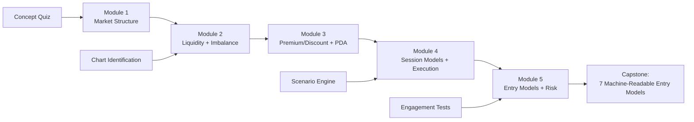

---

# 11. Competitive Capability Matrix

| Capability | ChatGPT | Journal | Backtester | Scripts | Discord | Spreadsheet | NeuroSpect |
|---|---|---|---|---|---|---|---|
| ICT-aware reasoning | No | No | No | No | Partial | No | **Yes** |
| Trade thesis generation | Partial | No | No | No | No | No | **Yes** |
| Event-driven ICT backtesting | No | No | Partial | Partial | No | No | **Yes** |
| Journal intelligence | No | Partial | No | No | No | Partial | **Yes** |
| NSLM prompt/model experimentation | No | No | No | No | No | No | **Yes** |
| Quant feature engineering | No | No | Partial | Partial | No | No | **Yes** |
| Hybrid ICT + quant modeling | No | No | No | No | No | No | **Yes** |
| Personalized coaching | Partial | No | No | No | Partial | No | **Yes** |
| Risk review | No | Partial | No | No | No | Partial | **Yes** |
| Setup validation | No | No | No | Partial | Partial | No | **Yes** |
| Model/version comparison | No | No | Partial | No | No | No | **Yes** |
| Workflow memory | Partial | No | No | No | No | No | **Yes** |
| Source-grounded knowledge | No | No | No | No | Partial | No | **Yes** |
| Shadow/paper trading roadmap | No | No | No | No | No | No | **Yes** |

**Summary:** No single competitor covers more than 3 of these 14 capabilities. NeuroSpect covers all 14.

---

# 12. Subscription Stack Replacement

## Before NeuroSpect — Eight Disconnected Tools

| Tool | Monthly Cost |
|---|---:|
| ChatGPT / Claude Pro | $20-200 |
| Tradovate / NinjaTrader | $0-60 |
| TradeZella / TraderSync | $30-50 |
| TradingView Premium | $15-60 |
| Discord signal groups | $30-100 |
| Notion / spreadsheets | $0-10 |
| Backtesting platforms | $30-80 |
| ICT course replays | $0-150 |
| **Total** | **$125-710/mo** |

## After NeuroSpect

| NeuroSpect Tier | Monthly Price | Main Value |
|---|---:|---|
| Mentor | $29 | Coaching, journal intelligence, entry validation |
| Trader | $99 | Strategy reports, risk dashboard, validation |
| Research | $199 | EdgeLab, Feature Library, NSLM experiments |
| Quant | $349 | NeuroQuant scoring, NeuroTrader roadmap |

```text
Monthly Cost Range
Before NeuroSpect  ███████████████████████████████████████ $125-$710
After NeuroSpect   ███████████████                         $29-$349
```

> **Key Insight:** The cost savings are useful, but the deeper value is integration. A cheaper stack is not enough if the trader still has to manually stitch together every insight.

---

# 13. Trader Maturity Radar

## Radar Dimensions

| Dimension | Tier 1 | Tier 2 | Tier 3 | Tier 4 |
|---|---:|---:|---:|---:|
| ICT Concept Clarity | 7 | 4 | 8 | 9 |
| Bias Consistency | 4 | 6 | 7 | 9 |
| Setup Validation | 3 | 5 | 7 | 9 |
| Execution Discipline | 3 | 7 | 7 | 9 |
| Risk Control | 3 | 7 | 8 | 9 |
| Journaling Quality | 2 | 5 | 7 | 9 |
| Backtesting Depth | 1 | 7 | 7 | 9 |
| Model Evaluation | 0 | 5 | 6 | 9 |
| Feedback Loop Quality | 2 | 5 | 7 | 9 |

## What Each Dimension Measures

| Dimension | What It Measures | How NeuroSpect Improves It |
|---|---|---|
| ICT Concept Clarity | Understanding of concepts and vocabulary | Course KB, Mentor explanations, retrieval-grounded answers |
| Bias Consistency | Ability to form and maintain directional bias | Pre-session briefs, HTF/LTF alignment checks |
| Setup Validation | Rule adherence before entry | Entry Model Validator and NSLM setup grading |
| Execution Discipline | Following plan under pressure | Journal review, mistake tags, cooldown rules |
| Risk Control | Sizing, stops, limits, drawdown discipline | Risk Dashboard and safety constraints |
| Journaling Quality | Completeness and usefulness of trade records | 100+ fields, auto-fill, AI coaching notes |
| Backtesting Depth | Historical validation quality | EdgeLab event-driven research |
| Model Evaluation | Prompt/model/version comparison | NSLM evaluation loops and EdgeLab experiments |
| Feedback Loop Quality | How quickly mistakes become improvements | Integrated journal, Mentor, EdgeLab, NeuroQuant loop |

```text
Illustrative Radar Interpretation

Tier 1: strong concepts, weak validation and feedback loop.
Tier 2: stronger testing and discipline, weaker ICT narrative.
Tier 3: balanced discretionary + quant process.
Tier 4: mature research, execution, risk, and feedback loop.
```

---

# 14. Risk Architecture & Safety

NeuroSpect’s automation philosophy is simple: **no model should trade live until it has evidence, guardrails, and human oversight.**

## Five-Layer Safety Architecture

| Layer | Safety Gate | Purpose |
|---:|---|---|
| 1 | EdgeLab evidence gate | Requires validated backtest, Monte Carlo, walk-forward, and null test p < 0.05 |
| 2 | Regime filter | Blocks trades in unfavorable regimes |
| 3 | Risk limits | Enforces daily loss, max trades, position size, drawdown circuit breakers |
| 4 | Human approval | Required for every escalation: shadow → paper → live |
| 5 | Kill switch | Instant halt at any layer |

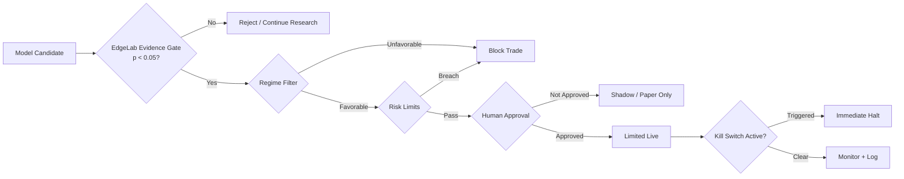

## Prop Firm Rule Presets

NeuroSpect can support presets for common prop-firm style constraints, including:

| Rule Type | Example Controls |
|---|---|
| Daily Loss Limit | Hard stop after predefined loss |
| Trailing Drawdown | Blocks new trades if drawdown threshold nears |
| Max Contracts | Prevents oversizing |
| Max Trades per Day | Blocks overtrading |
| Cooldown Timer | Requires pause after loss, rule violation, or volatility spike |
| News Windows | Pauses trading around high-impact events |

> **Warning:** Safety controls are not optional extras. They are core infrastructure. A trader who disables safety gates is no longer operating the NeuroSpect process.

---

# 15. Improvement Paths per Tier

## Tier 1 → Tier 2

| Category | Diagnosis |
|---|---|
| Current Strength | Strong ICT concept knowledge |
| Current Weakness | Emotional execution, overtrading, no data validation |
| Missing | Structured checklist, quantitative grading, journal discipline |
| Recommended Modules | Mentor, Journal, NSLM Setup Grading, EdgeLab Validation, Risk Engine |

### Eight-Step Improvement Plan

1. Define one primary entry model.
2. Convert the model into a checklist.
3. Add pre-trade checklist completion before every entry.
4. Set daily loss, max trades, and cooldown rules.
5. Use NSLM to grade every setup before or after the trade.
6. Journal every trade with required fields.
7. Backtest the model in EdgeLab.
8. Review weekly: rule adherence first, PnL second.

## Tier 2 → Tier 3

Tier 2 traders often have better discipline but may reduce ICT context into overly mechanical filters.

### Improvement Plan

1. Add NSLM narrative grading to each quant signal.
2. Label examples where the model passed but context was poor.
3. Add liquidity story fields: sweep, displacement, discount/premium, opposing PDA.
4. Run A/B tests: quant-only vs quant + NSLM context.
5. Evaluate performance by session and regime.
6. Promote only context-aware filters.

## Tier 3 → Tier 4

Tier 3 traders are balanced but still manually enforce much of the process.

### Improvement Plan

1. Deploy regime models.
2. Integrate NeuroQuant scoring into the pre-trade workflow.
3. Implement dynamic position sizing rules.
4. Run NeuroTrader in shadow mode.
5. Compare shadow decisions to actual decisions.
6. Move to paper mode only after consistent alignment.
7. Introduce limited-live automation with strict constraints.
8. Review safety events weekly.

## Tier 4 → Optimization

Tier 4 traders focus on refinement, capital allocation, and controlled expansion.

### Improvement Plan

1. Add multi-instrument research.
2. Track capital allocation by model and regime.
3. Expand agent testing across shadow and paper conditions.
4. Evaluate model drift monthly.
5. Audit feature importance stability.
6. Improve risk-adjusted returns, not just PnL.
7. Continue prompt/model version evaluation.
8. Scale only after evidence supports it.

---

# 16. Session & Day-of-Week Analytics

> **Reminder:** All performance data in this section is illustrative and synthetic.

## Session Performance — Illustrative Summary

| Session | Tier | PnL | Win Rate | Trades | Best Setup | Avoided Trades | Mistake Frequency |
|---|---|---:|---:|---:|---|---:|---:|
| Asia | T1 | -$250 | 35% | 6 | Range OB bounce | 1 | High |
| Asia | T2 | +$300 | 50% | 4 | Range mean reversion | 3 | Low |
| Asia | T3 | +$450 | 55% | 3 | HTF bias + LTF entry | 4 | Low |
| Asia | T4 | +$600 | 67% | 2 | High-confluence compression break | 6 | Very Low |
| London | T1 | +$400 | 40% | 8 | Liquidity sweep | 2 | Medium |
| London | T2 | +$900 | 55% | 5 | Sweep + displacement | 5 | Low |
| London | T3 | +$1,250 | 60% | 4 | Sweep + FVG | 6 | Low |
| London | T4 | +$1,700 | 75% | 3 | Regime-confirmed continuation | 8 | Very Low |
| New York AM | T1 | +$1,450 | 45% | 14 | FVG continuation | 3 | High |
| New York AM | T2 | +$2,500 | 60% | 8 | Quant-filtered FVG | 8 | Low |
| New York AM | T3 | +$3,900 | 68% | 7 | A+ NSLM confluence | 10 | Very Low |
| New York AM | T4 | +$5,800 | 78% | 6 | NeuroQuant A+ setup | 13 | Very Low |
| New York Lunch | T1 | -$550 | 25% | 5 | None | 0 | High |
| New York Lunch | T2 | +$100 | 45% | 3 | Tight range fade | 5 | Low |
| New York Lunch | T3 | +$200 | 50% | 2 | Rare high-confluence setup | 6 | Low |
| New York Lunch | T4 | +$300 | 50% | 1 | Agent-approved exception | 9 | Very Low |
| New York PM | T1 | +$800 | 45% | 5 | Session range expansion | 1 | Medium |
| New York PM | T2 | +$1,100 | 55% | 4 | Momentum continuation | 4 | Low |
| New York PM | T3 | +$1,650 | 60% | 4 | Late-day liquidity expansion | 6 | Low |
| New York PM | T4 | +$2,500 | 70% | 4 | Regime-aligned expansion | 8 | Very Low |

## Day-of-Week Performance

| Day | T1 PnL | T2 PnL | T3 PnL | T4 PnL | Observed Pattern |
|---|---:|---:|---:|---:|---|
| Monday | +$150 | +$500 | +$800 | +$1,200 | T1 overtrades low-clarity opens; higher tiers reduce size |
| Tuesday | +$700 | +$1,000 | +$2,100 | +$2,300 | Strongest T1 and T3 day |
| Wednesday | +$450 | +$1,400 | +$1,600 | +$2,200 | Best T2 day due to clean quant filters |
| Thursday | +$400 | +$1,300 | +$1,900 | +$3,000 | Best T4 day; regime filters align well |
| Friday | +$150 | +$700 | +$1,050 | +$2,200 | Higher tiers avoid late-week low-quality trades |

**Best days:** T1 = Tuesday, T2 = Wednesday, T3 = Tuesday, T4 = Thursday.

> **Key Insight:** Better tiers do not simply make more money by trading more. They often trade less, avoid worse conditions, and size better when confluence is strongest.

---

# 17. Mistake Taxonomy

## Mistake Catalog

| Tier | Mistake | Count | Severity |
|---|---|---:|---|
| T1 | Early entry before confirmation | 6 | HIGH |
| T1 | Ignored invalidation | 5 | HIGH |
| T1 | Traded outside model | 4 | HIGH |
| T1 | Overtraded after loss | 3 | HIGH |
| T1 | No historical validation | 2 | MED |
| T1 | Weak journal review | 2 | MED |
| T1 | Chased displacement | 1 | MED |
| T1 | Low-quality session entry | 1 | LOW |
| T2 | Missed ICT context | 3 | MED |
| T2 | Overfit filter | 2 | MED |
| T2 | Ignored liquidity narrative | 2 | MED |
| T2 | Low-context signal | 1 | LOW |
| T3 | Conflicting signal resolution | 2 | MED |
| T3 | Late entry on fast move | 1 | LOW |
| T3 | Permissive threshold | 1 | LOW |
| T4 | Over-selectivity missed opportunity | 1 | LOW |
| T4 | Conservative regime sizing | 1 | LOW |

## Severity Shift by Tier

```text
Illustrative Mistake Count
T1  ████████████████████████ 24
T2  ████████ 8
T3  ████ 4
T4  ██ 2

High-Severity Mistakes
T1  ██████████████████ 18
T2  0
T3  0
T4  0
```

As maturity increases, mistakes shift from **process-breaking violations** to **optimization-level tradeoffs**. Tier 1 loses money through avoidable rule breaks. Tier 4 may miss opportunity because it is highly selective, but the downside is better controlled.

---

# 18. Setup Performance Analysis

> **Reminder:** All performance data in this section is illustrative and synthetic.

## Setup-by-Setup Comparison

| Setup | Tier | Trades | Win Rate | Avg R | Expectancy |
|---|---|---:|---:|---:|---:|
| Liquidity Sweep + Displacement + FVG | T1 | 10 | 45% | 0.35R | $80 |
| Liquidity Sweep + Displacement + FVG | T2 | 7 | 57% | 0.72R | $210 |
| Liquidity Sweep + Displacement + FVG | T3 | 6 | 67% | 1.10R | $420 |
| Liquidity Sweep + Displacement + FVG | T4 | 5 | 80% | 1.75R | $850 |
| Market Structure Shift | T1 | 6 | 40% | 0.10R | $25 |
| Market Structure Shift | T2 | 4 | 50% | 0.45R | $150 |
| Market Structure Shift | T3 | 3 | 60% | 0.80R | $300 |
| Market Structure Shift | T4 | 2 | 75% | 1.30R | $600 |
| HTF Bias + LTF Entry | T1 | 7 | 43% | 0.22R | $50 |
| HTF Bias + LTF Entry | T2 | 4 | 55% | 0.65R | $190 |
| HTF Bias + LTF Entry | T3 | 4 | 65% | 1.00R | $380 |
| HTF Bias + LTF Entry | T4 | 3 | 72% | 1.60R | $780 |
| Order Block Continuation | T1 | 4 | 38% | -0.05R | -$20 |
| Order Block Continuation | T2 | 3 | 50% | 0.35R | $120 |
| Order Block Continuation | T3 | 3 | 58% | 0.75R | $280 |
| Order Block Continuation | T4 | 2 | 70% | 1.25R | $560 |
| Breaker Retest | T1 | 3 | 33% | -0.20R | -$70 |
| Breaker Retest | T2 | 2 | 50% | 0.25R | $90 |
| Breaker Retest | T3 | 2 | 60% | 0.70R | $260 |
| Breaker Retest | T4 | 1 | 70% | 1.20R | $500 |
| Session Range Expansion | T1 | 5 | 40% | 0.15R | $35 |
| Session Range Expansion | T2 | 3 | 55% | 0.60R | $180 |
| Session Range Expansion | T3 | 2 | 62% | 0.95R | $340 |
| Session Range Expansion | T4 | 2 | 72% | 1.50R | $700 |
| Failed FVG Continuation | T1 | 3 | 30% | -0.35R | -$120 |
| Failed FVG Continuation | T2 | 1 | 45% | 0.05R | $20 |
| Failed FVG Continuation | T3 | 0 | — | — | Avoided |
| Failed FVG Continuation | T4 | 1 | 60% | 0.80R | $300 |

## Interpretation

The same setup can perform dramatically differently depending on workflow quality. Tier 1 often sees the right pattern but enters with inconsistent confirmation. Tier 2 filters weak signals but may miss narrative context. Tier 3 combines context and evidence. Tier 4 adds regime selection, sizing, safety, and automation discipline.

---

# 19. Glossary of ICT Terms

| Term | Meaning |
|---|---|
| FVG | **Fair Value Gap**; a price imbalance often used as a retracement or continuation area |
| OB | **Order Block**; a price area associated with institutional-style order flow or displacement origin |
| MSS | **Market Structure Shift**; a structural change suggesting potential directional shift |
| CISD | **Change in State of Delivery**; shift in price delivery behavior |
| SMT | **Smart Money Technique** divergence; comparison between correlated instruments such as NQ and ES |
| OTE | **Optimal Trade Entry**; retracement zone often associated with discount/premium logic |
| PDA | **Premium/Discount Array**; price delivery reference such as FVG, OB, breaker, liquidity pool |
| HTF | Higher Timeframe |
| LTF | Lower Timeframe |
| Kill Zone | Session time window where certain ICT setups are prioritized |
| Displacement | Strong directional movement suggesting intent or imbalance |
| Liquidity Sweep | Move through a prior high/low to capture liquidity before reversal or continuation |
| Breaker | A failed order block or structure area that becomes a retest zone |
| AMD | Accumulation, Manipulation, Distribution market cycle model |
| APD | Algorithmic Price Delivery; structured view of how price moves between arrays and liquidity |
| Model 2022 | ICT-style model often involving liquidity sweep, displacement, and FVG entry logic |
| Daily Bias | Directional expectation for the day based on higher-timeframe context |
| Session Range Expansion | Expansion move from a defined session range |

---

# 20. Future Roadmap Preview

## Product Roadmap

| Phase | Name | Track | Status |
|---:|---|---|---|
| 0 | Research & Validation | A | In Progress |
| 1 | Knowledge Base & RAG MVP | A | Planned |
| 2 | Market Context & Trade Integration | A | Planned |
| 3 | Product MVP | A | Planned |
| 4 | Evaluation, Reliability & Prompt Infrastructure | A | Planned |
| 5 | Private Beta | A | Planned |
| 6 | V1 Launch | A | Planned |
| 7 | EdgeLab Foundation | B | Planned |
| 8 | Hybrid Model Research + NeuroQuant | B | Planned |
| 9 | NeuroTrader Agent | B | Planned |
| 10 | Advanced Features | — | Planned |

## Tracks

| Track | Focus |
|---|---|
| Track A: Coaching | Mentor, journal, course, RAG, reliability |
| Track B: Trading Intelligence | EdgeLab, NSLM evaluation, NeuroQuant, NeuroTrader |
| Track C: Business & Operations | Pricing, onboarding, waitlist, support, compliance, analytics |

## Go-to-Market Sequence

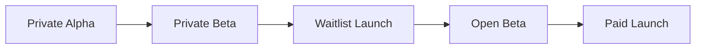

### Launch Logic

| Stage | Goal | Success Criteria |
|---|---|---|
| Private Alpha | Validate core workflow with trusted users | Users journal consistently and find Mentor useful |
| Private Beta | Test reliability and onboarding | Retention, low hallucination rate, clear setup validation |
| Waitlist Launch | Build audience and segment users | Qualified leads by trader type and maturity |
| Open Beta | Stress test product and support | Stable usage, dashboard engagement, feedback loop quality |
| Paid Launch | Monetize tiered platform | Conversion, retention, low churn, measurable user improvement |

---

# Final Disclaimers

> **All performance data in this document is illustrative and synthetic. It is not based on live trading results.**
>
> **NeuroSpect is an educational and research tool. It is not financial advice.**
>
> **Past performance — real or simulated — does not guarantee future results.**
>
> **Trading involves significant risk of loss. Only trade with capital you can afford to lose.**

