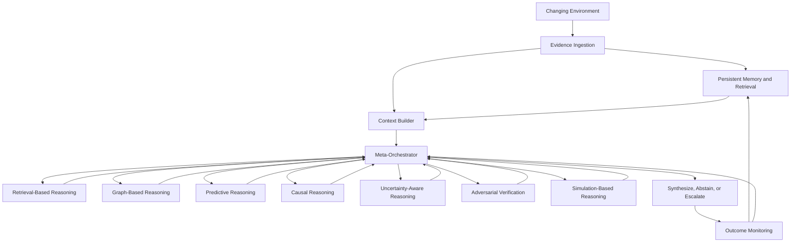
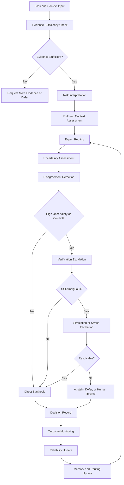
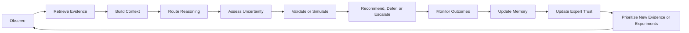
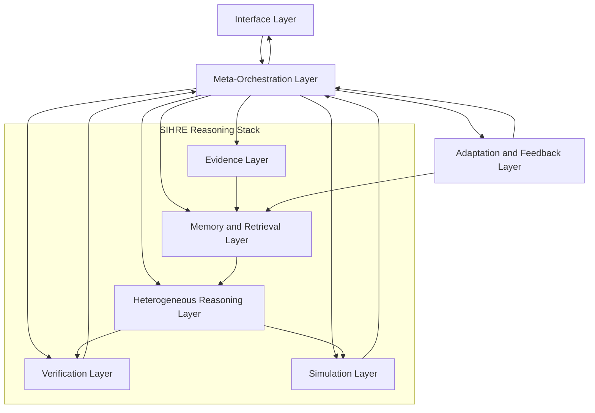
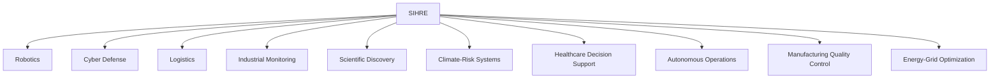

# Abstract

Modern intelligent systems often operate in environments that are non-stationary, partially observable, noisy, and difficult to validate with a single model or static ensemble. **SIHRE** — **Self-Improving Heterogeneous Reasoning Ensemble** — is a proposed domain-general architecture for coordinating multiple reasoning modalities through a meta-orchestration layer. Rather than treating expert outputs as fixed signals to be averaged, SIHRE frames reasoning as a governed process: evidence is retrieved, memory is consulted, specialized experts are routed dynamically, uncertainty is assessed, disagreement triggers verification or simulation, and expert reliability is updated over time. The framework draws from compound AI systems, online learning with expert advice, mixture-of-experts, continual learning, causal inference, uncertainty quantification, retrieval-augmented reasoning, knowledge graphs, active learning, self-supervised representation learning, and agentic workflows. Its contribution is architectural rather than component-level: SIHRE proposes a reasoning-governance structure for adaptive expert composition, cross-modality validation, persistent memory, and continuous improvement under distributional change.

# 1. Introduction

Real decision systems rarely operate in stationary conditions. Sensor quality changes, interventions perturb normal behavior, upstream dependencies shift, and the evidence available at decision time is often incomplete or contradictory. Research on concept drift, continual learning, uncertainty under distribution shift, and partially observable decision-making all points to the same practical problem: an intelligent system must not only make predictions, but also decide when its prior assumptions, evidence sources, and expert pathways have become unreliable.

Recent work on compound AI systems argues that robust performance increasingly comes from systems of interacting components rather than from scaling a single model in isolation. Classic ensemble learning and online learning with expert advice showed how multiple predictors can be combined and reweighted over time. Mixture-of-experts systems extended this idea with input-dependent routing. Retrieval-augmented generation, knowledge graphs, causal toolkits, conformal prediction, multi-agent verification, simulation, and active learning each add useful capabilities. Yet these ideas are often treated as separate modules rather than as parts of one governed reasoning process.

SIHRE is proposed as a response to that gap. It is not defined by a fixed number of experts, a fixed inventory of modalities, or a single optimization recipe. Instead, it is a modality-agnostic architecture for coordinating multiple heterogeneous reasoning pathways under drift. SIHRE is closer to a governed compound reasoning system than to a conventional ensemble. Its central question is:

> **How should an adaptive system decide which expert to consult, when to trust or distrust a conclusion, when to ask for more evidence, when to escalate to verification or simulation, and how to remember failures well enough to improve future reasoning?**

This paper makes three contributions:

1. **Architecture definition.** It defines SIHRE as a domain-general architecture for meta-orchestrated heterogeneous reasoning.
2. **Governance framing.** It introduces a governance view of expert composition in which uncertainty, disagreement, memory, evidence quality, and validation outcomes determine which reasoning pathways are trusted.
3. **Evaluation framing.** It proposes public-safe evaluation dimensions for adaptive reasoning systems under drift, including calibration, escalation quality, abstention quality, recovery after shift, expert contribution, and system-level reliability.

# 2. Motivation

Single-model systems are often brittle for three related reasons. First, they can overfit to historical operating states and underperform after drift. Second, they can remain overconfident under dataset shift, even when predictions become less reliable. Third, they tend to compress retrieval, representation, correlation, mechanism, explanation, and calibration into one output channel, which obscures when the system should defer, abstain, or seek validation.

A robotics system navigating terrain after heavy rain illustrates the problem. A geometric planner, a learned terrain classifier, a retrieval system for prior map fragments, and an uncertainty wrapper may each be useful, but not equally useful in every context. Similarly, an industrial monitoring system may trust statistical anomaly detection during routine operation, but prefer retrieved maintenance records, causal diagnostics, or synthetic fault scenarios after an unusual intervention. In both cases, the challenge is not merely to have many models. The challenge is to govern disagreement, degrade trust when calibration worsens, and trigger more expensive checks only when justified.

SIHRE is motivated by this need for **adaptive reasoning governance**. The framework assumes that robust reasoning under non-stationarity requires explicit mechanisms for:

- evidence retrieval and memory;
- uncertainty calibration and abstention;
- causal and mechanistic challenge;
- adversarial or independent verification;
- simulation-based stress testing;
- dynamic expert routing;
- expert reliability tracking; and
- continuous, bounded self-improvement.

# 3. Background and Related Work

## 3.1 Compound and modular AI systems

Compound AI systems combine multiple models, tools, retrieval systems, memories, planners, and verification components into larger workflows. This line of work motivates SIHRE's system-level framing: intelligence is not treated as a single model output, but as the result of coordinated components with different strengths, costs, and failure modes. SIHRE sits within this broad family, but narrows the focus to governed heterogeneous reasoning under non-stationarity.

## 3.2 Expert advice, adaptive ensembles, and mixture-of-experts

Online learning with expert advice provides the mathematical intuition for adaptive trust. The Weighted Majority algorithm, Tracking the Best Expert, and Dynamic Weighted Majority formalize how a master learner can down-weight poor experts, track changing comparators, and add or remove experts under drift. Mixture-of-experts systems add input-dependent routing among specialized components. SIHRE extends these intuitions from scalar prediction aggregation to broader reasoning governance: retrieval experts, graph experts, causal experts, uncertainty wrappers, critics, and simulation modules can all become governed participants.

## 3.3 Meta-learning, continual learning, and drift adaptation

Meta-learning studies systems that learn how to learn, while continual learning studies how systems adapt over time without catastrophic forgetting or loss of plasticity. SIHRE aligns with this motivation but does not assume that a single learner must absorb all future change. Instead, adaptation is distributed across persistent memory, expert reliability estimates, routing preferences, domain context, and expert lifecycle decisions.

## 3.4 Causality and uncertainty quantification

Causal inference and causal discovery help distinguish mechanism hypotheses from brittle associations, especially when operating conditions change. Uncertainty quantification, including deep ensembles and conformal prediction, helps systems express when outputs should be treated as unreliable or require wider prediction sets. SIHRE treats causal and uncertainty-aware methods not as isolated analytics add-ons, but as governance inputs that can trigger routing changes, verification, abstention, or further evidence gathering.

## 3.5 Memory, retrieval, and knowledge graphs

Retrieval-augmented generation and knowledge graph research show that reasoning quality can improve when systems retrieve external evidence, maintain structured context, and revisit prior outcomes. SIHRE uses memory and retrieval as core components of adaptive reasoning. Memory is not merely storage; it provides provenance, prior failures, expert reliability history, domain context, and evidence trails that influence future orchestration.

## 3.6 Agentic reasoning, verification, and autonomous discovery

Agentic systems interleave reasoning, tool use, planning, and memory. Multi-agent debate and adversarial verification can improve reasoning in some cases, but research also shows that critics and debates can fail when they are redundant, poorly grounded, or persuasive without being correct. SIHRE therefore treats adversarial verification as a selective escalation pathway rather than a universal default.

Active learning, self-supervised representation learning, synthetic scenario generation, and autonomous scientific discovery systems also provide important building blocks. SIHRE's novelty claim is not that any one of these components is new. Its claim is that these components can be organized under a single meta-orchestrated reasoning-governance architecture for non-stationary environments.

# 4. SIHRE Architecture Overview

SIHRE is designed as a layered architecture. The architecture separates evidence, memory, reasoning, verification, simulation, orchestration, adaptation, and interface responsibilities while allowing feedback between them.

| Layer | Purpose | Public-safe examples |
|---|---|---|
| Evidence layer | Ingest observations, documents, telemetry, event logs, and derived features. | Sensor streams, maintenance records, incident logs, experimental notes. |
| Memory and retrieval layer | Store retrievable evidence, structured context, provenance, prior outcomes, and expert reliability history. | Case memory, vector retrieval, knowledge graphs, temporal records. |
| Reasoning modality layer | Host heterogeneous experts that reason from different representations or assumptions. | Predictive, retrieval, graph, causal, uncertainty-aware, simulation-based, and adversarial experts. |
| Verification layer | Challenge provisional conclusions using critics, counter-evidence, contradiction checks, or independent review pathways. | Consistency checks, independent critiques, counterfactual challenge. |
| Simulation layer | Explore alternative conditions and stress assumptions under changed environments. | Synthetic operating scenarios, sensitivity probes, stress environments. |
| Meta-orchestration layer | Route tasks, compose experts, govern escalation, update trust, and decide whether to synthesize, defer, or request more evidence. | Context-conditioned routing, dynamic trust, abstention, expert lifecycle governance. |
| Adaptation layer | Update memory, reliability estimates, routing preferences, and research-action priorities over time. | Feedback integration, expert demotion or promotion, experiment prioritization. |
| Interface layer | Communicate recommendations, uncertainty, explanations, and escalation or deferral states. | Decision support output, confidence summaries, audit logs, human review requests. |

A useful way to interpret SIHRE is as a dynamically evolving reasoning topology. Not every task touches every expert, and not every expert should always be trusted. Under low uncertainty and routine conditions, SIHRE may route mostly through lightweight retrieval and predictive pathways. Under disagreement or suspected drift, it may activate graph context, causal checks, verification, or simulation. Under severe ambiguity, it may recommend deferral, abstention, or new evidence collection rather than forcing a conclusion.

# 5. Heterogeneous Reasoning Modalities

SIHRE assumes multiple classes of reasoning modality, not one universal form of intelligence. The specific modalities used in any implementation may vary by domain, but the public framework treats them as interchangeable participants in an extensible reasoning topology.

**Retrieval-based reasoning** brings in relevant prior evidence, documents, or analogous cases through explicit non-parametric memory. **Graph-based reasoning** organizes entities, relations, constraints, provenance, and temporal context that are difficult to represent in flat tables or isolated text. **Statistical predictive reasoning** remains useful for pattern extraction, temporal inference, ranking, anomaly scoring, and classification. **Causal reasoning** tests mechanism hypotheses and distinguishes potentially stable relationships from brittle associations. **Uncertainty-aware reasoning** wraps predictions with calibration, intervals, abstention criteria, or coverage estimates.

Additional modalities extend the architecture from prediction to governance. **Adversarial reasoning** challenges tentative conclusions with counterarguments or independent critics. **Simulation-based reasoning** generates alternative operating conditions or stress environments to probe sensitivity. **Representation-learning-based reasoning** compresses unlabeled observations into reusable latent structure. **Generative hypothesis reasoning** proposes explanatory or experimental candidates for follow-up rather than only producing scores.

The important point is not that all modalities must always be present. SIHRE is defined by the governance pattern: multiple heterogeneous reasoning pathways are selectively invoked, compared, challenged, weighted, and revised over time.

# 6. Meta-Orchestrator

> **Definition.** The SIHRE meta-orchestrator is a reasoning-governance layer that selects, sequences, weights, challenges, suppresses, or promotes heterogeneous reasoning modalities based on task context, evidence quality, uncertainty, disagreement, historical reliability, computational cost, and observed outcomes.

The meta-orchestrator is the center of SIHRE. It is the difference between a simple collection of models and a self-improving heterogeneous reasoning architecture.

Its first role is **task interpretation**: determining whether a query is routine or novel, evidence-rich or evidence-poor, low-cost or high-cost to get wrong, and stable or likely affected by drift. Its second role is **expert routing**: choosing which experts are eligible, which are required, and which are unreliable or too expensive for the current context. Its third role is **adaptive trust weighting**: combining expert outputs according to historical reliability, current uncertainty, disagreement patterns, latency constraints, and outcome feedback.

The meta-orchestrator also functions as a **reasoning governor** rather than only a combiner. When experts agree and calibration appears healthy, it may accept a synthesis with minimal escalation. When uncertainty grows or conflict appears, it can invoke critics, retrieve more context, ask for new evidence, or call the simulation layer. When an expert's performance degrades, the orchestrator can suppress, quarantine, demote, or relegate that expert to advisory status. When a new expert repeatedly proves reliable in a narrow context, the orchestrator can promote it.

A critical function is **disagreement management**. Disagreement is useful only when it is structured and interpretable. Otherwise, it can amplify noise or persuasion bias. SIHRE therefore treats disagreement as a signal for escalation, not as evidence of depth in itself. Similarly, it treats uncertainty as a control variable for routing, abstention, and information gathering rather than as a decorative confidence score.

The meta-orchestrator should maintain records of:

- which experts were invoked;
- which experts agreed or disagreed;
- whether uncertainty was calibrated;
- when verification or simulation was triggered;
- whether the final output was accepted, deferred, or escalated;
- how outcomes compared to expectations; and
- how expert trust changed after feedback.

These records make orchestration auditable and provide the substrate for bounded self-improvement.

# 7. Self-Improvement Loop

SIHRE's operating cycle can be summarized as:

1. observe the environment;
2. retrieve relevant evidence;
3. build context from memory and domain state;
4. route the task through selected reasoning modalities;
5. quantify uncertainty;
6. challenge preliminary conclusions;
7. simulate alternatives or stress conditions when needed;
8. synthesize, defer, or escalate;
9. monitor outcomes;
10. update memory;
11. update expert trust; and
12. propose the next useful evidence-gathering or experimental action.

In SIHRE, **self-improvement is bounded**. It refers to updates to memory, expert reliability estimates, routing preferences, evaluation records, and research-action priorities. It does not require unrestricted autonomous modification of the system's objectives, safety constraints, or deployment boundaries.

A simple illustration is an industrial monitoring system supervising a fleet of compressors. Early in deployment, SIHRE may rely heavily on retrieval of maintenance records and broad anomaly thresholds. As outcomes accumulate, the orchestrator learns which experts are reliable under high load, which critics are useful after interventions, and which synthetic fault scenarios are informative for stress testing. The system improves not because one model becomes universally correct, but because the architecture becomes better at knowing **which reasoning path to trust under which operating state**.

# 8. Domain Adaptation

SIHRE is domain-general at the orchestration level and domain-specific at the evidence, ontology, validation, and expert-implementation level. A robotics implementation, cyber defense implementation, healthcare decision-support implementation, and scientific discovery implementation may all instantiate SIHRE differently while sharing the same governance principles.

| Layer | General or domain-specific? | Role in SIHRE |
|---|---|---|
| Meta-orchestration principles | Domain-general | Govern routing, trust, escalation, abstention, and expert lifecycle. |
| Evidence interfaces | Domain-specific | Define which observations, records, logs, or events enter the system. |
| Ontologies and state descriptors | Domain-specific | Define entities, relations, context, constraints, and operating states. |
| Reasoning modalities | Mixed | Some modalities are generic; expert implementations are usually domain-tuned. |
| Validation metrics | Domain-specific | Define what counts as success, failure, error, cost, or recovery. |
| Simulation environments | Domain-specific | Represent plausible alternative conditions and stress scenarios. |
| Governance policies | Risk-specific | Define human oversight, auditability, abstention, and escalation requirements. |

In robotics, domain adaptation may mean combining scene observations, maps, control constraints, and partial observability. In cyber defense, it may mean linking logs, entity graphs, anomaly detectors, and adversarial critics. In healthcare decision support, it may mean combining patient context, retrieved guidelines, uncertainty wrappers, and causal checks. In scientific discovery, it may mean linking hypotheses, experimental records, literature retrieval, simulation, and active learning.

# 9. Evaluation Framework

SIHRE should be evaluated as a system, not merely as a collection of components. A strong single expert is not enough if routing is poor, critics are weak, memory retrieval fails, or uncertainty estimates collapse under shift. Likewise, a sophisticated orchestrator is not enough if its added complexity does not improve reliability, calibration, recovery, or decision quality.

| Evaluation axis | Core question |
|---|---|
| Drift robustness | Does SIHRE degrade gracefully after distribution shift? |
| Calibration | Does uncertainty remain meaningful when conditions change? |
| Escalation quality | Does the orchestrator invoke verification or simulation at the right times? |
| Abstention quality | Does the system defer when evidence is insufficient or uncertainty is too high? |
| Expert contribution | Which modalities actually improve outcomes, and in which contexts? |
| Disagreement resolution | Does structured disagreement improve decisions, or merely add noise? |
| Memory usefulness | Does retrieved context improve future reasoning and reduce repeated failures? |
| Recovery speed | How quickly does trust update after expert reliability changes? |
| Causal stability | Do mechanism hypotheses remain useful under changed conditions? |
| Simulation usefulness | Do synthetic stress environments reveal fragility without producing false confidence? |
| Cost-benefit | Does added reasoning complexity justify computational and operational cost? |
| Auditability | Can the system explain why an expert was trusted, suppressed, escalated, or ignored? |

Public evaluation should emphasize temporal validation, ablation studies, calibration under shift, expert contribution analysis, disagreement-resolution performance, memory usefulness, recovery after distribution shift, and computational efficiency. Evaluation should also record when the system recommends, defers, escalates, or requests additional evidence.

# 10. Applications

SIHRE is relevant anywhere decisions must be made from incomplete, changing, and heterogeneous evidence. Plausible public-safe application areas include:

- robotics;
- cyber defense;
- industrial monitoring;
- logistics;
- scientific discovery;
- climate-risk modeling;
- healthcare decision support;
- autonomous operations;
- manufacturing quality control;
- energy-grid optimization;
- spacecraft operations; and
- supply-chain monitoring.

In each case, the value proposition is not perfect prediction. It is a structured way to combine retrieval, memory, specialized reasoning, calibrated uncertainty, validation, simulation, and adaptation when the environment does not stand still.

# 11. Novelty and Contributions

> **Central novelty claim.** SIHRE proposes a domain-general architecture in which heterogeneous reasoning modalities are governed by a meta-orchestrator that dynamically routes, validates, calibrates, and updates expert trust under non-stationarity.

This claim is intentionally architectural. SIHRE does not claim that ensemble learning, expert routing, meta-learning, continual learning, causal inference, conformal prediction, knowledge graphs, retrieval augmentation, debate systems, active learning, self-supervised learning, or scientific hypothesis generation are individually new. Rather, SIHRE proposes a coherent integration of these components under one reasoning-governance layer.

The novelty claim has four parts:

1. **Meta-orchestrated heterogeneous reasoning.** SIHRE coordinates different forms of reasoning rather than merely voting over similar predictors.
2. **Continuous trust governance.** Expert reliability is updated over time and conditioned on context.
3. **Cross-modality validation loops.** Causal, uncertainty-aware, adversarial, and simulation-based reasoning can challenge ordinary predictions or conclusions.
4. **Bounded self-improvement.** Memory, evidence priorities, expert trust, and reasoning pathways evolve with outcomes while remaining subject to governance constraints.

# 12. Limitations, Non-Goals, and Governance

SIHRE introduces substantial risks. A meta-orchestrator can overfit, learning transient routing preferences that do not generalize beyond recent conditions. Synthetic stress environments can mislead if their generators omit important causal modes or unusual conditions. Causal discovery can be unstable under hidden confounding or changing mechanisms. Critic systems can fail through correlated blind spots, weak task verification, or persuasive but incorrect arguments. Continual adaptation can destabilize earlier competence. The system's computational overhead may also be unjustified if task difficulty does not require escalated reasoning.

There are also governance challenges. Compound and agentic systems are harder to audit than single predictors because errors can emerge from interactions between routing, memory, critics, retrieval, and simulation rather than from one model alone. For high-stakes use cases, SIHRE should be paired with logging, provenance, human oversight, abstention policies, explicit safety constraints, and reviewable decision records.

## Non-goals

SIHRE is not proposed as a universal reasoning engine, a replacement for domain expertise, or a guarantee of correctness under distribution shift. It is not a mandate to add more experts for their own sake. It is a framework for organizing, evaluating, and adapting heterogeneous reasoning systems under changing conditions.

# 13. Future Work

The most useful next research steps are not merely adding more experts. They are:

- standardizing modality interfaces;
- building open non-stationary benchmarks;
- studying orchestrator stability;
- formalizing trust-update rules;
- designing uncertainty-governed escalation policies;
- evaluating abstention quality;
- improving critic reliability;
- measuring memory usefulness;
- testing recovery after distribution shift; and
- designing audit protocols for compound reasoning systems.

There is also a need for frameworks that combine human oversight with adaptive system learning, especially when the same architecture is expected to operate across domains with different costs of error and different evidence topologies.

# 14. Conclusion

SIHRE is best understood as a public research framework for adaptive intelligence under non-stationarity. Its purpose is not to replace existing methods with a single universal model, but to provide an architecture for coordinating multiple reasoning modalities, governing uncertainty, validating conclusions, remembering failures, and improving over time. If developed carefully, SIHRE may provide a useful conceptual bridge between classical ensemble methods, knowledge-rich reasoning systems, uncertainty-aware decision tools, and emerging agentic and autonomous scientific workflows. Its strongest claim is architectural: a proposed design for self-improving heterogeneous reasoning in changing environments.

# Appendix A: Public-Safe Architecture Diagrams

The following diagrams are intentionally conceptual. They omit expert counts, routing thresholds, private schemas, implementation-specific identifiers, and domain-sensitive workflows.

## Figure 1. High-Level SIHRE Architecture

**Caption.** SIHRE as an orchestrator-centered compound reasoning system linking environment, evidence, memory, experts, verification, simulation, synthesis, monitoring, and feedback.

## Figure 2. Meta-Orchestrator Workflow

**Caption.** Context-conditioned routing and governance from task interpretation to synthesis, abstention, escalation, and reliability update.

## Figure 3. Self-Improvement Loop

**Caption.** SIHRE's bounded improvement cycle from observation to evidence retrieval, reasoning, validation, monitoring, trust revision, and experiment proposal.

## Figure 4. Public-Safe Layered Architecture

**Caption.** A layered view showing the meta-orchestrator as a governance layer that coordinates the reasoning stack rather than appearing as a final linear step.

## Figure 5. Domain-General Application Map

**Caption.** Example public-safe domains where SIHRE-style reasoning governance may be useful.

# Appendix B: Public-Safe Boundary Checklist

This checklist is intended to support safe publication. It can be removed from the public version if the paper is submitted to a formal venue.

| Public-safe content | Content to avoid disclosing | Public-safe treatment |
|---|---|---|
| SIHRE as a framework name | Private implementation names or internal codenames | Use only SIHRE in public materials. |
| Extensible heterogeneous reasoning | Fixed modality inventory or expert count | Use "multiple modalities" and "extensible reasoning experts." |
| High-level architecture | Routing thresholds, formulas, weights, task policies, or scheduling logic | Use conceptual terms such as meta-orchestration and adaptive trust. |
| Memory, retrieval, and graph context | Private schemas, ontologies, provenance tables, or memory layouts | Use generalized terms such as persistent memory and retrievable evidence. |
| Evaluation methodology | Sensitive benchmark values or competitive performance details | Describe methods without edge-revealing results. |
| Neutral public examples | Sensitive domain workflows or operational examples | Use robotics, industrial monitoring, cyber defense, logistics, or scientific discovery. |
| Uncertainty-aware interfaces | Domain-specific downstream action logic | Use recommend, defer, abstain, escalate, or request evidence. |
| Architectural novelty | Claims that every component is individually new | Frame novelty as integration and governance. |

# References

1. Berkeley Artificial Intelligence Research. "The Shift from Models to Compound AI Systems." 2024.
2. Littlestone, N., and Warmuth, M. K. "The Weighted Majority Algorithm." *Information and Computation*, 1994.
3. Herbster, M., and Warmuth, M. K. "Tracking the Best Expert." *Machine Learning*, 1998.
4. Kolter, J. Z., and Maloof, M. A. "Dynamic Weighted Majority: An Ensemble Method for Drifting Concepts." *Journal of Machine Learning Research*, 2007.
5. Jacobs, R. A., Jordan, M. I., Nowlan, S. J., and Hinton, G. E. "Adaptive Mixtures of Local Experts." *Neural Computation*, 1991.
6. Shazeer, N., et al. "Outrageously Large Neural Networks: The Sparsely-Gated Mixture-of-Experts Layer." 2017.
7. Finn, C., Abbeel, P., and Levine, S. "Model-Agnostic Meta-Learning for Fast Adaptation of Deep Networks." ICML, 2017.
8. Hospedales, T., Antoniou, A., Micaelli, P., and Storkey, A. "Meta-Learning in Neural Networks: A Survey." *IEEE Transactions on Pattern Analysis and Machine Intelligence*, 2021.
9. Gama, J., Zliobaite, I., Bifet, A., Pechenizkiy, M., and Bouchachia, A. "A Survey on Concept Drift Adaptation." *ACM Computing Surveys*, 2014.
10. Wang, L., Zhang, X., Su, H., and Zhu, J. "A Comprehensive Survey of Continual Learning: Theory, Method and Application." 2023.
11. Pearl, J. *Causality: Models, Reasoning, and Inference.* Cambridge University Press, 2009.
12. Sharma, A., and Kiciman, E. "DoWhy: An End-to-End Library for Causal Inference." 2020.
13. Blöbaum, P., et al. "DoWhy-GCM: An Extension of DoWhy for Causal Graphical Models." 2022.
14. Angelopoulos, A. N., and Bates, S. "A Gentle Introduction to Conformal Prediction and Distribution-Free Uncertainty Quantification." 2021.
15. Xu, C., and Xie, Y. "Conformal Prediction Interval for Dynamic Time-Series." 2021.
16. Xu, C., and Xie, Y. "Sequential Predictive Conformal Inference for Time Series." 2023.
17. Lakshminarayanan, B., Pritzel, A., and Blundell, C. "Simple and Scalable Predictive Uncertainty Estimation Using Deep Ensembles." NeurIPS, 2017.
18. Ovadia, Y., et al. "Can You Trust Your Model's Uncertainty? Evaluating Predictive Uncertainty Under Dataset Shift." NeurIPS, 2019.
19. Ji, S., Pan, S., Cambria, E., Marttinen, P., and Philip, S. Y. "A Survey on Knowledge Graphs: Representation, Acquisition, and Applications." *IEEE Transactions on Neural Networks and Learning Systems*, 2021.
20. Lewis, P., et al. "Retrieval-Augmented Generation for Knowledge-Intensive NLP Tasks." NeurIPS, 2020.
21. Edge, D., et al. "From Local to Global: A GraphRAG Approach to Query-Focused Summarization." 2024.
22. Yao, S., et al. "ReAct: Synergizing Reasoning and Acting in Language Models." ICLR, 2023.
23. Wang, G., et al. "Voyager: An Open-Ended Embodied Agent with Large Language Models." 2023.
24. Du, Y., et al. "Improving Factuality and Reasoning in Language Models through Multiagent Debate." 2023.
25. Pan, A., et al. "Why Do Multi-Agent LLM Systems Fail?" 2025.
26. Settles, B. "Active Learning Literature Survey." University of Wisconsin-Madison, 2009.
27. Li, Y., et al. "A Survey on Deep Active Learning." 2024.
28. Chen, T., Kornblith, S., Norouzi, M., and Hinton, G. "A Simple Framework for Contrastive Learning of Visual Representations." ICML, 2020.
29. Yue, Z., Wang, Y., Duan, J., Yang, T., Huang, C., Tong, Y., and Xu, B. "TS2Vec: Towards Universal Representation of Time Series." AAAI, 2022.
30. Yoon, J., Jarrett, D., and van der Schaar, M. "Time-Series Generative Adversarial Networks." NeurIPS, 2019.
31. Burger, B., et al. "A Mobile Robotic Chemist." *Nature*, 2020.
32. Boiko, D. A., MacKnight, R., Kline, B., and Gomes, G. "Autonomous Chemical Research with Large Language Models." *Nature*, 2023.
33. Xiong, G., et al. "Improving Scientific Hypothesis Generation with Knowledge-Grounded Large Language Models." 2024.
34. Yang, Q., et al. "Automated Open-Domain Scientific Hypotheses Discovery." 2023.
