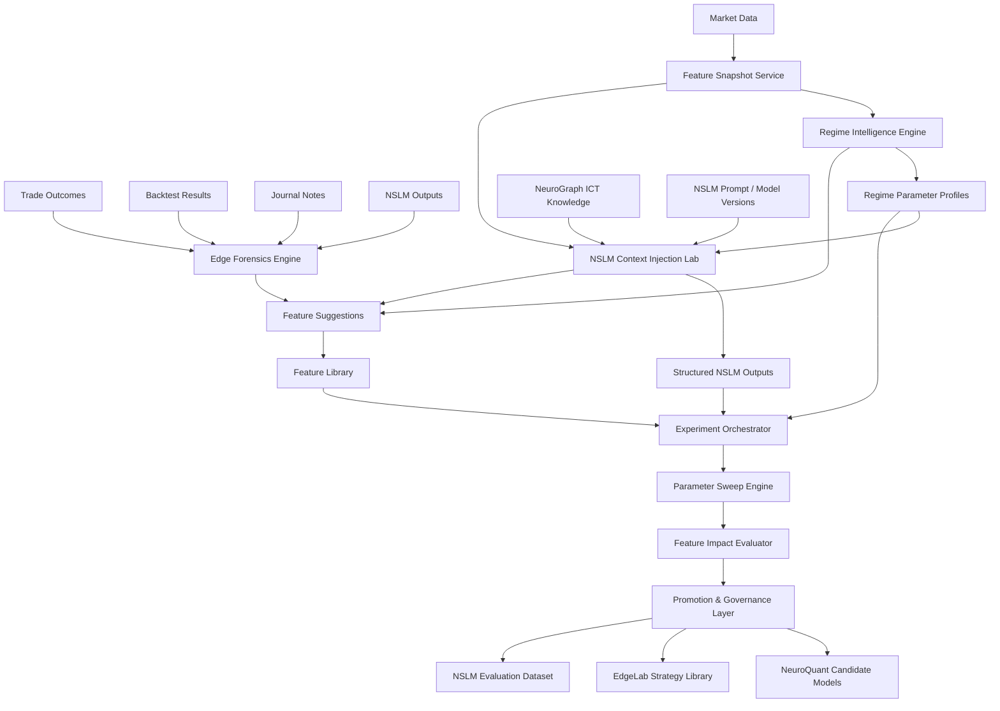
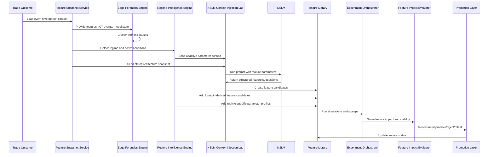
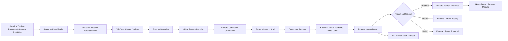
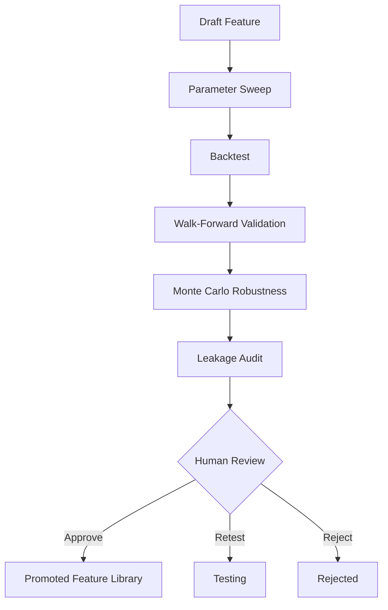
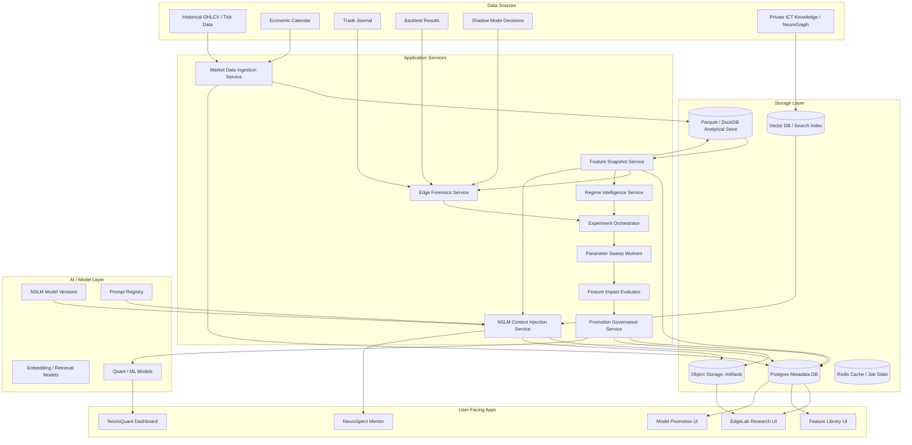

# NeuroSpect Adaptive Edge Engine — Design Doc

## 1. Executive Summary

The **NeuroSpect Adaptive Edge Engine** is a proposed research platform inside NeuroSpect EdgeLab that turns trading outcomes into better features, better model parameters, better NSLM prompts, and stronger hybrid trading models.

It is designed to answer one core question:

> Why did this model win or lose, and what feature, parameter, regime filter, or NSLM reasoning improvement would have changed the outcome?

The engine connects three major capabilities:

1. **Edge Forensics Engine** — analyzes wins, losses, skipped trades, and breakevens to discover what market conditions and feature states caused performance outcomes.
2. **Regime Intelligence Engine** — detects market regimes and tunes feature/model parameters by regime, session, news state, liquidity state, and price cycle.
3. **NSLM Context Injection Lab** — injects structured quant, ICT, regime, and trade-context features into NSLM prompts so NSLM can generate classifications, hypotheses, feature suggestions, and parameter improvements.

The output of the system is a continuously improving **Feature Library** of validated, versioned, testable features.

This system should be treated as a **research and decision-support layer**, not a trading signal guarantee. All trading decisions, model promotions, and automated workflows should remain gated by validation, risk controls, and human review.

---

## 2. Naming System

### Recommended Overall Platform Name

## **NeuroSpect Adaptive Edge Engine**

**Short description:**
A research engine that converts historical trade outcomes, market regimes, quant features, and NSLM reasoning into validated feature improvements and model upgrades.

**Product positioning:**

> Adaptive Edge Engine helps NeuroSpect learn from every win, loss, regime shift, and model experiment — turning raw outcomes into testable feature upgrades.

Alternative names:

| Name                                       | Notes                                              |
| ------------------------------------------ | -------------------------------------------------- |
| **Adaptive Edge Engine**                   | Best overall name; clear and product-ready.        |
| **EdgeLab Adaptive Research System**       | More technical and tied directly to EdgeLab.       |
| **NeuroSpect Feature Intelligence Engine** | Clear if emphasizing feature creation and ranking. |
| **NeuroSpect Model Improvement Loop**      | Accurate, but less premium.                        |
| **Edge Intelligence Engine**               | Strong, but slightly broad.                        |

Recommended final:

```text
NeuroSpect Adaptive Edge Engine
```

---

## 3. Core Components

## 3.1 Edge Forensics Engine

### Previous working idea

> Feature researcher — analyzes past trading model performance, gathers all data that caused a losing trade, and creates, adds, or removes features that will mitigate the loss. Same for wins.

### Formal name

## **Edge Forensics Engine**

### Description

**Edge Forensics Engine** analyzes past wins, losses, breakevens, skipped trades, and model decisions to identify the conditions that caused performance outcomes. It gathers trade context, market data, ICT events, quant features, NSLM outputs, journal notes, and model state to explain why a trade or strategy variant succeeded or failed.

It then recommends:

* new feature candidates,
* features to remove,
* feature parameter changes,
* regime-specific filters,
* prompt/model evaluation cases,
* backtest experiments,
* validation tests,
* feature library promotions or rejections.

### What it does

| Capability                  | Description                                                                                                  |
| --------------------------- | ------------------------------------------------------------------------------------------------------------ |
| Loss clustering             | Groups losing trades by shared conditions.                                                                   |
| Win clustering              | Finds repeated conditions behind profitable trades.                                                          |
| Feature contribution review | Identifies which features helped, hurt, or added noise.                                                      |
| Failure mode detection      | Finds common failure patterns such as weak displacement, no liquidity sweep, bad session, or news proximity. |
| Counterfactual simulation   | Tests whether a feature/filter would have avoided a loss or removed too many winners.                        |
| Feature recommendation      | Suggests new features or changes to existing features.                                                       |
| Feature removal suggestion  | Flags features that overfit, leak, conflict, or fail out-of-sample.                                          |
| Experiment generation       | Creates EdgeLab experiments from discovered patterns.                                                        |

### Concrete examples

#### Example A — Losing trade pattern

Edge Forensics detects:

* 9 losing trades occurred during New York Lunch.
* All had low displacement quality.
* Session range had already exceeded the 85th percentile.
* No SMT divergence was present.
* FVG retrace occurred late after the initial impulse.

Suggested features:

* `session_range_percentile`
* `late_fvg_retrace_penalty`
* `smt_confirmation_flag`
* `displacement_quality_score`
* `ny_lunch_chop_filter`

Suggested action:

> Run a parameter sweep requiring displacement quality above 0.72 during high-range NY Lunch conditions.

#### Example B — Winning trade pattern

Edge Forensics detects:

* The most profitable wins occurred in NY AM.
* Liquidity was swept before displacement.
* Displacement closed through short-term structure.
* FVG retrace occurred within 20 minutes.
* HTF bias matched the trade direction.

Suggested feature:

```text
nyam_sweep_displacement_fvg_alignment
```

Description:

> Detects when NY AM liquidity sweep, strong displacement, FVG retrace timing, and HTF bias alignment occur together.

---

## 3.2 Regime Intelligence Engine

### Previous working idea

> Market Regime Detector — uses and fine-tunes model parameters that increase performance by regime.

### Formal name

## **Regime Intelligence Engine**

### Description

**Regime Intelligence Engine** detects current and historical market regimes, then adapts feature thresholds, strategy parameters, model selection, risk assumptions, and NSLM context based on the regime.

The goal is not just to label the market. The goal is to answer:

> Which features and parameters work best under this specific market condition?

### Regime dimensions

| Dimension          | Example values                                          |
| ------------------ | ------------------------------------------------------- |
| Volatility regime  | low, normal, high, extreme                              |
| Trend state        | trending, mean reverting, choppy, transitional          |
| Session            | Asia, London, NY AM, NY Lunch, NY PM                    |
| Day of week        | Monday through Friday                                   |
| News state         | pre-news, during-news, post-news, no major news         |
| Liquidity state    | buy-side swept, sell-side swept, both swept, none swept |
| SMT state          | confirmed, absent, conflicting                          |
| Price cycle        | consolidation, accumulation, manipulation, distribution |
| HTF bias           | bullish, bearish, neutral, conflicting                  |
| Range state        | inside prior range, expanding range, exhausted range    |
| Displacement state | weak, moderate, strong                                  |

### What it does

| Capability                  | Description                                                                   |
| --------------------------- | ----------------------------------------------------------------------------- |
| Regime classification       | Labels historical and current market state.                                   |
| Parameter tuning            | Finds optimal feature thresholds by regime.                                   |
| Regime-specific performance | Shows which setups work or fail under each condition.                         |
| Adaptive feature weighting  | Increases/decreases feature importance by regime.                             |
| Model routing               | Recommends which model variant to use under specific regimes.                 |
| Risk adjustment             | Recommends reduced risk, no-trade, or normal risk based on tested conditions. |

### Concrete examples

#### Example A — Volatility-adjusted displacement

Default rule:

```text
displacement_score >= 0.60
```

Regime-adjusted rule:

```text
if regime = high_volatility_expansion:
  displacement_score >= 0.74
```

Reason:

> Weak displacement failed more often during high-volatility NY AM conditions.

#### Example B — News-sensitive setup filtering

Default rule:

```text
setup_quality_score >= 0.65
```

Adaptive rule:

```text
if news_proximity_minutes <= 30:
  setup_quality_score >= 0.82
```

Reason:

> Historical simulations showed lower model reliability within 30 minutes of major economic news.

#### Example C — Liquidity-state gating

Default:

```text
FVG retrace entries allowed
```

Adaptive:

```text
if liquidity_swept_flag = false:
  block_liquidity_sweep_fvg_strategy
```

Reason:

> FVG retrace strategy underperformed when no prior session liquidity was swept.

---

## 3.3 NSLM Context Injection Lab

### Previous working idea

> NSLM Model Injection — inject features as parameters into a prompt that can run iterations on optimal feature values and integrate with ICT concepts to create bespoke feature suggestions, then add those suggestions to the feature library.

### Formal name

## **NSLM Context Injection Lab**

### Description

**NSLM Context Injection Lab** converts structured market data, quant features, ICT events, regime labels, and historical model performance into clean prompt parameters for NSLM.

NSLM then reasons over that structured context and returns:

* setup classification,
* trade thesis quality,
* feature suggestions,
* parameter recommendations,
* ICT-aware hypotheses,
* failure explanations,
* prompt/model comparison artifacts,
* candidate features for the Feature Library.

### Core principle

```text
NSLM should reason over clean structured feature snapshots, not raw noisy market streams.
```

### What it does

| Capability                      | Description                                                          |
| ------------------------------- | -------------------------------------------------------------------- |
| Feature snapshot injection      | Converts market state into structured prompt context.                |
| Prompt parameter testing        | Runs NSLM with different feature sets and parameter values.          |
| NSLM output structuring         | Forces outputs into schemas that can be stored and tested.           |
| ICT hypothesis generation       | Uses ICT concepts to propose new features or rules.                  |
| Feature candidate creation      | Converts NSLM suggestions into testable feature definitions.         |
| Prompt/model version comparison | Compares NSLM prompt/model variants in EdgeLab.                      |
| Feedback loop generation        | Turns failures into future evaluation cases or fine-tuning examples. |

---

## 4. Supporting Platform Components

The three core engines require several supporting systems.

## 4.1 Feature Snapshot Service

Creates event-time-safe snapshots of the market and model context.

A snapshot includes:

* symbol,
* timeframe,
* timestamp,
* OHLCV summaries,
* session context,
* ICT events,
* regime labels,
* active feature values,
* available historical context,
* NSLM outputs,
* model predictions,
* journal context when applicable.

Purpose:

> Ensure every experiment uses only information that would have been available at that moment.

---

## 4.2 Feature Library

A versioned library of all approved, experimental, rejected, and deprecated features.

Feature states:

| State      | Meaning                                   |
| ---------- | ----------------------------------------- |
| Draft      | Proposed but not tested.                  |
| Candidate  | Ready for simulation.                     |
| Testing    | Under active backtest or parameter sweep. |
| Validated  | Passed initial validation.                |
| Promoted   | Approved for model usage.                 |
| Rejected   | Failed validation or created risk.        |
| Deprecated | Previously used but replaced.             |

---

## 4.3 Experiment Orchestrator

Runs simulations, parameter sweeps, feature comparisons, and prompt/model tests.

Responsibilities:

* schedule experiment runs,
* load datasets,
* apply feature sets,
* run backtests,
* compare metrics,
* store artifacts,
* generate reports,
* enforce reproducibility.

---

## 4.4 Parameter Sweep Engine

Tests ranges of parameter values.

Examples:

* displacement threshold from 0.55 to 0.85,
* FVG proximity from 4 to 20 ticks,
* news exclusion window from 15 to 60 minutes,
* session range percentile from 70 to 95,
* NSLM setup quality threshold from 0.60 to 0.90.

---

## 4.5 Feature Impact Evaluator

Ranks features by value and risk.

Evaluation dimensions:

* expectancy impact,
* win rate impact,
* drawdown impact,
* trade frequency impact,
* regime stability,
* out-of-sample stability,
* leakage risk,
* complexity cost,
* NSLM compatibility,
* production readiness.

---

## 4.6 Promotion & Governance Layer

Controls whether a feature, parameter set, prompt, or model can move from research to production.

Promotion checklist:

* passes anti-lookahead checks,
* improves out-of-sample performance,
* does not only work in one narrow regime,
* has acceptable trade frequency,
* has explainable behavior,
* has clear failure modes,
* does not increase drawdown beyond tolerance,
* has a rollback plan,
* has human approval.

---

## 5. Component Architecture Diagram



---

## 6. Component Flow Diagram



---

## 7. End-to-End Pipeline

## 7.1 High-Level Pipeline



---

## 7.2 Detailed E2E Example: Losing Trade to New Feature

### Step 1 — Losing trade occurs

Example:

| Field   | Value                                               |
| ------- | --------------------------------------------------- |
| Symbol  | NQ                                                  |
| Session | New York AM                                         |
| Setup   | Buy-side sweep → bearish displacement → FVG retrace |
| Result  | Loss                                                |
| PnL     | -$620                                               |
| Outcome | Stop hit before continuation                        |

---

### Step 2 — Snapshot reconstruction

The system reconstructs what was known at the time:

```json
{
  "symbol": "NQ",
  "timeframe": "5m",
  "eventTimestamp": "2026-02-12T15:05:00Z",
  "session": "New York AM",
  "setupCandidate": "buy_side_sweep_bearish_displacement_fvg_retrace",
  "features": {
    "mean_price_5m": 17942.25,
    "realized_volatility_5m": 0.86,
    "session_range_percentile": 92,
    "displacement_score": 0.58,
    "fvg_proximity_ticks": 18,
    "liquidity_swept_flag": true,
    "smt_divergence_flag": false,
    "news_proximity_minutes": 18,
    "htf_bias_alignment": "bearish",
    "price_cycle_phase": "manipulation"
  }
}
```

---

### Step 3 — Edge Forensics analysis

Findings:

* Displacement score was below the historical profitable threshold.
* Session range was already extended.
* News was too close.
* SMT confirmation was absent.
* Similar losses clustered around late retraces after aggressive range expansion.

---

### Step 4 — Regime Intelligence analysis

Detected regime:

```text
high_volatility_news_sensitive_nyam_expansion
```

Regime recommendation:

```text
Raise displacement threshold from 0.60 to 0.74 when:
- session = NY AM
- session_range_percentile > 85
- news_proximity_minutes < 30
```

---

### Step 5 — NSLM Context Injection

The system sends a structured prompt context into NSLM.

```json
{
  "task": "feature_research",
  "model": "NSLM",
  "promptVersion": "feature-suggestion-v3",
  "marketContext": {
    "symbol": "NQ",
    "timeframe": "5m",
    "session": "New York AM",
    "activeRegime": "high_volatility_news_sensitive_nyam_expansion",
    "priceCycle": "manipulation",
    "setupCandidate": "buy_side_sweep_bearish_displacement_fvg_retrace"
  },
  "quantFeatures": {
    "mean_price_5m": 17942.25,
    "realized_volatility_5m": 0.86,
    "session_range_percentile": 92,
    "displacement_score": 0.58,
    "fvg_proximity_ticks": 18,
    "liquidity_swept_flag": true,
    "smt_divergence_flag": false,
    "news_proximity_minutes": 18
  },
  "ictContext": {
    "htfBias": "bearish",
    "liquidityEvent": "buy_side_sweep",
    "displacementDirection": "bearish",
    "entryModel": "fvg_retrace",
    "invalidation": "above_sweep_high"
  },
  "historicalFinding": {
    "lossCluster": "late_fvg_retrace_after_extended_session_range",
    "similarLosses": 7,
    "similarWins": 2
  }
}
```

---

### Step 6 — Example NSLM structured output

```json
{
  "summary": "This trade belongs to a weak-displacement, extended-session-range loss cluster. The setup has ICT structure but lacks sufficient confirmation under the detected regime.",
  "suggestedFeatures": [
    {
      "name": "news_adjusted_displacement_threshold",
      "type": "adaptive_threshold",
      "description": "Raises the required displacement score when high volatility and near-news conditions are present.",
      "formulaConcept": "if news_proximity_minutes <= 30 and session_range_percentile >= 85 then displacement_score_threshold = 0.74",
      "expectedBenefit": "Reduce false continuation entries near news-driven volatility."
    },
    {
      "name": "late_fvg_retrace_penalty",
      "type": "ict_timing_feature",
      "description": "Penalizes FVG retraces that occur too late after the initial displacement impulse.",
      "formulaConcept": "minutes_since_displacement > tested_window_threshold",
      "expectedBenefit": "Avoid stale retraces after momentum has decayed."
    },
    {
      "name": "smt_absence_risk_flag",
      "type": "confluence_feature",
      "description": "Flags setups where SMT confirmation is absent in regimes where SMT historically improved filtering.",
      "formulaConcept": "smt_divergence_flag = false and regime requires confirmation",
      "expectedBenefit": "Reduce low-confluence entries."
    }
  ],
  "recommendedParameterSweep": [
    {
      "feature": "displacement_score",
      "values": [0.60, 0.66, 0.72, 0.78, 0.84]
    },
    {
      "feature": "news_proximity_minutes",
      "values": [15, 30, 45, 60]
    },
    {
      "feature": "session_range_percentile",
      "values": [75, 85, 90, 95]
    }
  ],
  "libraryAction": "create_feature_candidates",
  "confidence": 0.78
}
```

---

### Step 7 — Feature Library candidates created

| Feature                                | Type               | Status | Source                     |
| -------------------------------------- | ------------------ | ------ | -------------------------- |
| `news_adjusted_displacement_threshold` | Adaptive threshold | Draft  | NSLM + Edge Forensics      |
| `late_fvg_retrace_penalty`             | ICT timing feature | Draft  | NSLM + Loss Cluster        |
| `smt_absence_risk_flag`                | Confluence feature | Draft  | NSLM + Regime Intelligence |

---

### Step 8 — Parameter sweep

Example sweep result:

| Feature Set               | Win Rate | Expectancy | Max Drawdown | Trades Filtered | Status           |
| ------------------------- | -------: | ---------: | -----------: | --------------: | ---------------- |
| Baseline                  |      48% |      0.18R |      -$4,200 |               0 | Control          |
| Add news threshold        |      51% |      0.27R |      -$3,600 |               6 | Better           |
| Add late retrace penalty  |      54% |      0.34R |      -$3,100 |               9 | Better           |
| Add SMT absence risk flag |      55% |      0.39R |      -$2,850 |              11 | Candidate        |
| All three features        |      57% |      0.46R |      -$2,500 |              14 | Promotion review |

---

### Step 9 — Promotion decision

The feature set moves to **Candidate** if it improves out-of-sample results and passes leakage checks.



---

## 8. Example NSLM Model Injection

## 8.1 NSLM Injection Prompt Template

```text
You are NSLM, NeuroSpect's ICT-aware trading research model.

Your task is to analyze the provided feature snapshot, ICT context, trade outcome, and regime context.

Return only structured JSON.

Goals:
1. Explain why the trade likely won, lost, or should have been skipped.
2. Identify missing features that could improve future filtering.
3. Recommend parameter sweeps.
4. Suggest whether any existing features should be removed or down-weighted.
5. Create feature candidates that can be tested in EdgeLab.

Constraints:
- Do not give financial advice.
- Do not claim certainty.
- Do not recommend live trading.
- Focus on testable research hypotheses.
- Every feature suggestion must include a reason and validation test.
```

---

## 8.2 Example Injection Input

```json
{
  "analysisMode": "loss_forensics",
  "symbol": "NQ",
  "timeframe": "5m",
  "session": "New York AM",
  "dayOfWeek": "Wednesday",
  "eventType": "stopped_out_trade",
  "setup": "bearish_liquidity_sweep_displacement_fvg_retrace",
  "tradeOutcome": {
    "result": "loss",
    "rMultiple": -1.0,
    "maxFavorableExcursionR": 0.35,
    "maxAdverseExcursionR": -1.0
  },
  "regime": {
    "label": "high_volatility_expansion_near_news",
    "confidence": 0.81
  },
  "features": {
    "mean_price_5m": 17942.25,
    "realized_volatility_5m": 0.86,
    "session_range_percentile": 92,
    "displacement_score": 0.58,
    "fvg_proximity_ticks": 18,
    "liquidity_swept_flag": true,
    "smt_divergence_flag": false,
    "news_proximity_minutes": 18,
    "price_cycle_phase": "manipulation",
    "htf_bias_alignment_score": 0.74
  },
  "historicalContext": {
    "similarTradeCount": 42,
    "similarWinRate": 38,
    "commonLossReason": "weak displacement under high-volatility near-news conditions"
  }
}
```

---

## 8.3 Example Injection Output

```json
{
  "classification": {
    "setupQuality": "conditional_low_quality",
    "primaryFailureMode": "weak_displacement_near_news",
    "shouldHaveFiltered": true,
    "confidence": 0.79
  },
  "featureCandidates": [
    {
      "name": "news_adjusted_displacement_threshold",
      "description": "Adaptive displacement threshold that increases near scheduled economic news when volatility is elevated.",
      "featureType": "adaptive_threshold",
      "inputs": [
        "displacement_score",
        "news_proximity_minutes",
        "realized_volatility_5m",
        "session_range_percentile"
      ],
      "proposedRule": "Require displacement_score >= 0.74 when news_proximity_minutes <= 30 and session_range_percentile >= 85.",
      "validationTest": "Compare baseline strategy versus adaptive threshold across NY AM near-news windows using walk-forward validation.",
      "expectedImpact": "Reduce false continuation entries near event-driven volatility."
    },
    {
      "name": "late_fvg_retrace_penalty",
      "description": "Penalizes FVG retrace entries that occur after the tested impulse window has decayed.",
      "featureType": "ict_timing",
      "inputs": [
        "minutes_since_displacement",
        "fvg_proximity_ticks",
        "session_phase"
      ],
      "proposedRule": "Reduce setup quality when retrace occurs outside the highest-expectancy window for the detected regime.",
      "validationTest": "Bucket FVG retraces by minutes since displacement and compare expectancy by regime and session.",
      "expectedImpact": "Avoid stale FVG entries after momentum decay."
    },
    {
      "name": "smt_required_in_high_volatility_filter",
      "description": "Requires SMT confirmation for specific high-volatility reversal setups where historical tests show SMT improves filtering.",
      "featureType": "confluence_gate",
      "inputs": [
        "smt_divergence_flag",
        "active_regime",
        "setup_type"
      ],
      "proposedRule": "Block or down-score reversal setups in high-volatility expansion if SMT confirmation is absent.",
      "validationTest": "Compare reversal setup performance with and without SMT confirmation by volatility regime.",
      "expectedImpact": "Reduce low-confluence reversal attempts."
    }
  ],
  "featuresToDownWeight": [
    {
      "name": "raw_fvg_presence_flag",
      "reason": "FVG presence alone did not distinguish wins from losses in this cluster. Timing, displacement quality, and regime mattered more."
    }
  ],
  "parameterSweep": [
    {
      "parameter": "displacement_score_threshold",
      "values": [0.60, 0.66, 0.72, 0.78, 0.84]
    },
    {
      "parameter": "news_exclusion_window_minutes",
      "values": [15, 30, 45, 60]
    },
    {
      "parameter": "fvg_retrace_max_minutes_after_displacement",
      "values": [10, 20, 30, 45]
    }
  ],
  "recommendedNextExperiment": "Run a 3-feature comparison: baseline vs news-adjusted displacement vs late FVG penalty vs SMT-required filter vs combined adaptive filter.",
  "libraryAction": "create_feature_candidates"
}
```

---

## 9. Potential New Features Created by NSLM Injection

| Feature Name                             | Type                      | Description                                                                                    | Example Inputs                                          | Validation Test                                          |
| ---------------------------------------- | ------------------------- | ---------------------------------------------------------------------------------------------- | ------------------------------------------------------- | -------------------------------------------------------- |
| `news_adjusted_displacement_threshold`   | Adaptive threshold        | Raises displacement requirements near news in high-volatility regimes.                         | displacement score, news proximity, volatility          | Walk-forward test near-news windows.                     |
| `late_fvg_retrace_penalty`               | ICT timing                | Penalizes stale FVG retraces after impulse decay.                                              | minutes since displacement, session phase, FVG distance | Bucket expectancy by retrace timing.                     |
| `smt_required_in_high_volatility_filter` | Confluence gate           | Requires SMT confirmation for high-volatility reversal setups.                                 | SMT flag, regime, setup type                            | Compare with/without SMT filter.                         |
| `session_range_exhaustion_risk`          | Risk filter               | Flags trades after session range has already expanded beyond historical thresholds.            | session range percentile, ATR, time of day              | Test expectancy by range percentile.                     |
| `liquidity_sweep_quality_score`          | ICT quality score         | Scores sweep quality based on depth, speed, and reaction.                                      | sweep depth, candle structure, rejection                | Compare weak vs strong sweeps.                           |
| `displacement_followthrough_score`       | Momentum quality          | Measures whether displacement has meaningful continuation.                                     | candle closes, range, volume if available               | Test continuation probability.                           |
| `fvg_context_quality_score`              | ICT context               | Scores FVG based on location, displacement origin, session, and proximity.                     | FVG size, distance, session                             | Test FVG quality buckets.                                |
| `price_cycle_phase_alignment`            | Regime/ICT hybrid         | Checks whether setup matches consolidation, accumulation, manipulation, or distribution phase. | cycle label, setup type, session                        | Test setup performance by cycle phase.                   |
| `htf_bias_conflict_penalty`              | Context penalty           | Penalizes lower-timeframe setups that conflict with HTF bias.                                  | HTF bias, LTF setup direction                           | Compare aligned vs conflicting setups.                   |
| `nyam_liquidity_window_score`            | Session feature           | Scores whether the setup appears during high-value NY AM liquidity windows.                    | time since open, session, liquidity events              | Session-window expectancy test.                          |
| `post_loss_overtrade_risk`               | Behavioral feature        | Flags trades taken soon after a loss or streak.                                                | journal/trade history, time since loss                  | Compare post-loss trade expectancy.                      |
| `model_conflict_score`                   | Ensemble feature          | Measures disagreement between quant model, NSLM, and ICT rule engine.                          | model outputs, NSLM score, rule score                   | Test no-trade or reduced-size behavior during conflicts. |
| `nslm_opposing_evidence_count`           | NSLM-derived feature      | Counts meaningful reasons against a trade from NSLM output.                                    | structured NSLM output                                  | Test threshold where opposing evidence predicts failure. |
| `nslm_invalidation_clarity_score`        | NSLM-derived feature      | Scores whether the trade has clear invalidation.                                               | setup context, NSLM reasoning                           | Compare clarity score to drawdown behavior.              |
| `nslm_setup_quality_delta`               | Prompt comparison feature | Measures change in setup quality between prompt/model versions.                                | NSLM vA score, NSLM vB score                            | Evaluate prompt upgrade impact.                          |

---

## 10. Infrastructure Diagram



---

## 11. Suggested Data Models

## 11.1 FeatureDefinition

```ts
type FeatureDefinition = {
  id: string
  name: string
  displayName: string
  description: string
  featureType:
    | "quant"
    | "ict"
    | "regime"
    | "behavioral"
    | "nslm"
    | "adaptive_threshold"
    | "confluence_gate"
  version: string
  status: "draft" | "candidate" | "testing" | "validated" | "promoted" | "rejected" | "deprecated"
  inputs: string[]
  outputType: "boolean" | "number" | "category" | "score" | "json"
  leakageRisk: "low" | "medium" | "high"
  owner: string
  source: "human" | "edge_forensics" | "regime_engine" | "nslm_injection" | "hybrid"
  createdAt: string
  updatedAt: string
}
```

---

## 11.2 FeatureSnapshot

```ts
type FeatureSnapshot = {
  id: string
  symbol: string
  timeframe: string
  eventTimestamp: string
  session: string
  regimeLabel: string
  featureValues: Record<string, unknown>
  ictEvents: string[]
  sourceDatasetVersion: string
  createdAt: string
}
```

---

## 11.3 NSLMContextInjectionRun

```ts
type NSLMContextInjectionRun = {
  id: string
  modelVersion: string
  promptVersion: string
  featureSnapshotId: string
  taskType:
    | "loss_forensics"
    | "win_analysis"
    | "feature_suggestion"
    | "parameter_tuning"
    | "setup_classification"
  inputPayload: Record<string, unknown>
  structuredOutput: Record<string, unknown>
  tokenCost?: number
  latencyMs?: number
  confidence?: number
  createdAt: string
}
```

---

## 11.4 FeatureExperiment

```ts
type FeatureExperiment = {
  id: string
  name: string
  hypothesis: string
  baseStrategyVersion: string
  featureSetVersion: string
  datasetVersion: string
  parameterSweep?: Record<string, unknown>
  status: "queued" | "running" | "completed" | "failed" | "reviewed"
  metrics: {
    winRate: number
    expectancyR: number
    maxDrawdown: number
    profitFactor: number
    tradeCount: number
    sharpe?: number
    monteCarloRobustness?: number
    walkForwardScore?: number
  }
  conclusion?: string
  createdAt: string
}
```

---

## 11.5 RegimeParameterProfile

```ts
type RegimeParameterProfile = {
  id: string
  regimeLabel: string
  applicableSessions: string[]
  applicableSetups: string[]
  parameterOverrides: Array<{
    feature: string
    defaultValue: unknown
    adaptiveValue: unknown
    reason: string
    validationScore: number
  }>
  status: "testing" | "validated" | "promoted" | "rejected"
  createdAt: string
}
```

---

## 12. Storage Strategy

| Data                     | Recommended Storage                                     | Reason                                  |
| ------------------------ | ------------------------------------------------------- | --------------------------------------- |
| Feature definitions      | Postgres                                                | Versioned metadata, relational queries. |
| Feature snapshots        | Parquet + metadata in Postgres                          | Large analytical datasets.              |
| Backtest trades          | Parquet + Postgres summary                              | Large but queryable by run.             |
| Experiment metadata      | Postgres                                                | Traceability and UI.                    |
| Experiment artifacts     | Object storage                                          | Reports, plots, JSON outputs.           |
| NSLM prompt versions     | Postgres + Git                                          | Version control and audit.              |
| NSLM structured outputs  | Postgres for metadata, object storage for full payloads | Queryable and scalable.                 |
| Regime profiles          | Postgres                                                | Used by UI and model routing.           |
| Vector/retrieval context | Vector DB/search index                                  | NeuroGraph retrieval.                   |
| Job status/cache         | Redis                                                   | Long-running experiment orchestration.  |

---

## 13. Research Safety and Validation Rules

This system must enforce strong research controls.

### Key risks

| Risk                     | Description                                           | Mitigation                                              |
| ------------------------ | ----------------------------------------------------- | ------------------------------------------------------- |
| Lookahead bias           | Feature uses information not available at trade time. | Event-time snapshots and availability timestamps.       |
| Data leakage             | Future outcome leaks into feature generation.         | Leakage audits and train/test separation.               |
| Overfitting              | Feature only works on narrow historical windows.      | Walk-forward, Monte Carlo, out-of-sample tests.         |
| Prompt overfitting       | NSLM prompt tuned too specifically to past trades.    | Prompt version holdout sets.                            |
| Regime over-optimization | Parameter works only in one narrow regime.            | Minimum sample thresholds and stability scoring.        |
| NSLM hallucination       | NSLM invents unsupported explanations.                | Structured outputs, source grounding, evaluator checks. |
| False feature confidence | Feature looks useful but lacks robust validation.     | Promotion gates and human approval.                     |
| Excessive complexity     | Too many features make model fragile.                 | Complexity penalty and feature pruning.                 |

---

## 14. User Interface Concepts

## 14.1 Adaptive Research Dashboard

Shows the full research loop:

* active model,
* selected strategy,
* current regime,
* feature candidates,
* loss clusters,
* win clusters,
* NSLM suggestions,
* parameter sweep results,
* promotion decisions.

---

## 14.2 Feature Research Workbench

User flow:

1. Select strategy/model.
2. Select date range.
3. Select outcome type: wins, losses, breakevens, skipped trades.
4. Run Edge Forensics.
5. Review suggested features.
6. Send feature snapshot into NSLM.
7. Run parameter sweep.
8. Promote or reject feature candidates.

---

## 14.3 NSLM Injection Workbench

UI panels:

* Base NSLM model version,
* prompt version,
* feature snapshot,
* selected injected parameters,
* structured output,
* feature suggestions,
* simulation button,
* add to Feature Library button.

---

## 14.4 Regime Parameter Panel

Shows:

* active regime,
* default parameter,
* adaptive parameter,
* reason for change,
* historical impact,
* confidence score,
* approval state.

---

## 15. Roadmap Placement

## Phase 7 — EdgeLab Foundation

* event-driven ICT backtesting,
* historical data ingestion,
* feature snapshot service,
* core feature registry,
* strategy experiment tracking,
* baseline ICT and quant features.

## Phase 8 — Adaptive Edge Engine

* Edge Forensics Engine,
* Regime Intelligence Engine,
* NSLM Context Injection Lab,
* parameter sweeps,
* feature candidate generation,
* loss/win cluster analysis,
* feature impact reports,
* feature promotion workflow.

## Phase 9 — NeuroQuant Promotion

* promoted feature sets,
* hybrid models,
* regime-aware scoring,
* ensemble candidates,
* model cards,
* production model routing.

## Phase 10 — Shadow / Agent Integration

* live-like shadow mode,
* NeuroTrader decision logging,
* safety gates,
* paper trading only after evidence thresholds.

---

## 16. Acceptance Criteria

The Adaptive Edge Engine design is ready for roadmap inclusion when:

* the three core modules are named and described clearly,
* each module has concrete examples,
* the NSLM injection process has structured input/output examples,
* feature creation and tuning flow is defined,
* Feature Library promotion is defined,
* infrastructure/storage responsibilities are clear,
* research safety controls are documented,
* roadmap phase placement is explicit,
* diagrams show component architecture, component flow, E2E pipeline, and infrastructure.

---

## 17. Recommended One-Sentence Marketing Description

> NeuroSpect Adaptive Edge Engine analyzes every win, loss, regime, and model decision to discover better features, tune strategy parameters, inject structured context into NSLM, and promote only validated improvements into the trading research workflow.
