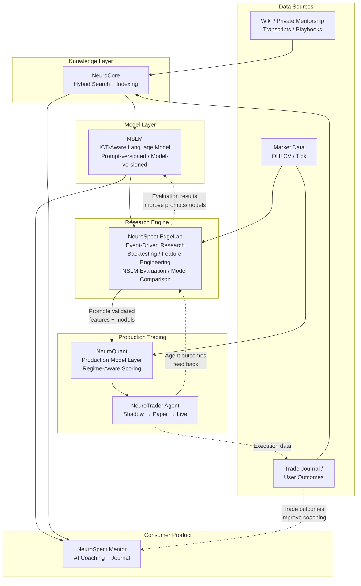

# NeuroSpect: AI Trading Research & Coaching Platform — v2 Product & Technical Plan

---

## 0. Architecture Pivot / Changelog from v1

### Why v2 Exists

v1 treated the Backtesting Platform, NeuroQuant, and NeuroTrader Agent as mostly sequential, independent systems. This is no longer accurate.

**The core insight:** NeuroSpect EdgeLab is not just a backtesting module. It is the event-driven research, backtesting, quant feature engineering, NSLM prompt/model experimentation, and hybrid model evaluation engine for the entire NeuroSpect platform. More critically: **NSLM is not only consumed by EdgeLab — NSLM is improved through EdgeLab.** EdgeLab becomes the evaluation environment where NSLM prompt versions, model versions, structured outputs, reasoning quality, setup classifications, feature extraction quality, and trading-context interpretations are tested against historical outcomes.

This makes the architecture a **bidirectional research loop**, not a one-way pipeline.

### Naming Changes (v1 → v2)

| v1 Name | v2 Name | What Changed |
|---|---|---|
| NeuroLLM (company/platform) | **NeuroSpect** | Brand unification — one name for company and platform |
| NeuroSpect / NeuroSpect Coach (consumer product) | **NeuroSpect Mentor** | Clearer product identity for the coaching product |
| NeuroCortex | **NeuroCore** | Better reflects the knowledge graph / retrieval role |
| *(no equivalent)* | **NSLM** (NeuroSpect Language Model) | New: the ICT-aware LLM/model family — trained, prompted, versioned, evaluated |
| Backtesting Platform | **NeuroSpect EdgeLab** | Massively expanded scope: research + experimentation + evaluation engine |
| NeuroQuant | **NeuroQuant** | Unchanged — production model layer |
| NeuroTrader Agent | **NeuroTrader Agent** | Unchanged — automated trading agent |

### Section Disposition (v1 → v2)

| v1 Section | v2 Disposition |
|---|---|
| Exec Summary | UPDATED — new hierarchy, EdgeLab framing |
| §1 Repo Assessment | CARRIED — column rename only |
| §2 Feasibility | CARRIED — name updates |
| §3 ICT Knowledge Modeling | CARRIED |
| §4 Wiki Transformation | CARRIED |
| §5 Product Architecture | REWRITTEN → §5 Components + §6 Diagram + §7 Workflows |
| §6 Integration/Migration | UPDATED → §8 with EdgeLab repo structure |
| §7 RAG vs Fine-Tuning | CARRIED → §9 |
| §8 Data Strategy | UPDATED → §10 with OHLCV, NSLM datasets, quant injection |
| §9 Storage Architecture | UPDATED → §11 with EdgeLab stores |
| *(new)* | NEW → §12 EdgeLab Database Schema |
| §10 Tech Stack | UPDATED → §13 |
| §11 Costs | UPDATED → §14 with EdgeLab costs |
| §12 Product Strategy | UPDATED → §15 with new pricing tiers |
| §13 Go-to-Market | CARRIED → §16 |
| §14 Risk/Compliance | UPDATED → §17 with Research Safety + 14 risks |
| §15 Project Tracking | CARRIED → §18 |
| §16 Roadmap (Phases 0-6) | CARRIED → §19 |
| §16 Phase 7 | REWRITTEN → §20 EdgeLab Foundation |
| §16 Phase 8 | REWRITTEN → §21 Hybrid Model Research |
| §16 Phase 9 | UPDATED → §22 |
| §16 Phase 10 | CARRIED → §23 |
| *(new)* | NEW → §24 EdgeLab UI/Product Implications |
| §17 Two-Engineer Plan | UPDATED → §25 |
| §18 Dev Workflow | CARRIED → §26 |
| §19 Roadmap Dashboard | CARRIED → §27 |
| §20 GitHub Issues | UPDATED → §28 |
| §21 Open Questions | UPDATED → §31 |
| §22 NeuroCortex | UPDATED → §29 NeuroCore |
| §23 Zeus Patterns | CARRIED → §30 |
| §24 /sync | CARRIED (in §29) |
| §25 Missing Requirements | UPDATED → §32 |
| §26 Final Recommendation | UPDATED → §33 |

---

## Executive Summary

**Current state:** NeuroSpect is a deployed, production trading journal + AI coaching platform for ICT traders. FastAPI backend on Render, React 19 frontend on Cloudflare Pages, Discord OAuth, TradingView webhook → Claude Sonnet coaching, trade journal with 17 ICT-specific enums, 7 analytics views, and a 36K-line wiki with 5 course modules and 7 machine-readable entry models.

**v2 direction:** NeuroSpect is becoming an **ICT-aware AI trading research and coaching platform**, with EdgeLab as the experimentation layer that improves NSLM and validates quant/ICT systems before any agent automation.

**This plan's recommendation:** **Yes, proceed with the EdgeLab-centered architecture.**

The core modification from v1: **EdgeLab sits between the knowledge/coaching layer and production trading systems.** It is the research loop where we test, compare, version, and improve deterministic ICT strategies, pure quant models, NSLM-generated features, prompt/model versions, hybrid ICT + quant + NSLM models, and regime-aware ensembles — across historical, replay, and live-like market conditions. Track A (coaching product) generates revenue. Track B (EdgeLab → NeuroQuant → NeuroTrader) builds the trading intelligence platform. The null test at Phase 7 remains a hard gate.

**Product hierarchy:**
```
NeuroSpect (company / product brand)
├── NeuroSpect Mentor   — Consumer-facing AI coaching product
├── NeuroCore          — Knowledge/retrieval layer
├── NSLM                — NeuroSpect Language Model (ICT-aware model family)
├── NeuroSpect EdgeLab  — Research, backtesting, and model experimentation engine
├── NeuroQuant          — Production model layer
└── NeuroTrader Agent   — Automated trading agent
```

**Components:**

| Component | Description |
|---|---|
| **NeuroSpect** | Company and product brand. AI trading research and coaching platform for traders and educators. |
| **NeuroSpect Mentor** | Consumer-facing AI coaching product. RAG + ICT knowledge + trade journal + personalized coaching with source-grounded citations and deterministic rule validation. |
| **NeuroCore** | Knowledge/retrieval layer. Hybrid 3-signal search (keyword + semantic + entity) across all knowledge sources — wiki, transcripts, playbooks, trade journal, backtest results, agent signals. Powers coaching RAG, cross-wiki intelligence, and agent reasoning. Source-grounded ICT memory. |
| **NSLM** | NeuroSpect Language Model. The ICT-aware LLM/model family trained and adapted from private mentorship content, wiki content, structured ICT playbooks, and evaluation feedback. Can be prompt-versioned, model-versioned, evaluated through EdgeLab, and eventually fine-tuned. Produces structured reasoning, setup classifications, and features consumed by EdgeLab and NeuroQuant. |
| **NeuroSpect EdgeLab** | Event-driven research, backtesting, quant feature engineering, NSLM prompt/model experimentation, and hybrid model evaluation engine. Allows traders and researchers to test pure quant models, deterministic ICT strategies, NSLM-generated features, prompt/model versions, and hybrid ICT + quant systems across historical, replay, and live-like market conditions. Evaluation results feed back into NSLM improvement. Validated features/models promote to NeuroQuant. |
| **NeuroQuant** | Production model layer. Consumes validated features and models promoted from EdgeLab. Handles regime-aware scoring, model ensembles, and confluence decisions using ranked quant features, ICT features, regime detection, and selected NSLM-derived features. |
| **NeuroTrader Agent** | Automated trading agent with shadow → paper → limited live progression and strict safety gates. Must be gated by EdgeLab evidence. 5-layer safety architecture. Learns from its mistakes via post-trade LLM analysis and model retraining. |

**Key numbers:**
- Coaching MVP cost: $6-107/month
- Full platform cost (all systems): $150-700/month
- Timeline to coaching revenue: ~31 weeks (8 months)
- Timeline to EdgeLab foundation: ~47 weeks (12 months)
- Timeline to paper trading agent: ~67 weeks (17 months)
- Timeline to live trading (conditional): ~72 weeks (18 months)
- Team: 2 engineers, no additional hires needed through Phase 8

---

## 1. Current Repo Assessment

### What's Built and Deployed

| Component | Status | Technology | Reusability for NeuroSpect |
|---|---|---|---|
| Backend API | Live on Render | FastAPI, SQLAlchemy async, PostgreSQL 16, Alembic | 100% — extend, don't replace |
| Frontend | Live on Cloudflare Pages | React 19, TypeScript, Vite, TanStack Query, shadcn/ui | 100% — add chat UI alongside existing |
| Auth | Live | Discord OAuth2, JWT | 100% — works as-is |
| AI Coach | Live | Anthropic SDK, Claude Sonnet 4.6, prompt caching | 90% — extend for RAG + multi-turn chat |
| Trade Journal | Live | 100+ ICT-specific fields, 17 enums, 5 tables | 100% — keep for journaling, add agent tools on top |
| Analytics | Live | 7 endpoints, summary/breakdown/mistakes/R-distribution | 100% — reuse, add AI-specific metrics later |
| Screenshots | Live | Cloudflare R2, presigned URLs | 100% — extend for chart review |
| Broker Integration | Partial | Tradovate REST (auth + fills, not orders) | 100% — sufficient for MVP |
| Wiki/KB | Complete | 111 markdown files, 36K lines, YAML frontmatter | HIGH — this IS the RAG corpus |
| Course Content | Complete | 5 modules, 18 lessons, 7 entry models with YAML | HIGH — machine-readable, ready to embed |
| Source Transcripts | Complete | 32 immutable transcripts (4 volumes + streams) | MEDIUM — needs chunking/embedding, lower priority than structured KB |

### Key Architecture Files

- `api/app/coach/claude_client.py` — Core Claude integration; extend for RAG + multi-turn
- `api/app/coach/prompt_loader.py` — System prompt assembly; extend for dynamic RAG injection
- `api/app/coach/prompts/system-prompt-template.md` — Full ICT system prompt with strategy library
- `api/app/coach/prompts/strategies.json` — Machine-readable ICT strategy library (already loaded into Claude)
- `api/app/models/trade.py` — ICT trade data model (100+ fields)
- `api/app/models/enums.py` — 17 ICT-specific enums
- `wiki/concepts/business-logic/` — 8 core ICT concept docs
- `wiki/concepts/entry-models/` — 7 strategies with checklist YAML blocks
- `wiki/concepts/course/` — 5 modules, 18 lessons

### What's Strong

1. **The wiki corpus is real, structured, and deep.** 36K lines of curated ICT content with YAML frontmatter, cross-references, and source traceability.
2. **Machine-readable strategy blocks exist.** The 7 entry models have YAML blocks designed for the AI Coach system prompt. Directly usable for both RAG retrieval and deterministic rule validation.
3. **The Claude integration is production-grade.** Prompt caching, structured JSON output, error handling, latency tracking — all proven in production.
4. **The async architecture is ideal for AI workloads.** FastAPI + SQLAlchemy async handles concurrent LLM calls naturally.

### What Needs Work

1. **No vector database or embedding pipeline.** Currently using static prompt injection, not dynamic RAG retrieval.
2. **No multi-turn chat.** The existing coaching pipeline is webhook → one-shot Claude call → polling.
3. **No conversation persistence.** Coaching events are stored but not as chat sessions with message history.
4. **No subscription/billing.** Single-user system with no tiers or payment processing.

---

## 2. NeuroSpect Platform Feasibility Assessment

### Recommendation: **Modify the approach significantly, then proceed**

| Aspect | Verdict | Reasoning |
|---|---|---|
| Phase sequencing (RAG → SFT → Vision → Detection → RL) | **Correct** | Each phase genuinely requires the previous phase's infrastructure |
| Risk calibration | **Correct** | Unusually honest about 0% adversarial pass rate, look-ahead bias, ICT non-validation |
| B2B2C multi-instructor platform | **Premature** | Codebase is deeply ICT-specific; methodology-agnostic abstraction = full rewrite |
| Phase 1 (RAG coaching) | **Strong, build now** | Wiki corpus is RAG-ready; existing Claude integration handles this |
| Phase 2 (LoRA fine-tuning) | **Conditional** | Blocked on instructor providing 200+ coaching examples |
| Phase 3 (Chart analysis) | **Deprioritize** | 0% adversarial pass rate; hybrid approach is a rule-validation tool |
| Phase 4 (Practice trading) | **High-value but large** | Custom detection engine is 3-6 months of engineering |
| Phase 5 (Automated trading) | **Separate entirely** | Different infrastructure, different regulatory requirements, null test is a research gate |

### Assumptions Requiring Validation

| Assumption | How to validate | Risk if wrong |
|---|---|---|
| The instructor will provide content access and participate | Direct conversation; written agreement | Project cannot start |
| ICT wiki content is retrieval-friendly after embedding | Build test RAG pipeline with 5 concept docs, test 20 questions | Phase 1 quality is poor |
| Students will pay $29-149/month for AI coaching | Landing page with pricing → waitlist signups; interview 10 ICT traders | No revenue |
| 200+ coaching examples can be collected from the instructor | Ask directly; estimate effort | Phase 2 (fine-tuning) delayed indefinitely |
| The instructor has IP rights to their content | Verify contractually | Legal liability |

---

## 3. ICT Knowledge Modeling Plan

### Concept Classification

| Concept | Type | Operationalizable? | Data Requirements | Encoding Difficulty |
|---|---|---|---|---|
| **Market Structure** (STH/ITH/LTH, BOS, MSS) | Structural | YES — swing classification is rule-based | OHLCV + swing detection algo | Medium |
| **Liquidity** (BSL/SSL, DOL, equal highs/lows) | Structural | YES — price level identification | OHLCV + level detection | Low |
| **Fair Value Gaps** (BISI/SIBI, IOFED, BAG) | Structural | YES — gap detection on 3-candle patterns | OHLCV | Low |
| **Order Blocks** | Structural | PARTIAL — requires "displacement" judgment | OHLCV + context | HIGH |
| **Breaker Blocks** | Structural | PARTIAL — depends on OB validity | OHLCV + OB detection | HIGH |
| **Displacement** | Qualitative | DIFFICULT — "significant impulse" is undefined | OHLCV + volatility context | VERY HIGH |
| **Premium/Discount** | Structural | YES — 50% of range is deterministic | OHLCV + range bounds | Low |
| **Kill Zones** | Temporal | YES — fixed time windows | Clock | None |
| **Sessions** | Temporal | YES — fixed time windows | Clock | None |
| **SMT Divergence** | Relational | YES — cross-instrument divergence | Multi-instrument OHLCV | Medium |
| **Bias Formation** | Composite | PARTIAL — combines HTF FVG + opening price | Multiple timeframe OHLCV | Medium |
| **Entry Confirmation** | Composite | PARTIAL — combines multiple concepts | All above | HIGH |
| **Invalidation** | Rule-based | YES — defined per entry model | Trade parameters + OHLCV | Low |
| **Risk Management** | Rule-based | YES — position sizing, R-multiple | Account data + trade parameters | Low |
| **Power of Three (AMD)** | Narrative | DIFFICULT — retrospective pattern recognition | OHLCV + session context | VERY HIGH |
| **Day-of-Week Protocol** | Rule-based | YES — specific rules per weekday | Calendar + price data | Low |

### Concepts That Should NEVER Be Fully LLM-Delegated

1. **Kill zone / session time calculations** — deterministic, must be exact
2. **Position sizing and risk calculations** — arithmetic, cannot tolerate hallucination
3. **R-multiple computations** — exact math
4. **Order execution** — regulatory + reliability
5. **Opening price identification** — lookup, not inference
6. **Premium/discount calculation** — arithmetic on range bounds

### What the Wiki Needs Before RAG Deployment

**Immediate (Phase 0-1):**
- Chunk structured KB docs at `##` section headers (~300-600 tokens per chunk)
- Build ICT terminology normalization dictionary (50+ terms)
- Tag chunks with metadata: `source_file`, `section`, `tags`, `chunk_type`
- Parse YAML strategy blocks separately for deterministic rule validation

**Later (Phase 2+):**
- Process raw transcripts: de-duplicate, normalize terminology, chunk at paragraph breaks
- Tag transcript chunks with lower retrieval priority than structured KB
- Build contradiction resolution: when multiple transcript versions disagree, flag and resolve

---

## 4. Wiki Transformation Plan

### Current State Assessment

| Dimension | Score | Notes |
|---|---|---|
| Content depth | 9/10 | 5 modules, 18 lessons, 8 business-logic docs, 7 entry models |
| Structure | 8/10 | Well-organized directories, consistent formatting |
| Metadata | 8/10 | YAML frontmatter with tags, aliases, sources, dates |
| Machine-readability | 7/10 | Entry models have YAML blocks; concept docs are prose |
| Cross-referencing | 7/10 | Wikilinks between pages; source traceability |
| Examples | 6/10 | Some worked examples in course lessons; need more |
| Visual content | 3/10 | Only 4 chart images; most concepts described in text |

### Transformation Strategy

**Keep markdown + YAML frontmatter as the source of truth.** Generate derived formats via pipelines.

```
Source of Truth:           Derived Formats:
wiki/concepts/*.md    →    pgvector embeddings (for RAG retrieval)
                      →    strategies.json (for deterministic validation, already exists)
                      →    eval_dataset.jsonl (for quality testing)
                      →    training_pairs.jsonl (for future LoRA SFT)
                      →    nslm_eval_dataset.jsonl (for NSLM version evaluation)
```

### Chunking Strategy

| Content Type | Chunking Method | Target Size | Priority |
|---|---|---|---|
| Business-logic docs | Split at `##` headers | 300-600 tokens | 1 (highest) |
| Entry model explanations | Split at `##` headers | 300-600 tokens | 1 |
| Entry model YAML blocks | Keep as single chunk | Variable (up to 1000 tokens) | 1 |
| Course lessons | Split at `##` headers | 300-600 tokens | 1 |
| Live commentary protocols | Split at `##` headers | 300-600 tokens | 1 |
| Raw transcripts (Vol 1-4) | Split at paragraph breaks, 500-token window with 100-token overlap | 500 tokens | 2 (lower) |
| Stream transcripts | Split at paragraph breaks | 500 tokens | 3 (lowest) |

### Semantic Tagging Schema

```json
{
  "source_file": "concepts/business-logic/ict-liquidity.md",
  "section": "## Draw on Liquidity",
  "tags": ["concept", "liquidity", "DOL"],
  "chunk_type": "concept",
  "priority": 1,
  "module": null,
  "entry_model": null,
  "ict_concepts": ["BSL", "SSL", "DOL", "FVG"],
  "created": "2026-04-18",
  "updated": "2026-04-22"
}
```

### Evaluation Dataset Requirements

Before beta, create 100-200 question-answer pairs spanning all concepts:

```jsonl
{"question": "What makes a valid order block?", "expected_answer": "The last opposing candle before displacement...", "source": "concepts/business-logic/ict-entry-models.md#order-blocks", "concepts": ["OB", "displacement"], "difficulty": "basic"}
{"question": "When should I avoid trading during NFP week?", "expected_answer": "Monday through Wednesday of NFP week...", "source": "concepts/business-logic/ict-live-commentary.md#economic-calendar", "concepts": ["news", "NFP"], "difficulty": "advanced"}
```

---

## 5. Product Components and Technical Architecture

### Component Responsibility Boundaries

**NeuroCore** (Knowledge Layer):
- Retrieves knowledge from all indexed sources
- Indexes private mentorship content, wiki content, transcripts, strategy playbooks
- Provides source-grounded context to NSLM and Mentor
- Hybrid 3-signal search (keyword BM25 + semantic pgvector + entity/tag)
- Cross-wiki intelligence between engineer wikis and team wiki
- Does NOT interpret, reason, or generate — only retrieves and ranks

**NSLM** (NeuroSpect Language Model):
- Interprets ICT context using retrieved knowledge from NeuroCore
- Classifies setups (e.g., "this is a consolidation model setup with these conditions met/unmet")
- Produces structured reasoning and features consumed by EdgeLab and NeuroQuant
- Can be prompt-versioned (v1, v2, ... vN with different system prompts)
- Can be model-versioned (base Claude, fine-tuned variants)
- Evaluated through EdgeLab against historical outcomes
- Eventually fine-tuned on instructor-specific coaching examples
- Does NOT make trading decisions — only provides reasoning, classifications, and features

**NeuroSpect EdgeLab** (Research Engine):
- Tests deterministic ICT strategies against historical data
- Evaluates NSLM prompt/model versions against historical setup windows
- Ranks and selects quant, ICT, and NSLM-derived features
- Runs event-driven historical, replay, and live-like experiments
- Produces evidence for model/feature promotion or rejection
- Manages experiment lifecycle: define → run → evaluate → compare → promote/reject
- Anti-lookahead enforcement is architecturally guaranteed
- Does NOT serve production traffic — only research and evaluation

**NeuroQuant** (Production Model Layer):
- Consumes validated features and models promoted from EdgeLab
- Handles regime-aware scoring using HMM + rule-based regime detection
- Runs model ensembles that select the right model for current market conditions
- Confluence scorer combines ICT gates (binary) + ML confidence (probability) + NSLM reasoning (narrative coherence)
- Serves production scoring requests for live/paper trading
- Does NOT train or evaluate models — only serves promoted ones

**NeuroTrader Agent** (Execution):
- Automated trading execution workflow
- Must be gated by EdgeLab evidence and NeuroQuant scoring
- Shadow first (signals only), then paper (simulated), then limited live (real)
- 5-layer safety architecture: mode enforcement, risk manager, circuit breakers, bracket orders, kill switch
- Feeds outcomes back into EdgeLab for continuous evaluation
- Does NOT make autonomous decisions about which models to use — uses NeuroQuant-promoted models

### Integration Map

```
NeuroCore provides context to → NSLM
NSLM provides classifications/features to → EdgeLab, NeuroQuant, Mentor
EdgeLab evaluates and improves → NSLM (prompt/model versions)
EdgeLab promotes validated models/features to → NeuroQuant
NeuroQuant provides scoring to → NeuroTrader Agent
NeuroTrader Agent feeds outcomes to → EdgeLab (continuous evaluation)
NeuroCore + NSLM power → NeuroSpect Mentor (coaching product)
Trade journal/outcomes improve → Mentor coaching (personalization)
```

---

## 6. System Workflow Diagram

### Full System Flow



### Feedback Loops

1. **EdgeLab → NSLM:** Evaluation results from historical replay show which prompt versions produce better setup classifications, more useful features, and more accurate reasoning. This drives prompt/model iteration.
2. **Journal → Mentor:** User trade outcomes and coaching interaction history personalize future coaching responses.
3. **NeuroTrader → EdgeLab:** Agent shadow/paper/live outcomes are compared against EdgeLab backtest expectations. Discrepancies trigger model re-evaluation.
4. **NeuroTrader → Journal:** Execution data flows into the trade journal for unified analytics.

---

## 7. End-to-End Workflows

### A. ICT Trader Coaching Workflow

**Trigger:** User asks "Is this a valid expansion and retracement setup on NQ 5-minute?"

1. **NeuroCore** retrieves relevant chunks: expansion-retracement entry model YAML, market structure concepts, current session context
2. **NSLM** receives retrieved context + user's question + trade journal history
3. NSLM applies the E&R checklist deterministically (session time, HTF bias, displacement, FVG, OTE zone) and produces structured reasoning
4. **NeuroSpect Mentor** formats the response with citations to specific wiki sections, checklist pass/fail indicators, and educational explanation
5. Response includes confidence scoring and links to relevant course modules
6. If the user logs a trade based on this setup, the outcome feeds back into coaching personalization

### B. Strategy Research Workflow

**Trigger:** Researcher wants to evaluate the Consolidation Model strategy on 2 years of NQ data

1. Researcher defines the strategy spec (ICT Consolidation Model rules from wiki YAML)
2. **EdgeLab** strategy compiler converts the spec into event-driven rules
3. EdgeLab ingests 2 years of NQ 1-minute OHLCV from Parquet store
4. Event engine replays bars through the strategy with anti-lookahead enforcement
5. EdgeLab runs Monte Carlo simulation (10K permutations) and walk-forward optimization
6. Results stored in experiment registry with full reproducibility metadata
7. Researcher reviews equity curve, drawdown, R-distribution, walk-forward efficiency, and statistical significance
8. If walk-forward efficiency > 0.5 and null test passes (p < 0.05), strategy is a candidate for NeuroQuant promotion

### C. NSLM Prompt Experiment Workflow

**Trigger:** Researcher creates NSLM prompt version v12 with improved displacement classification instructions

1. Researcher registers prompt v12 in the prompt version registry with changelog
2. **EdgeLab** selects a historical evaluation window (e.g., 6 months of NQ sessions with known setup outcomes)
3. EdgeLab replays each historical setup window through NSLM v12 and baseline v11
4. For each setup, EdgeLab compares: classification accuracy, reasoning consistency, feature usefulness (correlation with actual outcomes), and structured output quality
5. EdgeLab produces a comparison report: v12 vs v11 across all metrics
6. If v12 shows statistically significant improvement on key metrics, it becomes the new default prompt
7. If v12 shows regression on any metric, the report flags it and v11 remains default

### D. Hybrid Quant Model Workflow

**Trigger:** Quant researcher wants to build a model combining traditional features with NSLM-derived features

1. Researcher defines feature set: mean price over 5-minute periods, Parkinson volatility, session range, premium/discount zone, displacement metrics, NSLM setup classification confidence, NSLM reasoning coherence score
2. **EdgeLab** feature store computes and snapshots all features across the training window
3. EdgeLab trains pure quant baseline (LightGBM on traditional features only)
4. EdgeLab trains ICT feature model (LightGBM on ICT-derived features only)
5. EdgeLab trains hybrid model (LightGBM on all features including NSLM-derived)
6. Walk-forward validation with deflated Sharpe ratio on all three models
7. Feature importance ranking identifies which features (quant, ICT, NSLM) contribute most
8. If hybrid model outperforms baselines on out-of-sample data, it becomes a **NeuroQuant promotion candidate**
9. Promotion decision includes model card with: training data, feature list, performance metrics, regime behavior, confidence calibration

### E. Live-Like Shadow Workflow

**Trigger:** NeuroTrader Agent runs in shadow mode to validate real-time performance

1. **NeuroTrader Agent** receives live NQ market data via WebSocket
2. Agent runs ICT detectors on live bars (reusing EdgeLab detector framework)
3. When a setup is detected, agent evaluates it through **NeuroQuant** confluence scorer
4. Agent logs the hypothetical decision (entry, stop, target, confidence, reasoning) to `agent_signals` table — no trades executed
5. **EdgeLab** compares hypothetical decisions against actual market outcomes over the shadow period
6. EdgeLab produces a shadow performance report: hit rate, expected vs actual R-multiples, regime-conditional performance
7. Safety gates evaluate shadow results against promotion criteria
8. If shadow results meet criteria (positive expectancy, sufficient sample size, reasonable drawdown), **paper mode is allowed**
9. If shadow results show systematic issues, agent returns to parameter tuning in EdgeLab

---

## 8. Integration vs Migration Decision

### Recommendation: **Option B — New services inside the existing monorepo**

| Option | Verdict | Reasoning |
|---|---|---|
| **A: Integrate into existing codebase** | Partially | Chat endpoint, RAG pipeline, pgvector extend `api/` naturally |
| **B: New services in monorepo** | **Best** | EdgeLab is a major new module but stays in `api/`. No microservices at 2-engineer scale. |
| **C: Migrate to new architecture** | Overkill | Existing infrastructure handles this scale |

### Proposed Monorepo Structure

```
neurospect/
├── CLAUDE.md                    # Monorepo routing, product components, skill catalog
│
├── ── KNOWLEDGE ──────────────
├── wiki/                        # Team knowledge base (ICT content, architecture, transcripts)
├── vlad-wiki/                   # Vlad's personal wiki (Obsidian vault)
├── paul-wiki/                   # Paul's personal wiki (Obsidian vault)
├── roadmap/                     # Project state: phases, boot prompts, deviations, plan
│
├── ── BACKEND ────────────────
├── api/
│   ├── app/
│   │   ├── models/
│   │   │   ├── trade.py         # Existing
│   │   │   ├── coaching_event.py # Existing
│   │   │   ├── chat_session.py  # NEW (Phase 1): conversation persistence
│   │   │   ├── chat_message.py  # NEW (Phase 1): message history
│   │   │   ├── wiki_chunk.py    # NEW (Phase 1): embedded chunks + metadata
│   │   │   ├── subscription.py  # NEW (Phase 3): Stripe tier tracking
│   │   │   └── edgelab/         # NEW (Phase 7): EdgeLab models
│   │   │       ├── experiment.py
│   │   │       ├── backtest_run.py
│   │   │       ├── backtest_trade.py
│   │   │       ├── feature_definition.py
│   │   │       ├── nslm_prompt_version.py
│   │   │       ├── nslm_model_version.py
│   │   │       ├── nslm_evaluation.py
│   │   │       ├── model_candidate.py
│   │   │       └── model_promotion.py
│   │   ├── routers/
│   │   │   ├── trades.py        # Existing
│   │   │   ├── chat.py          # NEW (Phase 1): conversational coaching
│   │   │   ├── billing.py       # NEW (Phase 3): Stripe webhook
│   │   │   ├── edgelab.py       # NEW (Phase 7): experiments, backtests, features
│   │   │   ├── neuroquant.py    # NEW (Phase 8): models, regime, scoring
│   │   │   ├── agent.py         # NEW (Phase 9): agent config, status, halt
│   │   │   └── roadmap.py       # NEW: roadmap dashboard API
│   │   ├── coach/
│   │   │   ├── claude_client.py # Extended: RAG context injection
│   │   │   ├── prompt_loader.py # Extended: dynamic retrieval
│   │   │   ├── rag/             # NEW (Phase 1): NeuroCore retrieval pipeline
│   │   │   │   ├── embedder.py
│   │   │   │   ├── retriever.py
│   │   │   │   ├── ingestor.py
│   │   │   │   └── evaluator.py
│   │   │   └── tools/           # NEW (Phase 2): agent tool definitions
│   │   ├── edgelab/             # NEW (Phase 7): EdgeLab engine
│   │   │   ├── engine/
│   │   │   │   ├── event_engine.py
│   │   │   │   ├── simulator.py
│   │   │   │   ├── execution_model.py
│   │   │   │   └── anti_lookahead.py
│   │   │   ├── data/
│   │   │   │   ├── market_data_pipeline.py
│   │   │   │   ├── parquet_store.py
│   │   │   │   └── replay_loader.py
│   │   │   ├── detectors/
│   │   │   │   ├── swing_detector.py
│   │   │   │   ├── fvg_detector.py
│   │   │   │   ├── order_block_detector.py
│   │   │   │   ├── market_structure_detector.py
│   │   │   │   ├── session_detector.py
│   │   │   │   ├── smt_detector.py
│   │   │   │   ├── bias_detector.py
│   │   │   │   └── consolidation_detector.py
│   │   │   ├── features/
│   │   │   │   ├── registry.py
│   │   │   │   ├── quant_features.py
│   │   │   │   ├── ict_features.py
│   │   │   │   ├── nslm_features.py
│   │   │   │   └── feature_ranker.py
│   │   │   ├── experiments/
│   │   │   │   ├── experiment_runner.py
│   │   │   │   ├── experiment_registry.py
│   │   │   │   ├── metrics.py
│   │   │   │   └── reports.py
│   │   │   ├── nslm/
│   │   │   │   ├── prompt_registry.py
│   │   │   │   ├── model_registry.py
│   │   │   │   ├── structured_output_schemas.py
│   │   │   │   ├── evaluator.py
│   │   │   │   └── dataset_builder.py
│   │   │   ├── strategies/
│   │   │   │   ├── strategy_compiler.py
│   │   │   │   ├── strategy_spec.py
│   │   │   │   └── ict_strategy_library.py
│   │   │   └── risk/
│   │   │       ├── monte_carlo.py
│   │   │       ├── walk_forward.py
│   │   │       ├── drawdown.py
│   │   │       └── risk_metrics.py
│   │   ├── neuroquant/          # NEW (Phase 8): Production model layer
│   │   │   ├── features/
│   │   │   │   ├── ict_features.py
│   │   │   │   └── quant_features.py
│   │   │   ├── regime/
│   │   │   │   ├── detector.py
│   │   │   │   └── labeler.py
│   │   │   ├── models/
│   │   │   │   ├── baseline.py
│   │   │   │   ├── lgbm_model.py
│   │   │   │   └── ensemble.py
│   │   │   ├── llm_scorer.py
│   │   │   └── confluence.py
│   │   └── agent/               # NEW (Phase 9): NeuroTrader Agent
│   │       ├── state_machine.py
│   │       ├── market_monitor.py
│   │       ├── execution.py
│   │       ├── risk_manager.py
│   │       ├── learning.py
│   │       └── config.py
│   └── scripts/
│       ├── ingest_wiki.py
│       └── run_eval.py
│
├── ── FRONTEND ───────────────
├── app/
│   ├── src/
│   │   ├── pages/
│   │   │   ├── chat.tsx         # NEW (Phase 1): coaching chat
│   │   │   ├── edgelab/         # NEW (Phase 7): EdgeLab UI
│   │   │   │   ├── experiments.tsx
│   │   │   │   ├── backtest-detail.tsx
│   │   │   │   ├── features.tsx
│   │   │   │   ├── nslm-lab.tsx
│   │   │   │   └── model-registry.tsx
│   │   │   ├── roadmap.tsx
│   │   │   └── ...
│   │   ├── components/
│   │   │   ├── chat/
│   │   │   ├── edgelab/         # NEW (Phase 7)
│   │   │   └── roadmap/
│   │   └── hooks/
│
├── ── TOOLING ────────────────
├── .claude/skills/
├── evals/
└── docs/
```

**Key principle:** Everything stays in the monorepo's `api/` service. EdgeLab, NeuroQuant, and the agent are modules within FastAPI. Background tasks use Render background workers or FastAPI BackgroundTasks.

---

## 9. RAG vs Fine-Tuning vs Agent Tools vs Hybrid

### Comparison Matrix

| Dimension | RAG | Fine-Tuning (LoRA SFT) | Agent Tools | Deterministic Rules |
|---|---|---|---|---|
| **Solves** | Domain knowledge injection | Voice/style transfer | Real-time data access | Rule enforcement |
| **Accuracy** | High (bounded by retrieval quality) | N/A for knowledge | High (grounded outputs) | Perfect |
| **Hallucination risk** | 6-20% residual | Can increase if overtrained | Minimal | Zero |
| **Cost (inference)** | +$0.001-0.005/query | $0 if self-hosted | Negligible/tool call | Negligible |
| **Cost (setup)** | $50-200 one-time (embedding) | $500-2000 (GPU + data prep) | $0-500 (dev time) | $0 (code) |
| **Data requirements** | Existing corpus (HAVE IT) | 200-500 pairs (DON'T HAVE) | API credentials | Rule specs (HAVE IN YAML) |
| **Update cycle** | Minutes (re-embed) | Hours-days (retrain) | Immediate | Immediate (deploy) |

### Phased Hybrid Recommendation

**Month 1-2 (MVP): RAG + Deterministic Rules**
- Embed the wiki structured KB docs
- Move kill zone, opening price, and strategy checklist validation into deterministic Python functions
- Claude Sonnet 4.6 via API with strong system prompt for voice approximation

**Month 3-4 (V1): + Agent Tools**
- Add tool calling: `get_user_trades()`, `get_analytics_summary()`, `get_economic_calendar()`, `get_session_context()`
- Personalized coaching based on the trader's own history

**Month 5+ (conditional): + Fine-Tuning**
- Only if instructor provides 200+ coaching examples AND users report generic voice is a barrier

### What Should NEVER Be Fully LLM-Delegated

- Order execution or trade signals (regulatory + reliability)
- Risk management decisions (stop placement, position sizing)
- Kill zone / session time calculations (deterministic, must be exact)
- R-multiple and PnL calculations (arithmetic)
- Financial advice of any kind

---

## 10. Data Strategy

### Internal Data

**Immediately usable (RAG corpus):**

| Content | Files | Tokens (est.) | RAG Readiness |
|---|---|---|---|
| 8 business-logic docs | `wiki/concepts/business-logic/` | ~8K | HIGH |
| 7 entry models + YAML | `wiki/concepts/entry-models/` | ~6K | HIGH |
| 18 course lessons | `wiki/concepts/course/` | ~12K | HIGH |
| System prompt + strategies.json | `wiki/concepts/ai-coach/` | ~4K | ALREADY IN USE |

**Missing (needed for EdgeLab):**
- Historical OHLCV data for NQ/ES/YM futures
- Embeddings (none generated yet)
- NSLM training/evaluation datasets
- Feature snapshots
- Structured outcome labels

### Market Data Strategy (EdgeLab)

| Data Type | Source | Aggregation | Storage | Phase |
|---|---|---|---|---|
| Historical OHLCV (NQ, ES, YM) | FirstRate Data (one-time $100-200) | 1m base → derive 5m/15m/1H/4H/D | Parquet on R2 | 7 |
| Live/recent OHLCV | Tradovate API (existing) | 1m real-time | PostgreSQL buffer → Parquet | 7+ |
| Tick data (future) | Databento ($50-150/mo) | Raw → 1m aggregation | Parquet on R2 | 8+ |
| Replay datasets | Derived from historical | Session-windowed clips | Parquet on R2 | 7 |

**Aggregation pipeline:**
```
Tick/1m base data
  → 5m bars (OHLCV + volume)
  → 15m bars
  → 1H bars
  → 4H bars
  → Daily bars
```

Each aggregation level is pre-computed and stored. EdgeLab reads the appropriate timeframe for multi-timeframe analysis.

### Feature Store Data

| Feature Category | Examples | Storage |
|---|---|---|
| **Quant features** | Mean price (5m), Parkinson volatility, ATR, returns distribution, auto-correlation, opening range gap | Parquet snapshots (point-in-time) |
| **ICT features** | FVG distance, OB proximity, session encoding, HTF bias, displacement quality, SMT signal, premium/discount zone | Parquet snapshots |
| **NSLM features** | Setup classification confidence, reasoning coherence score, feature extraction outputs | PostgreSQL (structured output JSON) |
| **Session features** | Kill zone active, session range, midnight open distance, day-of-week encoding | Computed at runtime (deterministic) |

**Quant context injection into NSLM:** When NSLM evaluates a setup, it receives structured context including real-time quant values:
```json
{
  "timestamp": "2026-06-15T14:32:00Z",
  "instrument": "NQ",
  "session": "new_york_pm",
  "kill_zone_active": true,
  "mean_price_5m": 19823.5,
  "volatility_parkinson_1h": 0.0042,
  "session_range_pct": 0.68,
  "premium_discount": "discount",
  "displacement_z_score": 2.3,
  "htf_bias": "bullish",
  "nearest_fvg": {"type": "BISI", "distance_handles": 12, "timeframe": "1H"},
  "nearest_ob": {"type": "bullish", "distance_handles": 25, "timeframe": "4H"}
}
```

This structured context gives NSLM the quantitative grounding it needs to produce better reasoning without hallucinating numbers.

### NSLM Dataset Lifecycle

| Dataset Type | Purpose | Source | Phase |
|---|---|---|---|
| Evaluation dataset | Test NSLM prompt versions | Historical setups with known outcomes | 7 |
| Training pairs | Future LoRA fine-tuning | Instructor coaching examples (200+) | Conditional |
| Prompt version corpus | Track prompt evolution | Prompt registry + evaluation results | 7 |
| Structured output labels | Validate NSLM classifications | Manual labels on historical setups | 7-8 |
| Feedback loop data | NSLM self-improvement | EdgeLab evaluation results + trade outcomes | 8+ |

### External Data Sources

#### Market Data

| Source | NQ Futures? | Cost | Best For |
|---|---|---|---|
| **FirstRate Data** | Yes (CME) | $100-200 one-time | Phase 7 research: 3+ years of 1-min NQ CSVs |
| **Tradovate API** (existing) | Yes | $0 incremental | Recent price data via existing broker connection |
| **Databento** | Yes (CME) | $50-150/mo | Phase 8+: production tick data with clean API |

**Recommendation:** Start with FirstRate Data one-time purchase for Phase 7 research. Upgrade to Databento when live data pipeline is needed.

#### Economic Calendar

Start with Forex Factory RSS (free, comprehensive). Upgrade to Trading Economics API ($49/mo) if scraping is fragile.

### Which Market First

**NQ (Nasdaq 100 E-mini futures).** The entire codebase and wiki content is built around NQ. Supporting ES as secondary is trivial (same exchange, same sessions).

---

## 11. Ingestion and Storage Architecture

### Wiki Ingestion Pipeline

```
Wiki Markdown (concepts/ + course/ + entry-models/)
    ↓
Markdown Parser (extract frontmatter, split at ## headers)
    ↓
Section-Level Chunking (~500 tokens per chunk)
    ↓
Metadata Tagging (source_file, section, tags, chunk_type, priority)
    ↓
ICT Terminology Normalization (CHoCH, CISD, FVG, OTE → canonical forms)
    ↓
Embedding Generation (OpenAI text-embedding-3-small, 1536 dims)
    ↓
Store in pgvector (PostgreSQL extension, same DB)
```

### Storage Architecture

| Store | Technology | Purpose | Cost |
|---|---|---|---|
| App database | PostgreSQL 16 (Render) | Users, trades, chats, wiki chunks, EdgeLab experiments, NSLM versions | $0-50/mo |
| Vector storage | pgvector (same PostgreSQL) | Similarity search on wiki chunks | $0 (included) |
| Object storage | Cloudflare R2 | Screenshots, chart images, Parquet files (OHLCV, features) | ~$0-5/mo |
| Cache | In-process LRU | System prompt, strategy library, hot embeddings | $0 |
| Queue | FastAPI BackgroundTasks | Claude API calls, embedding generation, backtest jobs | $0 |
| Feature snapshots | Parquet on R2 | Point-in-time feature values for reproducibility | ~$1/mo |
| Backtest results | PostgreSQL + Parquet | Metadata in PG, detailed trade-by-trade in Parquet | Combined |

### What Goes Where: Relational vs Object Storage

| Data | Storage | Why |
|---|---|---|
| Experiment metadata, run configs, summary metrics | PostgreSQL | Queryable, joins with other tables, small rows |
| Individual backtest trades (per-bar detail) | Parquet on R2 | Large volume, columnar access pattern, no joins needed |
| Feature snapshots (point-in-time values) | Parquet on R2 | Large matrices, reproducibility, Polars-native |
| OHLCV market data | Parquet on R2 | Columnar, fast with Polars, cheap storage |
| NSLM prompt versions (text) | PostgreSQL | Small, needs versioning metadata, queryable |
| NSLM structured outputs | PostgreSQL (JSONB) | Queryable JSON, links to experiments |
| Monte Carlo results | PostgreSQL (summary) + Parquet (distributions) | Summary queryable, raw distributions are large |
| Model artifacts (trained LightGBM) | R2 (pickle/joblib) | Binary files, versioned by experiment ID |

---

## 12. EdgeLab Database Schema

### Tables

| Table | Phase | Purpose | Key Columns |
|---|---|---|---|
| `edgelab_experiments` | 7 | Experiment lifecycle management | id, name, type (backtest/feature_eval/nslm_eval/hybrid), status, parameters (JSONB), created_by, created_at |
| `edgelab_runs` | 7 | Individual runs within an experiment | id, experiment_id, run_number, status, started_at, completed_at, metrics (JSONB), config (JSONB) |
| `edgelab_run_trades` | 7 | Individual trades from backtest runs | id, run_id, entry_time, exit_time, direction, entry_price, exit_price, stop, target, r_multiple, strategy, detections (JSONB) |
| `feature_definitions` | 7 | Feature registry — all available features | id, name, category (quant/ict/nslm/session), description, computation_source, version, is_active |
| `feature_snapshots` | 7 | Point-in-time feature values (metadata only — values in Parquet) | id, run_id, snapshot_time, parquet_path, feature_count, row_count |
| `nslm_prompt_versions` | 7 | NSLM prompt version registry | id, version_tag (v1, v2...), system_prompt_hash, system_prompt_text, changelog, is_default, created_at |
| `nslm_model_versions` | 7 | NSLM model version registry (base + fine-tuned) | id, version_tag, base_model, fine_tune_id, training_config (JSONB), is_default, created_at |
| `nslm_evaluation_runs` | 7 | NSLM version evaluation results | id, run_id, prompt_version_id, model_version_id, eval_window_start, eval_window_end, metrics (JSONB) |
| `nslm_structured_outputs` | 7 | NSLM structured output samples | id, evaluation_run_id, input_context (JSONB), output (JSONB), expected_output (JSONB), score |
| `model_candidates` | 8 | Models trained in EdgeLab awaiting promotion | id, experiment_id, model_type, model_path (R2), features_used, performance_metrics (JSONB), regime_metrics (JSONB) |
| `model_promotion_decisions` | 8 | Promotion/rejection records | id, candidate_id, decision (promote/reject), reason, promoted_to_neuroquant_at, decided_by |
| `backtest_metrics` | 7 | Aggregate backtest performance metrics | id, run_id, total_trades, win_rate, avg_r, max_drawdown, sharpe, sortino, profit_factor, expectancy |
| `monte_carlo_results` | 7 | Monte Carlo simulation outputs | id, run_id, iterations, median_return, p5_return, p95_return, ruin_probability, distribution_path (Parquet) |
| `walk_forward_results` | 7 | Walk-forward optimization results | id, run_id, num_windows, in_sample_sharpe, out_sample_sharpe, efficiency_ratio, deflated_sharpe |

### Indexes

- `edgelab_experiments`: index on (type, status, created_at)
- `edgelab_runs`: index on (experiment_id, status)
- `nslm_prompt_versions`: unique index on version_tag
- `nslm_evaluation_runs`: index on (prompt_version_id, model_version_id)
- `model_candidates`: index on (experiment_id, model_type)
- `model_promotion_decisions`: index on (candidate_id, decision)

---

## 13. Recommended Tech Stack

### What to Keep (Already Built)

| Category | Technology | Status |
|---|---|---|
| Frontend framework | React 19 + TypeScript + Vite | Deployed |
| UI library | shadcn/ui + Tailwind v4 | Deployed |
| State management | TanStack Query | Deployed |
| Backend framework | FastAPI (Python 3.12+) | Deployed |
| ORM | SQLAlchemy 2.x async | Deployed |
| Database | PostgreSQL 16 | Deployed |
| Migrations | Alembic | Deployed |
| AI SDK | Anthropic Python SDK | Deployed |
| Auth | Discord OAuth2 + JWT | Deployed |
| Object storage | Cloudflare R2 | Deployed |
| Backend hosting | Render | Deployed |
| Frontend hosting | Cloudflare Pages | Deployed |

### What to Add

| Category | Recommended | Phase | Why | Cost |
|---|---|---|---|---|
| Vector DB | pgvector | 1 | Zero new infrastructure; corpus is small | $0 |
| Embedding model | OpenAI text-embedding-3-small | 1 | $0.02/1M tokens | ~$0 |
| Chat streaming | FastAPI SSE | 1 | Simpler for LLM streaming | $0 |
| Agent orchestration | Custom tool-calling loop (Anthropic SDK) | 2 | Direct SDK is simpler for 2-engineer team | $0 |
| Charting (trading) | TradingView Lightweight Charts (OSS) | 7 | Purpose-built for candlestick charts | $0 |
| Charting (analytics) | Recharts | 7 | React-native, works with shadcn | $0 |
| Billing | Stripe Billing | 3 | Industry standard | 2.9%+$0.30 |
| Error monitoring | Sentry (free tier) | 0 | Free, FastAPI integration | $0 |
| CI/CD | GitHub Actions | 0 | Test + lint before deploy | $0 |
| Project tracking | Linear (free tier) | 0 | Best DX for 2 engineers | $0 |
| Data processing | Polars | 7 | 10-100x faster than pandas for columnar data | $0 |
| Market data API | FirstRate Data / Databento | 7 | CME futures data | $100-200 one-time / $50-150/mo |
| Parquet support | PyArrow | 7 | Parquet read/write | $0 |
| ML models | scikit-learn + LightGBM | 8 | Boosted trees outperform neural nets on small datasets | $0 |
| Regime detection | hmmlearn | 8 | Hidden Markov Models | $0 |
| Live data | websockets | 9 | WebSocket client for live market data | $0 |

---

## 14. Infrastructure and Cost Estimates

### MVP Monthly Costs (Months 1-2, Phases 0-1)

| Category | Low | Medium | High |
|---|---|---|---|
| Claude Sonnet 4.6 API | $5 | $25 | $75 |
| OpenAI embeddings | $0.10 | $0.10 | $0.10 |
| PostgreSQL (Render) | $0 | $7 | $15 |
| Backend hosting (Render) | $0 | $7 | $15 |
| Frontend (Cloudflare Pages) | $0 | $0 | $0 |
| R2 | $0 | $0 | $1 |
| Sentry | $0 | $0 | $0 |
| **TOTAL** | **$6** | **$40** | **$107** |

### EdgeLab Phase Monthly Costs (Months 8-12, Phases 7-8)

| Category | Low | Medium | High |
|---|---|---|---|
| Market data (FirstRate amortized) | $8 | $8 | $8 |
| Claude API (NSLM evaluation) | $10 | $30 | $80 |
| PostgreSQL (larger plan for EdgeLab tables) | $25 | $50 | $100 |
| Backend hosting (backtest workers) | $25 | $50 | $100 |
| R2 (Parquet storage) | $1 | $3 | $10 |
| Databento (if needed) | $0 | $50 | $150 |
| **TOTAL** | **$69** | **$191** | **$448** |

### Scale Monthly Costs (100+ users, Month 12+)

| Category | Estimate |
|---|---|
| Claude Sonnet + Haiku | $500-1,500 |
| Database | $50-100 |
| Backend hosting | $50-150 |
| Market data | $200-400 |
| R2 storage | $5-20 |
| **TOTAL** | **$805-2,170** |

### Cost-Saving Recommendations

1. **Prompt caching** — already implemented, saves ~50% of input tokens
2. **Route simple queries to Claude Haiku** — 10x cheaper for deterministic lookups
3. **Cache deterministic results aggressively** — kill zones, opening prices are pure functions of time
4. **Don't buy market data until Phase 7** — $200-400/mo sitting unused is waste
5. **Batch NSLM evaluations** — run off-peak when possible
6. **Parquet compression** — Snappy/Zstd on R2 reduces storage costs 3-5x

---

## 15. Product Strategy and Pricing

### Product Positioning

**What is NeuroSpect?** An AI trading research and coaching platform that turns a trading educator's knowledge into a personalized AI coach available 24/7 — with a research engine (EdgeLab) for backtesting strategies, evaluating models, and engineering features.

**Who is it for?**
1. Trading students who want interactive coaching, not passive video consumption
2. Serious traders who want to backtest and validate ICT strategies quantitatively
3. Quant-curious traders who want to combine ICT methodology with quantitative analysis
4. Trading educators who can't scale personalized coaching

### Pricing Strategy

**v2 Tier Structure:**

| Tier | Price | Target User | Key Features |
|---|---|---|---|
| **Free** | $0 | Curious learners | 5 AI coaching questions/day, read-only glossary, basic journal |
| **Mentor** | $29/month | Active ICT students | Unlimited coaching, full journal, basic analytics, conversation history, voice journaling |
| **Trader** | $99/month | Serious traders | Everything in Mentor + backtesting (3 runs/month), basic Monte Carlo, strategy performance, economic calendar |
| **Research** | $199/month | Strategy researchers | Everything in Trader + unlimited backtesting, walk-forward optimization, full Monte Carlo, EdgeLab experiments, feature library, NSLM prompt comparison, replay review |
| **Quant** | $349/month | Quant-curious traders | Everything in Research + hybrid model building, feature engineering, regime detection, model training/evaluation, NeuroQuant access, NeuroTrader Agent shadow mode |
| **Team / Instructor** | $499/month | Educators, teams | Everything in Quant + private knowledge bases, custom NSLM variants, paper/live trading (when available), API access, multi-user management |

**v1 → v2 Tier Mapping:**

| v1 Tier | v2 Tier | Change |
|---|---|---|
| Free | Free | Unchanged |
| Student ($29) | Mentor ($29) | Renamed, same features |
| Pro ($79-99) | Trader ($99) | Renamed, backtesting added |
| Trader ($199) | Research ($199) | Renamed, EdgeLab experiments added |
| Quant ($349) | Quant ($349) | Expanded with EdgeLab model building |
| Quant Pro ($499) | Team / Instructor ($499) | Repositioned for educators and teams |

**B2B (instructor):** $0 for first instructor (design partner). Then $199/month + 15-25% revenue share.

**Unit economics (at scale):**
- Mentor tier: ~$1-5/mo LLM cost → 83-97% gross margin
- Trader/Research tiers: ~$5-15/mo → 85-93% gross margin
- Quant tier: ~$15-40/mo → 88-92% gross margin
- Team tier: ~$30-65/mo → 87% gross margin

---

## 16. Go-to-Market Plan

### Launch Sequence

1. **Private alpha** (2-4 weeks): Paul + 3-5 hand-picked ICT traders
2. **Private beta** (4-8 weeks): 20-50 students from instructor's community
3. **Waitlist launch**: Open waitlist, gated by instructor
4. **Open beta**: Remove waitlist, validate unit economics
5. **Paid launch**: Introduce paid tiers, first revenue

### Beta Exit Criteria

- 7-day retention > 30%
- Hallucination rate < 10%
- "Sounds like instructor" score > 3.5/5
- 60%+ of beta users say they would pay $29/month

### Growth Channels

1. **Instructor's community** (primary) — Discord announcement, YouTube video
2. **Student-generated content** — Screenshots of coaching interactions shared organically
3. **SEO** (long-term) — Public educational pages for ICT concepts
4. **Discord bot** — AI coach accessible inside instructor's existing Discord server
5. **Content marketing** — Weekly "AI coach reviews my student's trade" shorts

---

## 17. Risk, Compliance, and Safety

### Critical Risks and Mitigations

| Risk | Severity | Mitigation |
|---|---|---|
| **Financial advice classification** | CRITICAL | Educational framing only. System prompt prohibits trade recommendations. Pre-access disclaimer. |
| **Hallucinated ICT analysis** | HIGH | RAG grounding with citations. Confidence scoring. "I don't know" behavior. Instructor review queue. |
| **User trading losses** | HIGH | Paper trading first. No P&L responsibility. Never touches user funds. Persistent disclaimer. |
| **Overconfidence** | MEDIUM | Calibrated language. Vision is advisory, never authoritative. |
| **Regulatory exposure (SEC/FINRA)** | HIGH (Phase 9) | Phases 1-6 are educational (lower risk). Phase 9 triggers RIA registration. Budget for counsel. |
| **Model drift** | MEDIUM | Monitor quality metrics. Version models. Periodic re-evaluation. |
| **Content IP** | MEDIUM | Written content license agreement. Instructor retains IP. Exit clause with model destruction. |
| **NSLM outputs may not correlate with trade outcomes** | HIGH | EdgeLab evaluation against historical outcomes. Null test gate. |
| **ICT features may fail null tests** | MEDIUM | Phase 7 null test is a hard gate. If p > 0.05, pivot to analytics/coaching. |
| **Prompt versions may overfit historical windows** | MEDIUM | Walk-forward evaluation. Out-of-sample holdout. Cross-validation across time periods. |
| **Lookahead bias risk** | HIGH | Anti-lookahead enforcement is architectural (`bars[:current_idx+1]`). Feature pipeline audits. |
| **Data licensing cost** | MEDIUM | Start with FirstRate one-time purchase. Upgrade to Databento only when live pipeline needed. |
| **Compute cost for large backtest grids** | MEDIUM | Batch processing, off-peak scheduling, result caching, incremental backtests. |
| **UI complexity** | MEDIUM | Progressive disclosure. Research/Quant tiers unlock EdgeLab UI. Mentor tier stays simple. |
| **Two-engineer scope control** | HIGH | Strict phase gating. Don't build Phase 8 infrastructure during Phase 7. EdgeLab MVP first. |
| **Legal/IP constraints around private mentorship content** | HIGH | Content license agreement before ingestion. Instructor review of all training data. |

### Research Safety and Compliance

The product must use **educational and research language** throughout:

1. **No "guaranteed signals," "financial advice," or unrealistic claims** — all model outputs are research results, not trading recommendations
2. **Automated trading must be gated and optional** — shadow → paper → live progression with explicit user approval at each stage
3. **All model outputs need confidence scores, citations where applicable, and audit trails** — every NSLM output links to the prompt version, model version, and input context that produced it
4. **Live trading must have circuit breakers, kill switches, max daily loss, max position limits, and human override** — 5-layer safety architecture is non-negotiable
5. **Backtest results must include anti-lookahead certification** — the engine enforces this architecturally, and each backtest report includes a verification stamp
6. **Walk-forward validation is required before any model promotion** — in-sample performance alone is never sufficient
7. **Monte Carlo simulation must accompany any strategy evaluation** — point estimates of Sharpe ratio are meaningless without confidence intervals
8. **Null test (ICT vs random baseline) is a hard gate** — if ICT strategies don't show statistically significant edge, automated trading does not proceed

### Required Product Safeguards

1. Educational disclaimer acknowledgment recorded before first interaction
2. Every coaching response cites a source — never provides trade recommendations
3. Confidence scoring visible on every response
4. "I don't know" when outside course content
5. Persistent, non-dismissible disclaimer on every coaching interaction
6. Audit logs for all AI interactions
7. Instructor review queue for AI response quality
8. Rate limiting (per-user, per-endpoint)
9. EdgeLab experiment results include reproducibility metadata
10. Model promotion decisions require documented evidence

---

## 18. Project Tracking

### Recommendation: **Linear** (free tier)

- **Branches:** `feat/NEU-42-rag-retrieval-pipeline`, `fix/NEU-55-hallucination-on-order-blocks`
- **PRs:** `[NEU-42] Add RAG retrieval pipeline`
- **Sprints:** 2-week cycles, Monday start
- **Labels:** feature, bug, task, research, rag, edgelab, nslm, frontend, backend, content, compliance

---

## 19. Full Roadmap: Phases 0-6 (Coaching Product — Track A)

### Phase 0: Research & Validation (Weeks 1-3)

**Goals:** Validate first customer, prototype RAG, select tech stack.

**Deliverables:**
- Instructor content access agreement
- RAG prototype with wiki content (retrieval quality benchmarked)
- Vector DB selected (pgvector)
- Embedding model selected (text-embedding-3-small)
- 50 Q&A evaluation pairs
- Competitive teardown
- Linear workspace set up
- Marketing site (React 18 CDN, `neurospect-ui/`, deployed to Cloudflare Pages)
  - Landing page with waitlist capture (`/`)
  - Compare page — competitive differentiation (`/compare`)
  - Performance Lab — illustrative trader performance data (`/performance`)
  - Interactive ICT Course (`/course`) — 5 modules, 18 lessons, 4 assessment types per module
    - Trading profile questionnaire (experience, goals, struggles)
    - Concept quizzes, interactive chart identification (candlestick charts), scenario engine, engagement tests
    - Grading system: pass to advance, fail = study assignment based on mistakes
    - Content sourced from `wiki/concepts/course/` and `wiki/concepts/entry-models/`
  - EdgeLab Research Studio (`/research`) — interactive demo of 3 research engines
    - Feature Discovery Engine: analyzes trade outcomes, auto-engineers features
    - Regime-Adaptive Optimization: 6 market regimes, auto-tunes parameters + dynamic conditions
    - NSLM Feature Studio: inject features into prompts, run simulations, sweep parameters
    - Interactive terminal: add features → run sim → compare results → parameter sweep
    - Feature Library: 20+ features, searchable/filterable catalog
  - Workflows page — trader tier profiles (`/workflows`)
  - Architecture page — system diagram (`/architecture`)
  - Pricing page — tier comparison (`/pricing`)
- Product guide (`docs/neurospect_product_overview_user_guide.md`) — product overview, tier workflows, competitive matrix, glossary
- App navigation link from product app to marketing site

**Exit criteria:** RAG prototype returns relevant passages for 80%+ of test questions. Marketing site live with waitlist capturing signups and course engagement data.

### Phase 1: Knowledge Base & RAG MVP (Weeks 4-9)

**Goals:** Production RAG pipeline, ingested course content, working chat UI.

**Deliverables:**
- Ingestion pipeline (markdown → chunks → embeddings → pgvector)
- Retrieval pipeline (query → similarity search → top-K → re-rank)
- Chat API endpoint (`POST /api/coach/chat` with SSE streaming)
- Chat UI (message bubbles, citations, confidence indicators, session history)
- ICT terminology normalization dictionary (50+ terms)
- 100 Q&A evaluation pairs

**Exit criteria:** Hallucination rate < 15% on eval dataset. Response latency < 5s (p95).

### Phase 2: Market Context & Trade Integration (Weeks 10-15)

**Goals:** Agent tools for personalized coaching, economic calendar, trade review.

**Deliverables:**
- Agent tool system (get_user_trades, get_analytics, get_calendar, validate_ict_rules)
- Economic calendar integration
- Post-trade AI review from journal entries
- Structured trade review workflow
- Voice journaling prototype

**Exit criteria:** Agent can reference user's trading history in coaching responses.

### Phase 3: Product MVP (Weeks 16-21)

**Goals:** Beta-ready product with onboarding, billing, and polish.

**Deliverables:**
- User onboarding flow (Discord OAuth → disclaimer → guided first question)
- Stripe integration (Free / Mentor $29 / Trader $99)
- Usage limiting (free tier: 5 questions/day)
- Conversation history
- Landing page (product app — distinct from marketing site in `site/`)
- Discord coaching bot (MVP)
- ToS + Privacy Policy
- Roadmap dashboard

**Exit criteria:** A user can sign up, subscribe, and get coaching. Tiers enforced.

### Phase 4: Evaluation, Reliability & Prompt Infrastructure (Weeks 22-26)

**Goals:** Harden for real users. Instructor review. Load testing. Build the prompt versioning module that coaching uses immediately and EdgeLab depends on later.

**Deliverables (4A — Evaluation & Reliability):**
- Automated nightly evaluation
- Load testing (50 concurrent users)
- Security audit
- Instructor reviews 50+ AI responses
- User feedback mechanism (thumbs up/down)
- Monitoring and cost alerting

**Deliverables (4B — Prompt Versioning Module):**
- Prompt registry — catalog all prompts with version, status, and lineage metadata
- Version tracking — immutable versions with predecessor links
- A/B testing framework — compare prompt variants against same inputs, measure quality vs trade outcomes and coaching ratings
- Regression detection — automated comparison on model version changes
- Per-strategy prompt tuning — version and specialize by ICT strategy
- Audit trail — coaching response → exact prompt version, model, inputs
- Rollback — one-step revert to last known good version
- Multi-model routing — same logical prompt, optimized variants per model, runtime selection

**Exit criteria:** Hallucination < 10%. Latency < 5s (p95) under load. Instructor approves 85%+. All prompts registered and versioned. A/B test pipeline functional. Audit trail queryable. Module API ready for EdgeLab integration.

### Phase 5: Private Beta (Weeks 25-28)

**Goals:** Real users, validate product-market fit.

**Exit criteria:** 7-day retention > 30%. NPS > 20. 60%+ would pay $29/month.

### Phase 6: V1 Launch (Weeks 29-31)

**Goals:** Paid tiers live, first revenue.

**Exit criteria:** First paid subscribers within 7 days.

---

## 20. Phase 7: NeuroSpect EdgeLab Foundation (Weeks 32-47)

**Goals:** Build the event-driven research, backtesting, quant feature engineering, NSLM prompt/model experimentation, and hybrid model evaluation engine. This is the foundation for everything in Phases 8-9.

**Deliverables:**
- Custom event-driven backtest engine (anti-lookahead enforced architecturally)
- ICT pattern detector framework: SwingDetector, FVGDetector, OrderBlockDetector, MarketStructureDetector, SessionDetector, SMTDetector, BiasDetector, ConsolidationDetector
- Strategy compiler: YAML strategy blocks → executable `StrategySpec` objects
- Quant feature store with feature registry and point-in-time snapshots
- Experiment registry (define, run, compare, reproduce experiments)
- NSLM prompt version registry (track prompt evolution, compare versions)
- NSLM model version registry (track base + fine-tuned model versions)
- NSLM structured output evaluation (compare classifications against historical outcomes)
- Backtest run storage with full trade detail
- Feature importance and ranking pipeline
- Anti-lookahead enforcement (strategy receives only `bars[:current_idx+1]`)
- Monte Carlo simulation (permutation-based, 10K iterations)
- Walk-forward optimization with overfitting guards (deflated Sharpe, efficiency ratio)
- Market data ingestion pipeline (FirstRate/Databento → Parquet on R2)
- Baseline/null tests: ICT strategies vs random entries with same risk management
- EdgeLab REST API endpoints
- EdgeLab dashboard (experiment list, backtest detail, feature browser)

**Sub-phases:**

**7A (Weeks 32-36): Core Engine + Data Pipeline**
- Market data pipeline: FirstRate CSV → Parquet on R2 with aggregation
- Core detectors: SwingDetector, FVGDetector, SessionDetector, OpeningPriceDetector
- Backtest engine core: bar replay, position management, stop/target execution, anti-lookahead
- Database schema: `edgelab_experiments`, `edgelab_runs`, `edgelab_run_trades`, `backtest_metrics`
- Strategy compiler: Consolidation Model (first strategy)
- Experiment registry MVP

**7B (Weeks 37-41): Full Detector Suite + Statistical Tools**
- Remaining ICT detectors: OrderBlockDetector, MarketStructureDetector, ConsolidationDetector, SMTDetector, BiasDetector
- Strategy compiler for all 7 entry models
- Monte Carlo simulation
- Walk-forward optimization
- Risk metrics module (VaR, CVaR, drawdown, Kelly)
- Feature store: quant features + ICT features with registry and snapshots
- Feature importance ranking
- REST API endpoints for experiments and backtests

**7C (Weeks 42-44): NSLM Evaluation Framework**
- NSLM prompt version registry
- NSLM model version registry
- Structured output evaluation pipeline
- Dataset builder: historical setups with known outcomes → evaluation corpus
- NSLM evaluation runner: replay setups through NSLM, compare against baseline
- NSLM features: extract NSLM outputs as features for hybrid models
- `nslm_prompt_versions`, `nslm_model_versions`, `nslm_evaluation_runs`, `nslm_structured_outputs` tables

**7D (Weeks 45-47): Dashboard + Null Test**
- Frontend pages: experiment dashboard, backtest detail, feature library, NSLM prompt comparison
- Charts: equity curve, drawdown, R-distribution, monthly returns heatmap, rolling Sharpe, MAE/MFE scatter, Monte Carlo fan chart, WFO efficiency bars
- Run null test: ICT strategies vs random entries with same risk management
- Document results — if null test fails (p > 0.05), Phase 9 is NOT viable

**Architecture:**
```
Market Data (FirstRate/Databento) → Parquet files on R2
    ↓
ICT Detection Module (SwingDetector, FVGDetector, etc.)
    ↓
Feature Store (quant + ICT + NSLM features, versioned snapshots)
    ↓
Strategy Compiler (YAML → StrategySpec) + NSLM Prompt/Model Registry
    ↓
Experiment Runner (event-driven, anti-look-ahead)
    ↓
Results → PostgreSQL (experiments, runs, trades, metrics)
    ↓
Monte Carlo / Walk-Forward / Feature Ranking / NSLM Evaluation
    ↓
EdgeLab Dashboard (React)
```

**New database tables:** `edgelab_experiments`, `edgelab_runs`, `edgelab_run_trades`, `feature_definitions`, `feature_snapshots`, `nslm_prompt_versions`, `nslm_model_versions`, `nslm_evaluation_runs`, `nslm_structured_outputs`, `backtest_metrics`, `monte_carlo_results`, `walk_forward_results`

**New Python dependencies:** `polars`, `pyarrow`

**Cost:** FirstRate one-time $100-200 + R2 storage ~$1-3/mo + Claude API for NSLM evaluation ~$10-30/mo = ~$11-33/mo ongoing

**Exit criteria:**
1. All 7 ICT strategies compiled from YAML and backtestable
2. Walk-forward efficiency ratio > 0.5 for at least 3 strategies
3. Monte Carlo simulation runs 10K iterations in < 30 seconds
4. NSLM prompt evaluation pipeline functional (can compare 2 prompt versions on historical data)
5. Feature store contains quant + ICT + NSLM-derived features with snapshots
6. Null test completed and documented
7. Experiment registry tracks all runs with full reproducibility

---

## 21. Phase 8: Hybrid Model Research + NeuroQuant Promotion (Weeks 48-59)

**Goals:** Build hybrid models combining ICT features, quant features, and NSLM-derived features. Evaluate models across market regimes. Establish formal promotion criteria from EdgeLab research to NeuroQuant production.

**Deliverables:**
- Pure quant baselines (logistic regression + LightGBM on standard quant features only)
- ICT feature models (LightGBM on ICT-derived features only)
- NSLM-derived feature models (LightGBM on NSLM structured output features)
- Hybrid models (LightGBM/XGBoost on combined quant + ICT + NSLM features)
- Market regime detector (HMM-based 4-state + rule-based LRLR/HRLR fallback)
- Regime-conditional model selection (trending → E&R model, choppy → consolidation model)
- Model ensemble (regime-aware, calibrated)
- Confluence scorer: ICT gates (binary) + ML confidence (probability) + NSLM reasoning (narrative coherence)
- Confidence calibration via Platt scaling
- Formal promotion criteria from EdgeLab to NeuroQuant
- Model cards for each promoted model (training data, features, performance, regime behavior, calibration)
- Experiment comparison reports
- Model performance tracking per strategy x regime
- NeuroQuant serving layer (loads promoted models for live/paper scoring)

**Key design decisions:**
- **ICT conditions are FILTERS (binary gates)**, ML provides CONFIDENCE (probability), NSLM provides REASONING (narrative coherence check)
- **NSLM is NOT run on every backtest bar** (cost-prohibitive). NSLM is for: (a) live/paper decisions (~5-20 calls/day), (b) post-hoc analysis of flagged trades, (c) borderline setups scoring 0.55-0.75
- **No deep learning** — with hundreds of trades, boosted trees outperform neural networks
- **No traditional indicators** (RSI, MACD, Bollinger) — ICT doesn't use them

**Promotion Criteria (EdgeLab → NeuroQuant):**

A model is promoted to NeuroQuant only if ALL of the following are true:
1. Walk-forward efficiency ratio > 0.6
2. Out-of-sample Sharpe ratio > 0.5
3. Confidence calibration error < 0.1 (Platt scaling)
4. Performance is positive in at least 2 of 4 regime states
5. Feature importance is stable across walk-forward windows
6. Monte Carlo median return is positive at 95% CI
7. Model card is complete with all required fields

**Model Card Template:**
```yaml
model_id: "hybrid-lgbm-v3"
experiment_id: "EXP-042"
model_type: "LightGBM"
features_used: ["parkinson_vol_1h", "fvg_distance", "session_encoding", "nslm_setup_confidence"]
training_window: "2024-01-01 to 2025-06-30"
validation_method: "walk-forward (6 windows, 3-month in-sample, 1-month out-of-sample)"
performance:
  in_sample_sharpe: 1.8
  out_sample_sharpe: 1.1
  efficiency_ratio: 0.61
  total_trades: 342
  win_rate: 0.58
  max_drawdown: -8.2%
regime_performance:
  trending: {sharpe: 1.5, trades: 120}
  ranging: {sharpe: 0.4, trades: 95}
  high_volatility: {sharpe: 0.8, trades: 72}
  low_volatility: {sharpe: 0.3, trades: 55}
calibration_error: 0.07
promotion_date: "2027-01-15"
promoted_by: "paul"
```

**New database tables:** `model_candidates`, `model_promotion_decisions`

**New Python dependencies:** `scikit-learn`, `lightgbm`, `hmmlearn`

**Exit criteria:**
1. At least 3 model types trained and compared (pure quant, ICT, hybrid)
2. Regime detector classifies current market state with > 70% accuracy on labeled data
3. At least 1 model meets all promotion criteria and is deployed to NeuroQuant
4. Confluence scorer functional (ICT gates + ML + NSLM reasoning)
5. Model cards complete for all promoted models

---

## 22. Phase 9: NeuroTrader Agent — Automated Trading (Weeks 60-72)

**PREREQUISITE:** Phase 7 null test must show statistically significant edge (p < 0.05) for ICT strategies. If null test fails, this phase pivots to "better coaching and analytics."

**Goals:** Build an automated trading agent that detects ICT setups on live market data, evaluates them through NeuroQuant's promoted models, executes trades (paper first, then optionally live), and feeds outcomes back into EdgeLab.

**Deliverables:**
- Agent state machine (IDLE → SCANNING → SETUP_DETECTED → EVALUATING → WAITING_ENTRY → ENTERED → MANAGING → EXITED → LOGGING)
- Three operating modes: Shadow, Paper, Live
- Market monitor (WebSocket for live bars)
- Paper execution manager (simulated fills with realistic slippage)
- Live execution manager (Tradovate API bracket orders)
- Risk management system (5-layer safety architecture)
- Learning loop: outcomes feed back to EdgeLab for continuous model evaluation
- Kill switch
- Discord webhook notifications
- Agent performance dashboard

**Safety architecture (5 layers):**

| Layer | Mechanism | Details |
|---|---|---|
| Mode enforcement | Shadow → Paper → Live | Live requires 30+ days profitable paper + explicit user approval |
| Risk manager | Pre-trade gate | Daily loss limit 3%, weekly 5%, max 3 consecutive losses, 30-min cooldown |
| Circuit breakers | Intra-session | 10% drawdown → half size; 15% → halt |
| Bracket orders | Execution safety | Every order is OSO (entry + stop + target). No naked orders. |
| Kill switch | Emergency | `POST /api/agent/halt` — immediate flatten + cancel |

**Sub-phases:**

**9A (Weeks 60-63): Shadow Mode**
- Market monitor (WebSocket)
- Agent state machine
- ICT pattern detection on live data (reusing EdgeLab detectors)
- Signal logging
- Discord notifications

**9B (Weeks 64-67): Paper Trading**
- Paper execution manager
- Full agent loop: detect → evaluate (NeuroQuant) → paper entry → manage → exit
- Risk manager with all circuit breakers
- Learning loop: post-trade analysis, EdgeLab feedback

**9C (Weeks 68-72): Live Trading (conditional)**
- Live execution via Tradovate API
- Kill switch endpoint + frontend button
- Weekly automated review reports
- **Gate:** 30+ days profitable paper AND positive walk-forward efficiency

**New database tables:** `agent_configs`, `agent_sessions`, `agent_signals`

**Exit criteria for live trading (ALL must be true):**
1. 30+ days of paper trading completed
2. Paper trading shows positive expectancy (avg R > 0)
3. Walk-forward efficiency > 0.6 on all active strategies
4. Risk manager circuit breakers tested and verified
5. Kill switch tested end-to-end
6. Null test showed statistically significant edge (p < 0.05)
7. User explicitly approves live mode

---

## 23. Phase 10: Advanced Features (Weeks 73+)

- Second instructor onboarding (validates platform model)
- Chart analysis hybrid (text-primary, vision-supplementary)
- Multi-market support (ES, GC, currencies)
- Advanced psychology profiling from journal + agent data
- Voice coaching (TTS)
- Multi-instructor architecture
- Mobile-optimized UI
- Strategy builder (user-defined ICT strategies → EdgeLab backtest → deploy to agent)
- Custom NSLM variants per instructor

---

## 24. EdgeLab UI/Product Implications

### Likely Screens

| Screen | Tier Required | Purpose |
|---|---|---|
| **Experiment Dashboard** | Research+ | List of experiments with status, type, parameters, summary results. Filter by type (backtest/nslm_eval/hybrid). Launch new experiments. |
| **Backtest Run Detail** | Trader+ | Equity curve, drawdown chart, R-distribution histogram, monthly returns heatmap, trade log table, MAE/MFE scatter. |
| **Monte Carlo Viewer** | Research+ | Fan chart with confidence intervals, ruin probability, median/P5/P95 returns. |
| **Walk-Forward Results** | Research+ | Efficiency bars (in-sample vs out-of-sample per window), deflated Sharpe, overfitting indicators. |
| **Feature Library** | Research+ | Browse all registered features by category (quant/ICT/NSLM). View distributions, correlations, importance rankings. |
| **Feature Ranking Page** | Research+ | Feature importance from latest model runs. Compare importance across models and regimes. |
| **NSLM Prompt Lab** | Research+ | Edit and version NSLM prompts. View evaluation results per version. Side-by-side comparison of v(N) vs v(N-1). |
| **Model Registry** | Quant+ | List of promoted models with model cards. Performance tracking over time. Regime-conditional behavior. |
| **Strategy Compiler UI** | Research+ | YAML editor with syntax highlighting and preview. Compile strategy spec, launch backtest. |
| **Replay Review UI** | Trader+ | TradingView Lightweight Charts with historical data replay. Overlay ICT detections. Step through bar-by-bar. |
| **Promotion Decision Page** | Quant+ | Model candidate comparison. Evidence dashboard. Approve/reject with reason. Audit trail. |
| **Research Report Export** | Research+ | Generate PDF/markdown report of experiment results for sharing or record-keeping. |
| **Null Test Dashboard** | Research+ | ICT vs baseline comparison. Statistical significance testing. Go/no-go gate visualization. |

### Progressive Disclosure

EdgeLab UI complexity is managed through tier-based access:
- **Trader tier** sees: backtest detail, replay review (read-only)
- **Research tier** sees: full EdgeLab dashboard, experiments, features, NSLM prompt lab
- **Quant tier** sees: model registry, promotion decisions, hybrid model builder
- **Mentor tier** sees: none of EdgeLab (coaching-only experience)

---

## 25. Two-Engineer Execution Plan

### Workstream Split

**Engineer A (Backend/AI/Data):** RAG pipeline, LLM integration, EdgeLab engine, feature store, NSLM evaluation, market data, model training, backend API extensions.

**Engineer B (Frontend/Product/Infrastructure):** React UI (chat, EdgeLab dashboard, onboarding), Stripe, Discord bot, landing page, CI/CD, monitoring, DevOps.

### Parallelization

```
Phases 0-6: Same as v1 (coaching product)

Phase 7 (Weeks 32-47):
  A: EdgeLab engine, detectors, feature store, NSLM evaluation framework, experiment registry
  B: EdgeLab dashboard, backtest detail UI, feature browser, NSLM prompt lab UI
  Shared: Market data validation, null test analysis

Phase 8 (Weeks 48-59):
  A: Model training, regime detection, confluence scorer, promotion pipeline
  B: Model registry UI, promotion decision page, experiment comparison UI
  Shared: Model card review, promotion criteria validation
```

### Critical Path

```
Track A (Coaching Product):
  Instructor commitment (GATE)
    → Content ingestion (Phase 1)
      → RAG pipeline (Phase 1)
        → Chat API (Phase 1)
          → Product MVP (Phase 3)
            → Beta (Phase 5)
              → Launch (Phase 6)

Track B (Trading Intelligence — EdgeLab-centered):
  Market data acquisition
    → EdgeLab core engine (Phase 7A)
      → Full detector suite + features (Phase 7B)
        → NSLM evaluation framework (Phase 7C)
          → NULL TEST (Phase 7D) ← GO/NO-GO GATE
            → Hybrid models + NeuroQuant promotion (Phase 8)
              → Shadow agent (Phase 9A)
                → Paper trading (Phase 9B)
                  → Live trading (Phase 9C) — conditional
```

### Exit Criteria Summary

**Coaching Product (Phase 6):** Student can sign up, subscribe, get coaching with citations, hallucination < 10%, instructor approves 85%+.

**EdgeLab Foundation (Phase 7):** All 7 strategies backtestable, WFO efficiency > 0.5 for 3+ strategies, NSLM evaluation pipeline functional, null test completed.

**NeuroQuant (Phase 8):** At least 1 model meets promotion criteria, regime detector > 70% accuracy, confluence scorer functional.

**NeuroTrader (Phase 9C):** 30+ days paper trading, positive expectancy, all safety tested, user approved.

---

## 26. Initial GitHub Issues (Top 25)

### Phase 0-1 (existing)
1. Set up pgvector on existing PostgreSQL — P0
2. Evaluate embedding models — P0, research
3. Research chunking strategies for ICT content — P1, research
4. Build wiki content ingestion pipeline — P0
5. Build RAG retrieval pipeline — P0
6. Build coaching chat API endpoint — P0
7. Build chat coaching UI — P0
8. Create ICT terminology normalization dictionary — P1
9. Build evaluation framework for RAG quality — P1
10. Implement conversation persistence — P1
11. Set up CI/CD pipeline — P1
12. Set up Sentry error monitoring — P1

### Phase 7 (EdgeLab — new)
13. Design EdgeLab database schema — P0, Phase 7
14. Build market data ingestion pipeline (FirstRate → Parquet → R2) — P0, Phase 7
15. Build event-driven backtest engine core — P0, Phase 7
16. Implement SwingDetector + FVGDetector — P0, Phase 7
17. Build strategy compiler (YAML → StrategySpec) — P0, Phase 7
18. Build experiment registry — P1, Phase 7
19. Build feature store with registry and snapshots — P1, Phase 7
20. Build NSLM prompt version registry — P1, Phase 7
21. Build NSLM evaluation pipeline — P1, Phase 7
22. Implement Monte Carlo simulation — P1, Phase 7
23. Implement walk-forward optimization — P1, Phase 7
24. Build EdgeLab dashboard (experiment list + backtest detail) — P1, Phase 7
25. Run null test: ICT strategies vs random baseline — P0, Phase 7

---

## 27. NeuroCore — Knowledge Layer Architecture

### What NeuroCore Is

NeuroCore is the hybrid retrieval/intelligence layer that indexes ALL knowledge sources in the platform and makes them queryable via a unified search interface. It powers:
- RAG coaching (Phase 1) — answer ICT questions from the wiki corpus
- Cross-wiki intelligence — surface relevant content from one engineer's wiki to the other
- Agent reasoning (Phase 9) — provide context for NeuroTrader's decision-making
- NSLM context provision — structured knowledge retrieval for NSLM prompt augmentation
- Fine-tuning dataset generation — transform wiki content into training pairs
- EdgeLab experiment context — retrieve relevant wiki content for experiment setup

### Knowledge Sources Indexed

| Source | Content Type | Corpus Tag | Index Priority |
|---|---|---|---|
| `wiki/` pages tagged `corpus_type: training` | ICT concepts, entry models, course lessons | `training` | 1 (highest) |
| `wiki/` pages tagged `corpus_type: both` | Mixed content | `training` + `development` | 1 |
| `wiki/` pages tagged `corpus_type: development` | Architecture, boot prompts, system prompt templates | `development` | 2 |
| `wiki/sources/` (raw transcripts) | Immutable mentor transcripts | `transcript` | 3 (lowest) |
| `paul-wiki/` | Paul's research, decisions, journal | `personal` | 2 |
| `vlad-wiki/` | Vlad's research, decisions, journal | `personal` | 2 |
| `initial-plan/` | Versioned plans | `planning` | 2 |
| PostgreSQL `trades` table | User trade journal entries | `trade_data` | On-demand |
| PostgreSQL `edgelab_*` tables | EdgeLab experiments and results | `edgelab` | On-demand |
| PostgreSQL `nslm_*` tables | NSLM versions and evaluations | `nslm` | On-demand |
| PostgreSQL `agent_signals` | Agent decisions and outcomes | `agent` | On-demand |

### Search Architecture

3-signal hybrid search fused via Reciprocal Rank Fusion (RRF):
1. **Keyword/BM25** (25% weight) — tsvector GIN index, catches exact ICT jargon
2. **Semantic** (60% weight) — pgvector HNSW index (1536-dim embeddings), conceptual similarity
3. **Entity/Tag** (15% weight) — tag matches on instruments, sessions, strategies, corpus_type

Optional cross-encoder reranking for precision on borderline results.

### Cross-Wiki Intelligence

When an engineer works on a component, NeuroCore surfaces relevant content from the other engineer's wiki and the team wiki. Triggers:
- New file creation in a personal wiki → auto-search other wikis
- `/crossref` command → on-demand deep search
- Component tag matching → pages tagged with the same component name

---

## 28. Patterns to Replicate from Zeus Memory

Zeus Memory (ALDC's production knowledge system, 3.6M+ memories) has battle-tested patterns to reimplement independently in NeuroSpect.

| Pattern | Zeus Implementation | NeuroSpect Application | Priority |
|---|---|---|---|
| **Hybrid 3-Signal Search (RRF)** | tsvector + pgvector + entity signals, RRF fusion | NeuroCore search across all knowledge sources | P0 (Phase 1) |
| **pgvector + HNSW** | Sub-100ms queries on 3.5M+ rows | Wiki chunk embeddings + similarity search | P0 (Phase 1) |
| **Ingestion base class** | Abstract base with dedup (SHA256), batch processing, error recovery | Market data, wiki, calendar ingestion pipelines | P1 (Phase 1+7) |
| **Cross-encoder reranking** | Voyage rerank-2.5 second-pass reranking | Precision reranking for coaching Q&A | P2 (Phase 2) |
| **Entity extraction + knowledge graph** | LLM-powered entity extraction, profile synthesis, relationships | Instruments, sessions, ICT concepts as entities | P2 (Phase 8) |
| **Multi-tenant RLS** | PostgreSQL Row-Level Security with GUCs | Multi-instructor isolation (Phase 10) | P3 (Phase 10) |
| **Embedding queue + batch** | Async queue for embedding generation with retry | Wiki re-embedding, new content ingestion | P1 (Phase 1) |

---

## 29. `/sync` — Unified Project State Synchronization

A single Claude Code skill that keeps the entire project state in sync. **Must be offered to the user before every session ends.**

### What `/sync` Does (5 operations)

1. **Linear sync** — Compares Linear ticket statuses against git branches/PRs. Closes tickets for merged PRs. Flags stale in-progress tickets.
2. **Boot prompt regeneration** — Rebuilds the current phase's boot prompts from phase definition + actual code state + deviations + Linear tickets.
3. **Phase README update** — Updates the current phase's README with implementation context from this session.
4. **Cross-wiki intelligence flag** — Searches the other engineer's personal wiki for content relevant to what changed.
5. **Roadmap status update** — Updates the phase status table based on ticket completion percentages.

### Why Boot Prompts Must Be Generated

A Phase 3 boot prompt written during Phase 0 planning is stale by the time Phase 3 starts. `/sync` ensures boot prompts always reflect what was actually built, not what was originally planned.

---

## 30. Missing Requirements

- **User roles and permissions** — need student/instructor/admin roles
- **Subscription/billing infrastructure** — no Stripe integration exists
- **Admin dashboard** — no internal management UI
- **Product analytics** — no DAU/retention/conversion tracking
- **Evaluation datasets** — no RAG test pairs exist yet
- **Legal pages** — no ToS, Privacy Policy, or educational disclaimer
- **Content license agreement** — no legal framework for instructor content
- **Feedback/correction pipeline** — no mechanism for users or instructor to flag incorrect responses
- **Prompt versioning** — no version tracking or A/B testing for system prompts
- **Model monitoring** — no quality metric tracking over time
- **EdgeLab experiment reproducibility tooling** — experiment configs must fully reproduce results
- **NSLM dataset management** — lifecycle for training/evaluation datasets
- **Feature store versioning** — feature definitions may change; snapshots must be immutable
- **Model promotion governance** — who can promote, audit trail, rollback procedure
- **Mobile optimization** — responsive but not deliberately designed for mobile

---

## 31. Open Questions

1. **Has the instructor committed to content access?** Single gate for the entire project.
2. **Does the instructor have 200+ coaching examples?** Determines fine-tuning feasibility.
3. **What are the instructor's IP arrangements?** Need content license agreement.
4. **Should billing be per-instructor or platform-wide?** Affects Stripe design.
5. **Is Discord the only auth provider?** Broader audience may need email auth.
6. **What is the compliance posture?** Budget for legal counsel before beta?
7. **Is the existing journal preserved alongside coaching?** Recommendation: yes.
8. **NSLM outputs may not correlate with trade outcomes** — what is the minimum sample size for statistical significance in NSLM evaluation?
9. **How do we handle NSLM prompt version proliferation?** — archival policy, maximum active versions.
10. **What is the feature store retention policy?** — how long to keep snapshots, storage budget.
11. **What compute budget is acceptable for large backtest grids?** — cost caps per experiment.
12. **How do we handle the subjectivity in ICT concepts like "displacement"?** — threshold parameterization vs instructor labeling.
13. **What is the minimum walk-forward efficiency for model promotion?** — 0.5 (conservative) vs 0.6 (strict).
14. **Should EdgeLab support multi-instrument experiments from day one?** — NQ first vs NQ+ES+YM.

---

## 32. Final Recommendation

### Should we proceed with the EdgeLab-centered architecture?

**Yes.**

The EdgeLab-centered architecture solves the fundamental problem with v1's sequential approach: in v1, the backtesting engine, NeuroQuant, and NeuroTrader were independent systems. In v2, EdgeLab is the research hub that connects them. NSLM improves through EdgeLab evaluation. Models promote from EdgeLab to NeuroQuant with documented evidence. NeuroTrader is gated by EdgeLab results. Every system benefits from the centralized experimentation loop.

### Key Changes from v1

1. **EdgeLab replaces Backtesting Platform** — massively expanded scope to include feature engineering, NSLM evaluation, and experiment management
2. **NSLM is a first-class component** — not just "the AI layer" but a versioned, evaluated, improvable model family
3. **NeuroCore replaces NeuroCortex** — same architecture, clearer name
4. **NeuroSpect Mentor replaces NeuroSpect Coach** — clearer product identity
5. **Promotion pipeline** — formal criteria for moving research results into production
6. **Bidirectional feedback loops** — EdgeLab ↔ NSLM, NeuroTrader → EdgeLab, Journal → Mentor
7. **Phase 7 expanded from 12 to 16 weeks** to accommodate NSLM evaluation and experiment infrastructure
8. **Phase 8 refocused** from "build NeuroQuant" to "hybrid model research + formal promotion to NeuroQuant"

### Next 10 Actions

1. **Confirm instructor content access** — GATE for everything else
2. **Prototype RAG on existing wiki** — 5 business-logic docs, 20 test questions
3. **Enable pgvector on existing PostgreSQL** — one `CREATE EXTENSION` command
4. **Set up Linear workspace** — Import Phase 0-1 issues
5. **Build ICT terminology normalization dictionary** — 50+ terms
6. **Create 50 evaluation Q&A pairs** — ground-truth dataset for RAG quality
7. **Design chat UI mockups** — reference existing coaching panel
8. **Set up CI/CD** — GitHub Actions for pytest + ESLint + type-check
9. **Acquire FirstRate NQ data** — 3+ years of 1-min CSVs for EdgeLab Phase 7
10. **Build wiki ingestion pipeline** — markdown → chunk → embed → pgvector

### Full Timeline Summary

| Phase | Weeks | Description | Key Deliverable |
|---|---|---|---|
| 0 | 1-3 | Research & Validation | RAG prototype, instructor commitment |
| 1 | 4-9 | Knowledge Base & RAG MVP | Chat coaching with citations |
| 2 | 10-15 | Market Context & Tools | Agent tools, economic calendar |
| 3 | 16-21 | Product MVP | Billing, onboarding, landing page |
| 4 | 22-24 | Evaluation & Reliability | Eval suite, load testing, security audit |
| 5 | 25-28 | Private Beta | 20-50 users, feedback loop |
| 6 | 29-31 | V1 Launch | First revenue |
| 7 | 32-47 | NeuroSpect EdgeLab Foundation | Engine, features, NSLM eval, **null test** |
| 8 | 48-59 | Hybrid Model Research + NeuroQuant | Models, regime detection, promotion pipeline |
| 9 | 60-72 | NeuroTrader Agent | Shadow → Paper → Live (conditional) |
| 10 | 73+ | Advanced Features | Multi-instructor, strategy builder, mobile |

---

## 33. v2 Plan Acceptance Criteria

This v2 plan is complete only if ALL of the following are true:

- [x] EdgeLab is clearly defined as the experimentation engine (§5, §20)
- [x] NSLM is both consumed by and improved through EdgeLab (§5, §6, §7C, §20 sub-phase 7C)
- [x] Phase 7 and Phase 8 are rewritten around EdgeLab + NeuroQuant promotion (§20, §21)
- [x] Product component names and descriptions are updated (§5, Executive Summary)
- [x] Workflow diagram is included (§6)
- [x] At least five E2E workflows are included (§7: A through E)
- [x] Database/storage changes are included (§12)
- [x] Data strategy includes quant features and NSLM context injection (§10)
- [x] Risks/compliance are updated (§17)
- [x] v1 is not overwritten (this is a new file: `initial-plan/v2-neurollm-plan.md`)
- [x] Version history is updated (`initial-plan/CLAUDE.md`)
- [x] Research Safety and Compliance section exists (§17)
- [x] EdgeLab UI screens described (§24)
- [x] Updated pricing tiers (§15)
- [x] Updated risks and open questions (§17, §31)
